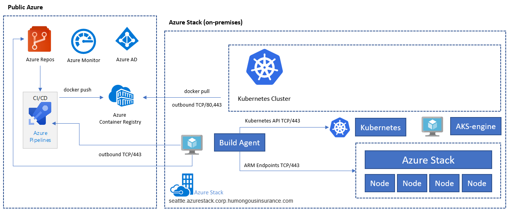
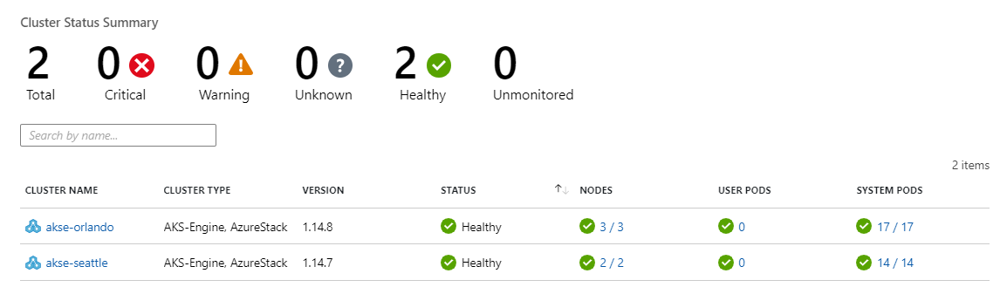
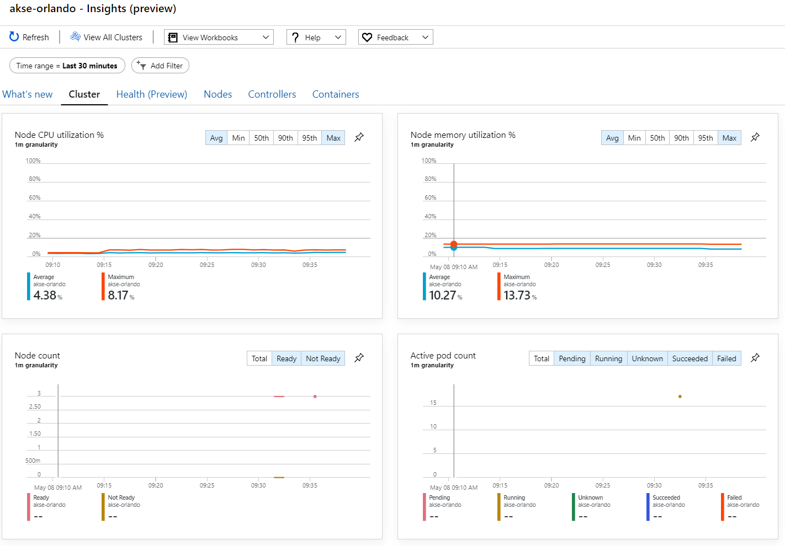
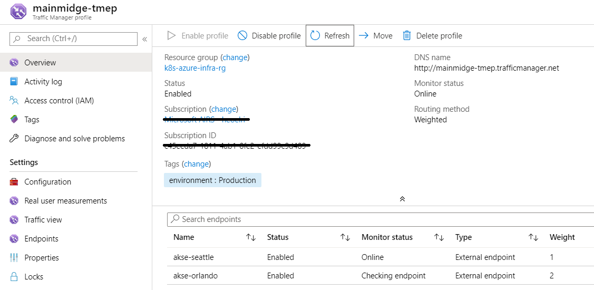

# Deploying Kubernetes Clusters on Azure Stack Hub

The steps below show how to build a highly available Kubernetes Cluster environment deployed on multiple Azure Stack Hub instances in different physical locations.

**Table of contents**

* [Download and Prepare AKS Engine](#download-and-prepare-aks-engine)
* [Connect to the AKS Engine Helper VM](#connect-to-the-aks-engine-helper-vm)
* [Deploy a Kubernetes Cluster](#deploy-a-kubernetes-cluster)
* [Connect to the Kubernetes Cluster](#connect-to-the-kubernetes-cluster)
* [Connect Azure DevOps to Kubernetes Cluster](#connect-azure-devops-to-kubernetes-clusters)
* [Configure Monitoring](#configure-monitoring)
* [Deploy Applications](#deploy-applications)
* [Autoscale Application](#autoscale-application)
* [Configure Traffic Manager](#configure-traffic-manager)
* [Upgrade Kubernetes](#upgrade-kubernetes)
* [Scale Kubernetes](#scale-kubernetes)

## Download and Prepare AKS Engine

AKS Engine is a binary that can be used from any Windows or Linux host that can reach the Azure Stack Hub ARM endpoints. This guide describes deploying a new Linux (or Windows) VM on Azure Stack Hub. It will be used later when AKS Engine deploys the Kubernetes clusters.

> You can also use an existing Windows or Linux VM to deploy a Kubernetes cluster on Azure Stack Hub using AKS Engine.

The step-by-step process and requirements for AKS Engine are documented here:

* [Install the AKS Engine on Linux in Azure Stack Hub](https://docs.microsoft.com/azure-stack/user/azure-stack-kubernetes-aks-engine-deploy-linux) (or using [Windows](https://docs.microsoft.com/azure-stack/user/azure-stack-kubernetes-aks-engine-deploy-windows))

AKS Engine is a helper tool to deploy and operate (unmanaged) Kubernetes Clusters (in Azure and Azure Stack Hub).

The details and differences of AKS Engine on Azure Stack Hub are described here:

* [What is the AKS Engine on Azure Stack Hub?](https://docs.microsoft.com/azure-stack/user/azure-stack-kubernetes-aks-engine-overview)
* [AKS Engine on Azure Stack Hub](https://github.com/Azure/aks-engine/blob/master/docs/topics/azure-stack.md) (on GitHub)

The sample environment will use Terraform to automate the deployment of the AKS Engine VM. You can find the details and code samples [here](src/tf/aksengine/README.md).

The result of this step is a new resource group on Azure Stack Hub that contains the AKS Engine helper VM:


> If you have to deploy AKS Engine in a disconnected (aka air-gapped) environment, go to [Disconnected Azure Stack Hub Instances](https://github.com/Azure/aks-engine/blob/master/docs/topics/azure-stack.md#disconnected-azure-stack-hub-instances) to learn more.

In the next step we will use the newly deployed AKS Engine VM to deploy a Kubernetes cluster.

## Connect to the AKS Engine helper VM

First you must connect to the previously created AKS Engine helper VM.

The VM should have a Public IP Address and should be accessible via SSH (Port 22/TCP).


> You can use a tool of your choice like MobaXterm, puTTY or PowerShell in Windows 10 to connect to a Linux VM using SSH.

```console
ssh <username>@<ipaddress>
```

After connecting, run the command `aks-engine`. Go to [Supported AKS Engine Versions](https://github.com/Azure/aks-engine/blob/master/docs/topics/azure-stack.md#supported-aks-engine-versions) to learn more about the AKS Engine and Kubernetes versions.


## Deploy a Kubernetes Cluster

The AKS Engine helper VM itself has not created a Kubernetes cluster on our Azure Stack Hub, yet. This will be the first action to take in the AKS Engine helper VM.

The step-by-step process is documented here:

* [Deploy a Kubernetes cluster with the AKS engine on Azure Stack Hub](https://docs.microsoft.com/azure-stack/user/azure-stack-kubernetes-aks-engine-deploy-cluster)

The end result of the `aks-engine deploy` command and the preparations in the previous steps is a fully featured Kubernetes cluster deployed into the tenant space of the first Azure Stack Hub instance. The cluster itself consists of Azure IaaS components like VMs, Load Balancers, VNets, Disks and so on.


1) Azure Load Balancer (K8s API Endpoint)
2) Worker Nodes (Agent Pool)
3) Master Nodes

The cluster is now up-and-running and in the next step we will connect to it.

## Connect to the Kubernetes Cluster

You can now connect to the previously created Kubernetes cluster, either via SSH (using the SSH key specified as part of the deployment) or via `kubectl` (recommended). The Kubernetes command line tool `kubectl` is available for Windows, Linux and MacOS [here](https://kubernetes.io/docs/tasks/tools/install-kubectl/). It is already pre-installed and configured on the master nodes of our cluster.

```console
ssh azureuser@<k8s-master-lb-ip>
```


It is not recommended to use the master node as a jumpbox for administrative tasks. The `kubectl` configuration is stored in `.kube/config` on the master node(s) as well as on the AKS Engine VM. You can copy the configuration to an admin machine with connectivity to the Kubernetes cluster and use the `kubectl` command there. The `.kube/config` file is also used later to configure a service connection in Azure DevOps.

> **Important!** Please keep these files secure because they contain the credentails for your Kubernetes cluster. An attacker with access to the file has enough information to gain administrator access to it. All actions that are done using the initial `.kube/config` file are done using a cluster-admin account.

You can now try various commands using `kubectl` to check the status of your cluster.

```bash
kubectl get nodes
```

```console
NAME                       STATUS   ROLE     VERSION
k8s-linuxpool-35064155-0   Ready    agent    v1.14.8
k8s-linuxpool-35064155-1   Ready    agent    v1.14.8
k8s-linuxpool-35064155-2   Ready    agent    v1.14.8
k8s-master-35064155-0      Ready    master   v1.14.8
```

```bash
kubectl cluster-info
```

```console
Kubernetes master is running at https://aks.***
CoreDNS is running at https://aks.***/api/v1/namespaces/kube-system/services/kube-dns:dns/proxy
kubernetes-dashboard is running at https://aks.***/api/v1/namespaces/kube-system/services/https:kubernetes-dashboard:/proxy
Metrics-server is running at https://aks.***/api/v1/namespaces/kube-system/services/https:metrics-server:/proxy
```

> **Important!** Kubernetes has its own **Role-based Access Control (RBAC)** model that allows you to create fine-grained role definitions and role bindings that be preferrably used to control access to the cluster instead of handing out cluster-admin permissions.

## Connect Azure DevOps to Kubernetes Clusters

To connect Azure DevOps to the newly deployed Kubernetes cluster, we need its kube config (`.kube/config`) file as explained in the previous step.

* Connect to one of the master nodes of your Kubernetes cluster.
* Copy the content of the `.kube/config` file.
* Go to Azure DevOps > Project Settings > Service connections to create a new "Kubernetes" service connection (use KubeConfig as Authentication method)

> **Important!** This requires that Azure DevOps (or its build agents) can access the Kubernetes API. If Internet connection from Azure DevOps to the Azure Stack Kubernetes clusetr, you will need to deploy a self-hosted Azure DevOps Build Agent.

When deploying self-hosted Agents for Azure DevOps, you may deploy either on Azure Stack Hub itself or on a machine with network connectivityto all required management endpoints. See the details here:

* [Azure Pipelines agents](https://docs.microsoft.com/azure/devops/pipelines/agents/agents) on [Windows](https://docs.microsoft.com/azure/devops/pipelines/agents/v2-windows) or [Linux](https://docs.microsoft.com/azure/devops/pipelines/agents/v2-linux)

The [Deployment (CI/CD) considerations](README.md#deployment-cicd-considerations) section of this reference architecture contains a decision flow that helps you to understand whether to use Microsoft-hosted agents or self-hosted agents:


In this sample solution, the topology includes a self-hosted build agent on each Azure Stack Hub instance that can access the Azure Stack Management Endpoints and the Kubernetes Cluster API endpoints.



This fullfills a common regulatory requirement, which is to have only outbound connections from the application solution.

## Configure Monitoring

You can use [Azure Monitor](https://docs.microsoft.com/azure/azure-monitor/) for containers to monitor the containers in the solution. This points Azure Monitor to the AKS Engine-deployed Kubernetes cluster on Azure Stack Hub.

There are two ways to enable Azure Monitor on your cluster. Both ways require you to set up a Log Analytics workspace in Azure.

* [Method one](https://docs.microsoft.com/azure-stack/user/kubernetes-aks-engine-azure-monitor#method-one) uses a Helm Chart
* [Method two](https://docs.microsoft.com/azure-stack/user/kubernetes-aks-engine-azure-monitor#method-two) as part of the AKS Engine cluster specification

In the sample topology, "Method one" using a Helm Chart is used. This allows automation of the process and updates can be installed more eaily.

For the next step, you need an Azure LogAnalytics Workspace (ID and Key) as well as `Helm` (version 3) and `kubectl` on your machine.

Helm is a Kubernetes package manager, available as a binary that is runs on MacOS, Windows and Linux. It can be downloaded here: [helm.sh](https://helm.sh/docs/intro/quickstart/) Helm relies on the Kubernetes configuration file used for the `kubectl` command.

```bash
helm repo add incubator https://kubernetes-charts-incubator.storage.googleapis.com/
helm repo update

helm install incubator/azuremonitor-containers \
--set omsagent.secret.wsid=<your_workspace_id> \
--set omsagent.secret.key=<your_workspace_key> \
--set omsagent.env.clusterName=<my_prod_cluster> \
--generate-name
```

This command will install the Azure Monitor agent on your Kubernetes cluster:

```bash
kubectl get pods -n kube-system
```

```console
NAME                                       READY   STATUS
omsagent-8qdm6                             1/1     Running
omsagent-r6ppm                             1/1     Running
omsagent-rs-76c45758f5-lmc4l               1/1     Running
```

The Operations Managament Suite (OMS) Agent on your Kubernetes cluster will send monitoring data to your Azure Log Analytics Workspace (using outbound HTTPS). You can now use Azure Monitor to get deeper insights about your Kubernetes clusters on Azure Stack Hub. This is a powerful way to demonstrate the power of analytics that can be automatically deployed with your application's clusters.





> **Important!** If Azure Monitor does not show any Azure Stack Hub data, please make sure that you have followed the instructions on [how to add AzureMonitor-Containers solution to a Azure Loganalytics workspace](https://github.com/Microsoft/OMS-docker/blob/ci_feature_prod/docs/solution-onboarding.md) carefully.

## Deploy Applications

Before installing our sample application, there is another step to configure the nginx-based Ingress controller on our Kubernetes cluster. The Ingress controller is used as a layer 7 load balancer to route traffic in our cluster based on host, path or protocol. Nginx-ingress is available as a Helm Chart and you can find detailed instructions [here](https://github.com/helm/charts/tree/master/stable/nginx-ingress).

Our sample application is also packaged as a Helm Chart, like the [Azure Monitoring Agent](#configure-monitoring) in the previous step. Therefore it's pretty straightforward to deploy the application onto our Kubernetes Cluster. You can find the Helm Chart here:

* [application/helm](application/helm) and you can find additional information around the sample application [here](application/).

The sample application is a three tier application that will be deployed onto a Kubernetes Cluster on each of two Azure Stack Hub instances. The application uses a MongoDB database and you can learn more about how to get the data replicated accross multiple  instances in the [Data and Storage considerations](README.md#data-and-storage-considerations) section of our [Reference Architecture](README.md).

After deploying the Helm Chart for the application, you'll see all three tiers of your application represented as deployments and stateful sets (for the database) with a single pod:

```kubectl
kubectl get pod,deployment,statefulset
```

```console
NAME                                         READY   STATUS
pod/ratings-api-569d7f7b54-mrv5d             1/1     Running
pod/ratings-mongodb-0                        1/1     Running
pod/ratings-web-85667bfb86-l6vxz             1/1     Running

NAME                                         READY
deployment.extensions/ratings-api            1/1
deployment.extensions/ratings-web            1/1

NAME                                         READY
statefulset.apps/ratings-mongodb             1/1
```

On the services side you'll find the nginx-based Ingress Controller and its public IP address:

```kubectl
kubectl get service
```

```console
NAME                                         TYPE           CLUSTER-IP     EXTERNAL-IP   PORT(S)
kubernetes                                   ClusterIP      10.0.0.1       <none>        443/TCP
nginx-ingress-1588931383-controller          LoadBalancer   10.0.114.180   *public-ip*   443:30667/TCP
nginx-ingress-1588931383-default-backend     ClusterIP      10.0.76.54     <none>        80/TCP
ratings-api                                  ClusterIP      10.0.46.69     <none>        80/TCP
ratings-web                                  ClusterIP      10.0.161.124   <none>        80/TCP
```

The "External IP" address is our "application endpoint". It is how users will connect to open the application and will also be used as the endpoint for our next step [Configure Traffic Manager](#configure-traffic-manager).

## Autoscale application
You can optionally configure the [Horizontal Pod Autoscaler](https://kubernetes.io/docs/tasks/run-application/horizontal-pod-autoscale-walkthrough/)  to scale up or down based on certain metrics like CPU utilization. The following command will create a Horizontal Pod Autoscaler that maintains between 1 and 10 replicas of the Pods controlled by the ratings-wee deployment. HPA will increase and decrease the number of replicas (via the deployment) to maintain an average CPU utilization across all Pods of 80%.

```kubectl
kubectl autoscale deployment ratings-web --cpu-percent=80 --min=1 --max=10
```
You may check the current status of autoscaler by running:

```kubectl
kubectl get hpa
```
```
NAME         REFERENCE                     TARGET    MINPODS   MAXPODS   REPLICAS   AGE
ratings-web   Deployment/ratings-web/scale   0% / 80%  1         10        1          18s
```
## Configure Traffic Manager

To distribute traffic between the two (or more) deployments of the application we will use [Azure Traffic Manager](https://docs.microsoft.com/azure/traffic-manager/traffic-manager-overview), which is a DNS-based traffic Load Balancer in Azure.

> Traffic Manager uses DNS to direct client requests to the most appropriate service endpoint based on a traffic-routing method and the health of the endpoints.

Instead of using Azure Traffic Manager you can also use other global load-balancing solutions hosted on-premises. In the sample scenario we will use Azure Traffic Manager to distribute traffic between two instances of our application. They can run on Azure STack Hub instances in the same or different locations:


In Azure we configure Traffic Manager to point to the two different instances of our application:



As you can see here, two endpoints are configured, pointing to the two instances of the deployed application from the [previous step](#deploy-applications).

At this point, the Kubernetes infrastructure has been created including an Ingress Controller, clusters have been deployed across two Azure Stack Hub instances, monitoring has been configured and traffic will be balanced across the two instances using Azure Traffic Manager. On top of this infrastructure, the sample three-tier application has been deployed in an automated way using Helm Charts. The solution should be up and accessible to users!

There are some post-deployment operational considerations that are worth describing. They are covered in the next two sections.

## Upgrade Kubernetes

Upgrading a Kubernetes Cluster is a complex Day 2 operation that can be done using AKS Engine. 

- [Upgrade a Kubernetes cluster on Azure Stack Hub](https://docs.microsoft.com/azure-stack/user/azure-stack-kubernetes-aks-engine-upgrade)

AKS Engine allows you to upgrade clusters to newer Kubernetes and base OS image versions:

- [Steps to upgrade to a newer Kubernetes version](https://docs.microsoft.com/azure-stack/user/azure-stack-kubernetes-aks-engine-upgrade#steps-to-upgrade-to-a-newer-kubernetes-version)

As well as upgrading only the underlaying nodes to newer base OS image versions:

- [Steps to only upgrade the OS image](https://docs.microsoft.com/azure-stack/user/azure-stack-kubernetes-aks-engine-upgrade#steps-to-only-upgrade-the-os-image)

Newer base OS images contain security and kernel updates. It's the cluster operator's responsibility to monitor the the availability of newer Kubernetes Versions and OS Images and to plan and execute these upgrades using AKS Engine. The base OS images have to be downloaded from the Azure Stack Hub Marketplace by the Azure Stack Operator.

## Scale Kubernetes

Scale is another Day 2 operation that can be orchestrated using AKS Engine.

The scale command reuses your cluster configuration file (apimodel.json) inside the output directory as input for a new Azure Resource Manager deployment. AKS Engine executes the scale operation against a specific agent pool. When the scale operation is complete, AKS Engine updates the cluster definition in that same apimodel.json file to reflect the new node count in order to reflect the updated, current cluster configuration.

- [Scale a Kubernetes cluster on Azure Stack Hub](https://docs.microsoft.com/azure-stack/user/azure-stack-kubernetes-aks-engine-scale)
