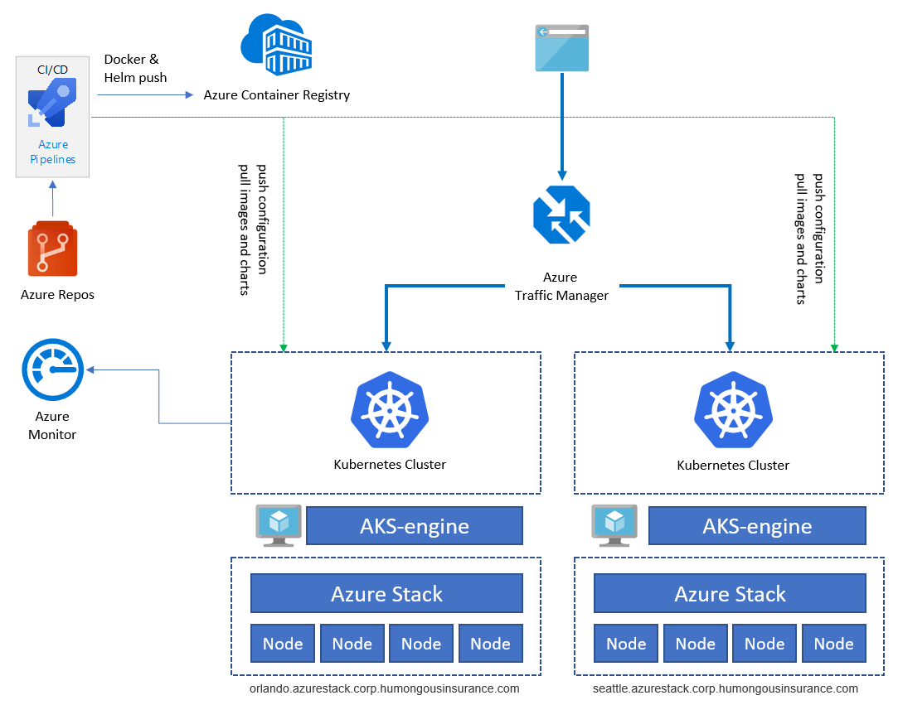
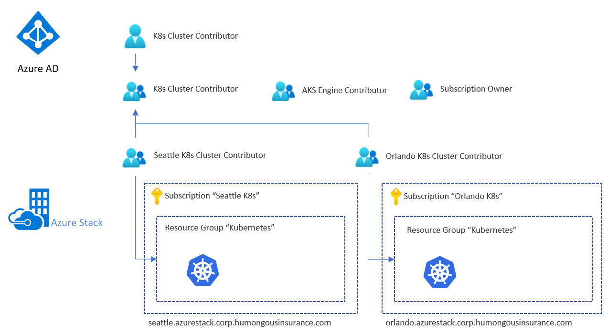
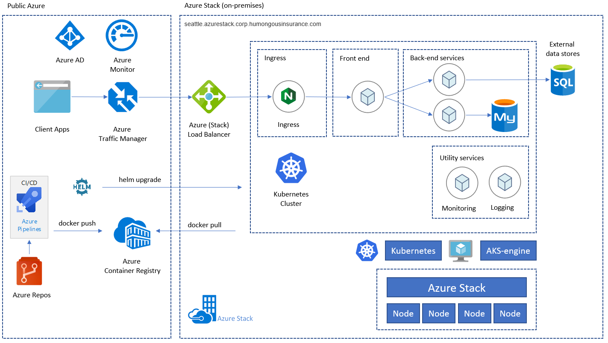
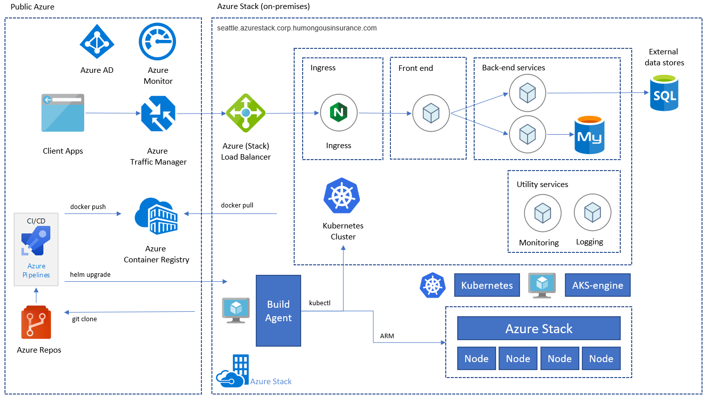

# Overview

This document describes how to architect and operate a highly available Kubernetes-based infrastructure using Azure Kubernetes Service Engine (AKS Engine) on Azure Stack Hub. This is a frequently requested scenario for organizations running critical workloads in highly restricted and regulated environments like finance, defence, and government.

**Table of contents**

- [Overview](#overview)
- [Context and Problem](#context-and-problem)
- [Architecture](#architecture)
- [Design Considerations](#design-considerations)
- [Scalability Considerations](#scalability-considerations)
- [Networking and Connectivity Considerations](#networking-and-connectivity-considerations)
- [Data and Storage Considerations](#data-and-storage-considerations)
- [Backup and Disaster Recovery](#backup-and-disaster-recovery)
- [Availability Considerations](#availability-considerations)
- [Identity and Security Considerations](#identity-and-security-considerations)
- [Patch and Update](#patch-and-update)
- [Deployment (CI/CD) Considerations](#deployment-cicd-considerations)
- [Deploying the Solution](#deploy-the-solution)
- [Next Steps](#next-steps)

## Context and Problem

Many organizations are developing cloud-native solutions leveraging state of the art services and technologies like Kubernetes. Although Azure provides datacenters in most regions of the world, sometimes there are edge use-cases and scenarios where business critical applicationsmust run in a specific location. Considerations include:

- Location sesitivity
- Latency between the application and on-premises systems
- Bandwidth conservation
- Connectivity
- Regulatory or statutory requirements

Azure, in combination with Azure Stack Hub, addresses most of these concerns. A broad set of options, decisions and considerations needed for a successful implementation of Kubernetes running locally on Azure Stack Hub is described below.

## Architecture

This pattern assumes that we have to deal with a strict set of constraints. The application must run on-premises and all Personally Identifying Information (PII) data must not reach public cloud services. Monitoring and other non-PII data can be sent to Azure and be processed there. External services like a public Container Registry or others can be accessed but might be filtered through a firewall or proxy server.

The sample application included here (from the [Azure Kubernetes Service Workshop](https://docs.microsoft.com/en-us/learn/modules/aks-workshop/) on Microsoft Learn) is designed to use Kubernetes-native solutions whenever possible to avoid vendor lock-in, instead of using platform services like Azure Key Vault. As an example, the application uses a self-hosted MongoDB database backend instead of a PaaS service or external database service.

The above diagram illustrates the overall application architecture of the sample application running on Kubernetes on Azure Stack Hub. The app consists of several components, including:

 1) An AKS Engine based Kubernetes Cluster on Azure Stack Hub.
 2) [cert-manager](https://www.jetstack.io/cert-manager/) provides a suite of tools for certificate management in Kubernetes. This is used to automatically request certificates from Let's Encrypt.
 3) A Kubernetes namespace that contains the application components for the front end (ratings-web), api (ratings-api), and database (ratings-mongodb).
 4) The Ingress Controller that routes HTTP/HTTPS traffic to endpoints within the Kubernetes Cluster.

The sample application is used to illustrate the application architecture. All components are examples. The architecture contains only a single application deployment. To achieve high availability (HA) we will run the deployment at least twice on two different Azure Stack Hub instances - they can run either in the same location or in two (or more) different sites:

Services like Azure Container Registry, Azure Monitor etc. are hosted outside Azure Stack Hub, either in Azure or on-premises. This protects the solution against outage of a single Azure Stack Hub instance.

The overall architecture consists of the following components:

**Azure Stack Hub** is an extension of Azure that provides a way to run workloads in an on-premises environment by providing Azure services in your datacenter. Go to [Azure Stack Hub overview](https://docs.microsoft.com/azure-stack/operator/azure-stack-overview) to learn more.

**Azure Kubernetes Service Engine (AKS Engine)** is the engine behind the managed Kubernetes service offering, Azure Kubernetes Service (AKS), that is available in Azure today. For Azure Stack Hub, AKS Engine allows us to deploy, scale and upgrade fully featured, self-managed Kubernetes clusters using Azure Stack Hub's IaaS capabilities. Go to [AKS Engine Overview](https://github.com/Azure/aks-engine) to learn more.

Go to [Known Issues and Limitations](https://github.com/Azure/aks-engine/blob/master/docs/topics/azure-stack.md#known-issues-and-limitations) to learn more about the differences between AKS Engine on Azure and AKS Engine on Azure Stack Hub.

**Azure Virtual Network (VNet)** is used to provide the network infrastructure on each Azure Stack Hub for the Virtual Machines (VMs) hosting the Kubernetes Cluster infrastructure.

**Azure Load Balancer** is used for the Kubernetes API Endpoint and the Nginx Ingress Controller. The load balancer routes external (e.g. Internet) traffic to nodes and VMs offering a specific service.

**Azure Container Registry (ACR)** is used to store private Docker images and Helm charts, which are deployed to the cluster. AKS Engine can authenticate with the Container Registry using an Azure AD identity. Note that Kubernetes does not require ACR. You can use other container registries, such as Docker Hub.

**Azure Repos** is a set of version control tools that you can use to manage your code. You can also use GitHub or other git-based repositories. Go to [Azure Repos Overview](https://docs.microsoft.com/azure/devops/repos/get-started/what-is-repos) to learn more.

**Azure Pipelines** is part of Azure DevOps Services and runs automated builds, tests, and deployments. You can also use third-party CI/CD solutions such as Jenkins. Go to [Azure Pipeline Overview](https://docs.microsoft.com/azure/devops/pipelines/get-started/what-is-azure-pipelines) to learn more.

**Azure Monitor** collects and stores metrics and logs, including platform metrics for the Azure services in the solution and application telemetry. Use this data to monitor the application, set up alerts and dashboards, and perform root cause analysis of failures. Azure Monitor integrates with Kubernetes to collect metrics from controllers, nodes, and containers, as well as container logs and master node logs. Go to [Azure Monitor Overview](https://docs.microsoft.com/en-us/azure/azure-monitor/overview) to learn more.

**Azure Traffic Manager** is a DNS-based traffic load balancer that enables you to distribute traffic optimally to services across different Azure regions or Azure Stack Hub deployments, while providing high availability and responsiveness. This requires the application endpoints to be accessible from the outside. There are other on-premises solutions available as well.

**Kubernetes Ingress Controller** exposes HTTP(S) routes to services inside of a Kubernetes cluster. Nginx or any suitable ingress controller can be used for this purpose.

**Helm** is a package manager for Kubernetes deployment — a way to bundle different Kubernetes objects like Deployments, Services, Secrets etc. into a single unit (a 'Chart') that you can publish, deploy, control version management, and update. Azure Container Registry can be used as a repository to store packaged Helm Charts.

## Design Considerations

This pattern follows a few high level considerations explained in more detail in the next sections of this document.

- The application uses Kubernetes-native solutions, to avoid vendor lock-in.
- The application uese a microservices architecture.
- Azure Stack Hub does not need inbound but allows outbound Internet connectivity.

These are typical recommended practices that will apply to real-world workloads and scenarios as well.

## Scalability Considerations

Scalability is important to provide users consistent, reliable, and well-performing access to the application.

The sample scenario covers scalability on multiple layers of the application stack. Here is a high level overview of the different layers:

| Architecture Level | Affects | How? |
| --- | --- | ---
| Application | Application | Horizontal scaling based on the number of Pods/Replicas/Container Instances; using Kubernetes' Horizontal Pod Autoscaler (HPA); automated metric-based scaling or vertical scaling by sizing the container instances (cpu/memory) |
| Cluster | Kubernetes Cluster | Number of Nodes (between 1 and 50), VM-SKU-sizes, and Node Pools (AKS Engine on Azure Stack Hub currently supports only a single node pool); using AKS Engine's scale command (manual) |
| Infrastructure | Azure Stack Hub | Number of nodes, capacity and scale units within an Azure Stack Hub deployment |

**Azure Stack Hub (Infrastructure-level)**

The Azure Stack Hub infrastructure is the foundation of this implementation, becasue Azure Stack Hub runs on physical hardware in a datacenter. You will need to make choices regarding CPU, memory density, storage configuration, and overall solution scale or number of servers when selecting your Azure Stack hardware. If you'd like to learn more about Azure Stack's scalability, check out the following resources:

- [Capacity planning for Azure Stack Hub overview](https://docs.microsoft.com/azure-stack/operator/azure-stack-capacity-planning-overview)
- [Add additional scale unit nodes in Azure Stack Hub](https://docs.microsoft.com/azure-stack/operator/azure-stack-add-scale-node)

**Kubernetes Cluster (Cluster-level)**

The Kubernetes cluster itself consists of, and is built on top of Azure (Stack) IaaS components including compute, storage, and network resources. Kubernetes solutions involve master and worker nodes, and these are deployed as VMs in Azure (and Azure Stack).

- [Control plane nodes](https://docs.microsoft.com/azure/aks/concepts-clusters-workloads#control-plane) (master) provide the core Kubernetes services and orchestration of application workloads.
- (worker) [Nodes](https://docs.microsoft.com/azure/aks/concepts-clusters-workloads#nodes-and-node-pools) run your application workloads.

When selecting VM sizes for the initial deployment there are several considerations:  

- __Cost__
  - When planning your worker nodes keep in mind the overall cost per VM you will incur. For example, if your application workloads require limited resources, you should plan to deploy smaller sized VMs. Azure Stack, like Azure, is normally billed on a consumption basis, so appropriately sizing the VMs for Kubernetes roles is crucial to optimizing consumption costs.
  - If your application needs more (or fewer) resources, you can scale out (or in) your current nodes horizontally (between 1 and 50 nodes). If you need more than 50 nodes you can create an additional cluster in a separate subscription.
  - At this time you can not scale up the actual VMs vertically to another VM size without redeploying the cluster.
- __Quotas__
  - Consider the [quotas](https://docs.microsoft.com/azure-stack/operator/azure-stack-quota-types) you have configured when planning out an AKS deployment on your Azure Stack Hub. Make sure each [subscription](https://docs.microsoft.com/en-us/azure-stack/operator/service-plan-offer-subscription-overview) has the proper plans and the proper quotas configured to handle the amount of compute, storage, etc. that will be needed for your clusters as they scale out.
- __Application Workloads__
  - Please refer to the [Clusters and workloads concepts](https://docs.microsoft.com/azure/aks/concepts-clusters-workloads#nodes-and-node-pools) in the Kubernetes core concepts for Azure Kubernetes Service document to scope the proper VM size based on the compute and memory needs of your application.  

Scalability of the cluster itself will be achieved by scaling in and out the number of master and worker nodes or by adding additional node pools (which is not available on Azure Stack Hub today). Scaling the cluster can be done based on performance data, e.g. collected using Container Insights (Azure Monitor + Log Analytics) and is done manually using the AKS Engine helper VM that was used to deploy the Kubernetes cluster in the first place.

- [Scaling Kubernetes Clusters](https://github.com/Azure/aks-engine/blob/master/docs/topics/scale.md)

**Application (Application-level)**

On the application layer we use Kubernetes' own [Horizontal Pod Autoscaler (HPA)](https://kubernetes.io/docs/tasks/run-application/horizontal-pod-autoscale/) that can increase or decrease the number of Replicas (Pod/Container Instances) in our deployment based on different metrics (like CPU utilization).

Another option is to scale container instances vertically by changing the amount of CPU and Memory requested and available for a specific deployment (go to [Managing Resources for Containers](https://kubernetes.io/docs/concepts/configuration/manage-resources-containers/) on kubernetes.io to learn more).

## Networking and Connectivity considerations

Networking and Connectivity also affects the three layers mentioned above for Kubernetes on Azure Stack Hub. The following table shows the layers and which services they contain:

| Layer | Affects | What? |
| --- | --- | ---
| Application | Application | How is the application accessible? Will it be exposed to the Internet? |
| Cluster | Kubernetes Cluster | Kubernetes API, AKS Engine VM, Pulling container images (egress), Sending monitoring data and telemetry (egress) |
| Infrastructure | Azure Stack Hub | Accessibility of the Azure Stack Hub management endpoints like the portal and ARM endpoints. |

**Application**

For the application layer, the most important consideration is whether the application is exposed and accessible from the Internet. From a Kubernetes perspective, Internet accessibility means exposing a deployment or pod using a Kubernetes Service or an Ingress Controller.

> We recommend the use of Ingress controllers to expose Kubernetes Services as the number of Frontend public IPs on Azure Stack Hub is limited to 5. This also limits the number of Kubernetes Services (with the type LoadBalancer) to 5, which will be too small for many deployments. Go to the [AKS Engine documentation](https://github.com/Azure/aks-engine/blob/master/docs/topics/azure-stack.md#limited-number-of-frontend-public-ips) to learn more.

Keep in mind that exposing an application using a public IP via a Load Balancer or an Ingress Controller does not nessecarily mean that the application is now accessible via the Internet. It is possible for Azure Stack to have a public IP address that is only visible on the local intranet - not all public IPs are truly Internet-facing.

The previous block considers ingress traffic to the application. Another topic that must be considered for a successful Kubernetes deployment is outbound/egress traffic. Here are a few use cases that require egress traffic:

- Pulling Container Images stored on DockerHub or Azure Container Registry
- Retrieving Helm Charts
- Emitting Application Insights data (or other monitoring data)

Some enterprise environments might require the use of _transparent_ or _non-transparent_ proxy servers. This requires specific configuration on various components of our cluster. The AKS Engine documentation contains various details on how to accommodate network proxies:

- [AKS Engine and proxy servers](https://github.com/Azure/aks-engine/blob/master/docs/topics/proxy-servers.md)

Lastly, cross-cluster traffic must flow between Azure Stack Hub instances. The sample deployment consists of individual Kubernetes clusters running on individual Azure Stack Hub instances. Traffic between them, such as the replication traffic between two databases, is "external traffic". This means the traffic must be routed through either a Site-to-Site VPN or Azure Stack Public IP Addresses to connect Kubernetes on two Azure STack Hub instances:

**Cluster**  

The Kubernetes cluster does not necessarily need to be accessible via the Internet. The relevant part here is the Kubernetes API used to operate a cluster, for example, using `kubectl`. The Kubernetes API endpoint must be accessible to everyone who operates the cluster or deploys applications and services on top of it. This topic is covered in more detail from a DevOps-perspective in the [Deployment (CI/CD) considerations](#deployment-cicd-considerations) section below.

On the cluster level there are also a few considerations around egress-traffic:

- Node updates (for Ubuntu)
- Monitoring data (sent to Azure LogAnalytics)
- Other agents requiring outbound traffic (these will be specific to each deployer's environment)

Before you deploy your Kubernetes cluster using AKS Engine, plan for the final networking design. Instead of creating a dedicated Virtual Network, it may be more efficient to deploy a cluster into an existing network. For example, you might leverage an existing Site-to-Site VPN connection already configured in your Azure Stack Hub environment.

**Infrastructure**  

Infrastructure here means accessing the Azure Stack management endpoints including the tenant and admin portals and the ARM admin and ARM tenant endpoints. This is required to operate Azure Stack and its core services.

## Data and storage considerations

Because two individual instances of our application will be deployed on two individual Kubernetes clusters across two Azure Stack Hub instances, you must consider how to replicate and synchronize data between them.

With Azure, we have the built-in capability to replicate storage across multiple regions and zones within the cloud. Currently with Azure Stack Hub there are no native ways to replicate storage across two different Azure Stack Hub instances - they form two independent clouds with no overarching way to manage them as a set. Planning for resiliency of applications running across Azure Stack Hub forces you to consider this independence in your application design and deployments.

In most cases storage replication will not be necessary to have a resilient and highly available application deployed on AKS, but you should consider independent storage per Azure Stack Hub instance in your application design. If this is a concern and a possible road block to deploying the solution on Azure Stack Hub, there are possible solutions from Microsoft Partners that provide storage attachments.  This can provide a storage replication solution across multiple Azure Stack Hubs and Azure. For more information on our Partners that provide these solutions you can visit our [Partner Solution section](./msp.md).

In our architecture these layers were considered:

**Configuration**  
Configuration includes the configuration of Azure Stack Hub, AKS Engine, and the Kubernetes cluster itself. The configuration should be automated as much as possible and stored as Infrastructure-as-Code in a git-based version control system like Azure DevOps or GitHub. These settings cannot easily be synchronized accross multiple deployments, so we recommend storing and applying configuration from the outside. You should use a DevOps pipeline for this.

**Application**  
The application itself should be stored in a git-based Repository so it can be easily deployed using Azure Pipelines whenever there is a new deployment, changes to the application, or disaster recovery.

**Data**  
Data is the most important consideration in most application designs. This includes application data that must stay in sync between the different instances of the application, and needs a backup and disaster recovery strategy in case of an outage.

The way to achieve this depends heavily on technology choices - here are a few patterns for how to implement a database in a highly available fashion on Azure Stack Hub:

- [Deploy a SQL Server 2016 availability group to Azure and Azure Stack Hub](https://docs.microsoft.com/azure-stack/hybrid/solution-deployment-guide-sql-ha)
- [Deploy a highly available MongoDB solution to Azure and Azure Stack Hub](https://docs.microsoft.com/azure-stack/hybrid/solution-deployment-guide-mongodb-ha)

Considerations when working with data across multiple locations is an even more complex consideration for a highly available and resilient solution. Consider:

- Latency and network connectivity between Azure Stack Hubs.
- Availability of identities for services and permissions. Each Azure Stack Hub instance integrates with an external directory - either an Azure AD tenant or an Active Directory forest - so there is potential to use a single identity that can interact with multiple independednt Azure Stack instances.

## Backup and Disaster Recovery

Backup and Disaster Recovery (or short BCDR) is an important topic in Azure Stack as well as in Azure. The main difference here is that in Azure Stack Hub, the operator must manage the whole BCDR process. In Azure, parts of BCDR are automatically covered by Microsoft.

BCDR affects the same areas mentioned in the previous section [Data and storage considerations](#data-and-storage-considerations):

- Infrastructure / Configuration
- Application Availability
- Application Data

And as mentioned in the previous section, these areas are the responsibility of the Azure Stack Hub operator and can vary between organizations. Plan BCDR according to your available tools and processes.

**Infrastructure / Configuration**

The Infrastructure / Configuration section covers the physical and logical infrastructure and the configuration of Azure Stack Hub. It covers actions in the admin and the tenant spaces.

The Azure Stack operator (or administrator) is responsible for maintenance of the Azure Stack Hub instances, taking care of network, storage, identity and other topics that are outside the scope of this document. To learn more about the specifics of Azure Stack Hub operations, see the following resources:

- [Recover data in Azure Stack Hub with the Infrastructure Backup Service](https://docs.microsoft.com/azure-stack/operator/azure-stack-backup-infrastructure-backup)
- [Enable backup for Azure Stack Hub from the administrator portal](https://docs.microsoft.com/azure-stack/operator/azure-stack-backup-enable-backup-console)
- [Recover from catastrophic data loss](https://docs.microsoft.com/azure-stack/operator/azure-stack-backup-recover-data)
- [Infrastructure Backup Service best practices](https://docs.microsoft.com/azure-stack/operator/azure-stack-backup-best-practices)

Azure Stack is the platform and fabric on which Kubernetes applications will be deployed. The application owner for the Kubernetes application will be a user of Azure Stack, with access granted to deploy the application infrastructure needed for the solution. Application infrastructure in this case means the Kubernetes cluster, deployed using AKS Engine, and the surrounding services. These will be deployed into Azure Stack Hub, constrained by an Azure Stack Offer. Make sure that the Offer accepted by the Kubernetes application owner has sufficient capacity (expressed in Azure Stack quotas) to deploy the entire solution. As recommended in the previous section, the application deployment should be automated using Infrastructure-as-Code and deployment pipelines like Azure DevOps and Azure Pipelines.

For more details on Azure Stack Offers and quotas see [Azure Stack Hub services, plans, offers, and subscriptions overview](https://docs.microsoft.com/en-us/azure-stack/operator/service-plan-offer-subscription-overview?view=azs-2002)

It is important to securely save and store the AKS Engine configuration including its outputs. These files contain confidential information that is required to access the Kubernetes cluster so it needs to be protected from being exposed to non-administrators.

**Application Availability**

The application should not rely on backups of a deployed instance. As a standard practice, re-deploy the application completely following Infrastructure-as-Code patterns. For example, re-deploy using Azure DevOps and Azure Pipelines. The BCDR procedure should involve the (re-)deployment of the application to the same or another Kubernetes Cluster.

**Application Data**

Application Data is the critical part to minimize data loss. In the previous section, techniques to replicate and synchronize data between two (or more) instances of the application were described. Depending on the database infrastructure (MySQL, MongoDB, MSSQL or others) used to store the data, there will be different database availability and backup techniques available to choose from.

The recommended way to achieve that is to leverage either native backup solutions for the specific database, or to use a backup solution that officially supports backup and recovery of the database type used in Azure Stack Hub for your application.

> **Important!** Do not store your backup data on the same Azure Stack Hub instance where your application data resides. A complete outage of the Azure Stack Hub instance would also compromise your backups.

## Availability Considerations

Kubernetes on Azure Stack Hub deployed via AKS Engine is not a managed service. It is an automated deployment and configuration of a Kubernetes Cluster using Azure Infrastructure-as-a-Service (IaaS). Therefore it provides the same availability as the underlying infrastructure.

While the infrastructure of Azure Stack Hub is already resilient to failures and provides capabilities like Availability Sets to distribute the components across multiple [fault and update domains](https://docs.microsoft.com/azure-stack/user/azure-stack-vm-considerations?view=azs-2002#high-availability), the underlying technology (failover clustering) still incurs some downtime for VMs on an impacted physical server if there is a hardware failure.

Therefore it is a good practice to deploy your production Kubernetes cluster as well as the workload to two (or more) clusters hosted in different locations or datacenters and use technologies like Azure Traffic Manager (or comparable solutions) to route users based on cluster response time or based on geography.

Customers who have a single Kubernetes cluster typically connect to the service IP or DNS name of a given application. In a multi-cluster deployment, customers should connect to a Traffic Manager DNS name that points to the services/ingress on each Kubernetes cluster.

> This pattern is also a [best practice for (managed) AKS clusters in Azure](https://docs.microsoft.com/azure/aks/operator-best-practices-multi-region#plan-for-multiregion-deployment).

The Kubernetes cluster itself, deployed via AKS Engine, should consist of at least 3 master nodes and 2 worker nodes.

## Identity and Security considerations

Identity and Security is a very important topic when the solution spans independent Azure Stack Hub instances. Kubernetes and Azure (including Azure Stack Hub) both have distinct mechanisms for role-based access control (RBAC):

- Azure RBAC controls access to resources in Azure (and Azure Stack Hub), including the ability to create new Azure resources. Permissions can be assigned to users, groups, or service principals. (A service principal is a security identity used by applications.)
- Kubernetes RBAC controls permissions to the Kubernetes API. For example, creating pods and listing pods are actions that can be authorized (or denied) to a user through RBAC. To assign Kubernetes permissions to users, you create roles and role bindings.

**Azure Stack Hub Identity and RBAC**

In Azure Stack Hub, there are two possible identity providers, depending on the environment and whether Azure STack is configured in a connected (AAD or ADFS can be used for identity) or disconnected (ADFS only) environment:

- Azure Active Directory (AAD)
- Active Directory Federation Services (ADFS) to a traditional Active Directory forest

The Identity Provider is the source of users and groups that can be used to grant access to Azure Stack resources like Subscriptions, Resource Groups and individual resources like VMs or load balancers. To have a consistent access model you should consider using the same groups (either direct or nested) for all Azure Stacks. Here is an example how this could be configured:

The example contains a dedicated group (doesn't matter if in AAD or ADFS) for a specific purpose, for example with Contributor permissions for the Resource Group that contains our Kubernetes Cluster infrastructure on a specific Azure Stack Hub instance (here "Seattle K8s Cluster Contributor"). These groups are then nested into an overall group that contains the "sub-groups" for each Azure Stack Hub.

Our sample user will now have "Contributor" permissions to both Resources Groups that contain the entire set of Kubernetes infrastructure reources, and they will have access to resources on both Azure Stack Hub instances, becasue the instances share the same identity provider.

> **Important!** This affects only Azure Stack Hub and some of the resources deployed on top of it. A user who has this level of access can do a lot of harm, but cannot access the Kubernetes IaaS VMs nor the Kubernetes API without additional access to the Kubernetes deployment.

**Kubernetes Identity and RBAC**

A Kubernetes cluster, by default, does not use the same Identity Provider as the underlaying Azure Stack Hub. The VMs hosting the Kubernetes Cluster, the master and worker nodes, are configured with the SSH Key that is specified during the deployment of the cluster. This SSH key is required to connect to these nodes using SSH.

The Kubernetes API (e.g. accessed by using `kubectl`) is also protected by service accounts including a default "cluster admin" service account. The credentials for this service account are initially stored in the `.kube/config` file on your Kubernetes master nodes.

**Secrets Management and Application Credentials**

To store secrets like connection strings or database credentials there are several choices, including:

- Azure Key Vault
- Kubernetes Secrets
- 3rd-Party solutions like HashiCorp Vault (running on Kubernetes)

Secrets/credentials should never be stored in plaintext in your application code or within scripts. And shouldn't be stored in a version control system. Instead, the deployment automation should retrieve the secrets as needed.

## Patch and Update

The **Patch and Update (PNU)** process in Azure Kubernetes Service (in Azure) is partially automated, Kubernetes version upgrades are triggered manually while security updates are applied automatically. These updates can include OS security fixes or kernel updates. AKS does not automatically reboot these Linux nodes to complete the update process. 

On a Kubernetes Cluster deployed using AKS Engine on Azure Stack Hub is the PNU process unmanaged and the responsibility of the cluster operator. 

AKS Engine helps with the two most important tasks:

- [Upgrade to a newer Kubernetes and base OS image version](https://docs.microsoft.com/azure-stack/user/azure-stack-kubernetes-aks-engine-upgrade#steps-to-upgrade-to-a-newer-kubernetes-version)
- [Upgrade the base OS image only](https://docs.microsoft.com/azure-stack/user/azure-stack-kubernetes-aks-engine-upgrade#steps-to-only-upgrade-the-os-image)

Newer base OS images contain the latest OS security fixes and kernel updates. 

Security updates that are released before a new base OS image version is available in the Azure Stack Hub Marketplace are automatically installed using the [Unattended Upgrade](https://wiki.debian.org/UnattendedUpgrades) mechanism. The _Unattended Upgrade_ mechanism is enabled by default and installs security updates automatically, but does not reboot the Kubernetes cluster nodes. Rebooting the nodes can be automated using the open-source [**K**Ubernetes **RE**boot **D**aemon (kured))](https://docs.microsoft.com/en-us/azure/aks/node-updates-kured) that watches for Linux nodes that require a reboot, then automatically handle the rescheduling of running pods and node reboot process.

## Deployment (CI/CD) considerations

Azure and Azure Stack Hub expose the same ARM REST APIs. These are addressed like any other Azure Cloud (Azure, Azure China, Azure Gov etc.). There may be differences in API versions between clouds, an Azure Stack Hub instance provides only a subset of services, and the management endpoint URI is different for each cloud and each instance of Azure Stack Hub.

Aside from the subtle differences listed above, becasue ARM REST APIs are the way to interact with both Azure and Azure Stack Hub, the same set of tools can be used here as would be used with any other Azure Cloud. You can use Azure DevOps or other tools like Jenkins or even plain PowerShell to deploy and orchestrate services to Azure Stack Hub.

**Considerations**

One of the major differences when it comes to Azure Stack Hub deployments is the question of Internet accessibility. This is relevant to decide if you can proceed with a Microsoft-hosted or a self-hosted build agent for your CI/CD jobs.

A self-hosted agent can run on top of Azure Stack Hub (as an IaaS VM) or in a network subnet that can access Azure Stack Hub. Go to [Azure Pipelines agents](https://docs.microsoft.com/azure/devops/pipelines/agents/agents) to learn more about the differences.

The following image helps you to decide if you need a self-hosted or a Microsoft-hosted build agent:

- Are the Azure Stack Hub management endpoints accessible via Internet?
  - Yes - We can use Azure Pipelines with Microsoft-hosted agents to connect to Azure Stack Hub.
  - No - We need self-hosted agents that are able to connect to Azure Stack Hub's management endpoints.
- Is our Kubernetes cluster accessible via the Internet?
  - Yes - We can use Azure Pipelines with Microsoft-hosted agents to interact directly with Kubernetes API endpoint.
  - No - We need self-hosted Agents that are able to connect to the Kubernetes Cluster API endpoint.

In scenarios where the Azure Stack Hub management endpoints and the Kubernetes API are all accessible via the internet, the deployment can use a Microsoft-hosted agent and will result in an application architecture like this:

If either the ARM endpoints or the Kubernetes API or both are not directly accessible via the Internet, we can leverage a self-hosted build agent to run the pipeline steps. This needs less connectivity, and can deployed with only on-premises network connectivity to Azure Stack for ARM and/or Kubernetes API:

> **What About Disconnected Scenarios?** In scenarios where either Azure Stack Hub or Kubernetes or both of them do not have internet-facing management endpoints, it is still possible to use Azure DevOps for your deployments. You can either use a self-hosted Agent Pool (which is a DevOps Agent running on-premises or on Azure Stack itself) or a completly self-hosted Azure DevOps Server on-premises. The self-hosted agent needs only outbound HTTPS (TCP/443) Internet connectivity.

The pattern can use a Kubernetes Cluster (deployed and orchestrated with AKS engine) on each Azure Stack Hub instance. It includes an application consisting of a frontend, a mid-tier, backend services (e.g. MongoDB), and an nginx-based Ingress Controller. Instead of using a database hosted on the K8s cluster, you could leverage "external data stores" like MySQL or SQL or any kind of database hosted outside of Azure Stack Hub or in IaaS. COnfigurations like this are not in scope here.

## Deploy the Solution

To deploy the reference implementation for this architecture, follow the steps in the [GitHub repo](./DEPLOYMENT.md).

## Next Steps

Learn more about

- [Cross-cloud scaling](https://docs.microsoft.com/azure-stack/hybrid/pattern-cross-cloud-scale) and [Geo-distributed app patterns](https://docs.microsoft.com/azure-stack/hybrid/pattern-geo-distributed) in Azure Stack Hub
- [Microservices architecture on Azure Kubernetes Service (AKS)](https://docs.microsoft.com/azure/architecture/reference-architectures/microservices/aks#security-considerations)
