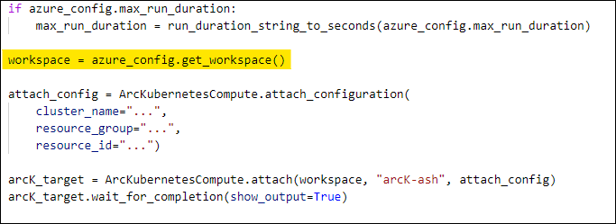
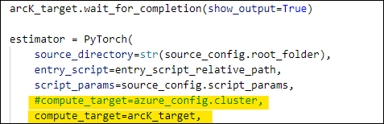

# Run InnerEye Deep Learning training workloads utilizing Azure Stack Hub’s Kubernetes cluster as Azure Machine Learning Compute Cluster (Private Preview)

In this article, you:

* Modify the InnerEye Deep Learning SDK to run training workloads utilizing Azure Stack Hub’s compute cluster through Azure Machine Learning (Private Preview)

## Prerequisites

Make sure you have access to Azure and your Azure Stack Hub is ready for use. In addition, this article assumes you have already:

*	Deployed a Kubernetes cluster in you Azure Stack Hub
*	Connected the Kubernetes cluster to Azure via Azure ARC

If you have not completed any of the two above, please do so using [instructions given here (AML-ARC Compute document)](AML-ARC-Compute.md). In addition, 
please make sure that you have cloned the [InnerEye Deep Learning SDK repository](https://github.com/microsoft/InnerEye-DeepLearning) and gone through 
[Getting started instructions](https://github.com/microsoft/InnerEye-DeepLearning#getting-started) on the device that you will be running SDK from. Lastly, make sure both Python and AzureML Python SDK are 
installed on the device that you will be using to communicate with Azure Machine Learning. 

## InnerEye Deep Learning Training using Arc Connected Azure Stack Hub’s Cluster (Private Preview)

1.	If you haven’t done so, Install private preview branch of AzureML SDK by running following command on your device (private preview):

    ``` pip install --disable-pip-version-check --extra-index-url https://azuremlsdktestpypi.azureedge.net/azureml-contrib-k8s-preview/D58E86006C65 azureml-contrib-k8s ```
    
2. Go to **‘\InnerEye\Azure’** path of the InnerEye Deep Learning SDK cloned repository and open **‘azure_runner.py’** on your favorite IDE/Code Editor.
3.	In the import section, paste the following import:
    ```python 
    try:
      from azureml.contrib.core.compute.arckubernetescompute import ArcKubernetesCompute
    except Exception:
      pass
    ```
4.	Attach/Register Azure Arc’s Kubernetes cluster as Azure Machine Learning compute target by pasting and filling the following python code snippet Inside **‘create_estimator_from_configs()’** function (after workspace is defined in the code):

    ```python 
    attach_config = ArcKubernetesCompute.attach_configuration(
      cluster_name="<arc-cluster-name>",
      resource_group="<resource-group>",
      resource_id="<arc-cluster-resource-id>")
    
    arcK_target = ArcKubernetesCompute.attach(ws, "arcK-ash", attach_config)
    arcK_target.wait_for_completion(show_output= True)
    ```
    <p align="center">
      
    </p>
5.	Edit variable **‘estimator’** (In the same function as above) by replacing **‘compute_target’** definition from ‘azure_config.cluster’ to ‘arcK_target’ which we defined in step 4. 

    <p align="center">
      
    </p>

6.	Save all your changes. You are now able to use the InnerEye Deep Learning SDK training capabilities by following their instructions, as is, on their repository. The small changes we made will allow the compute component of your training to be sent to the Arc connected Azure Stack Hub’s Cluster.
