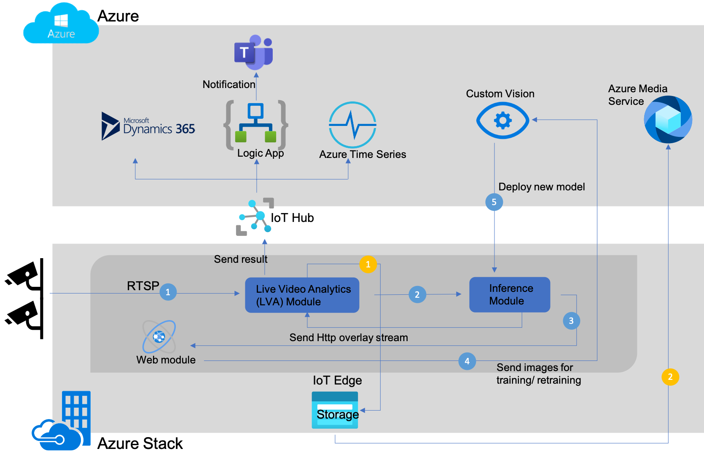
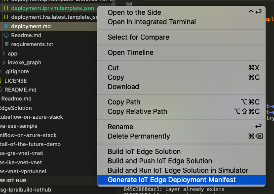
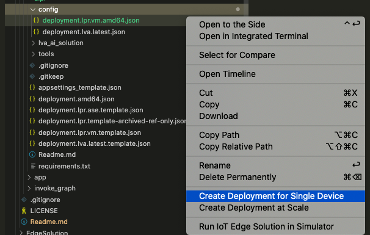
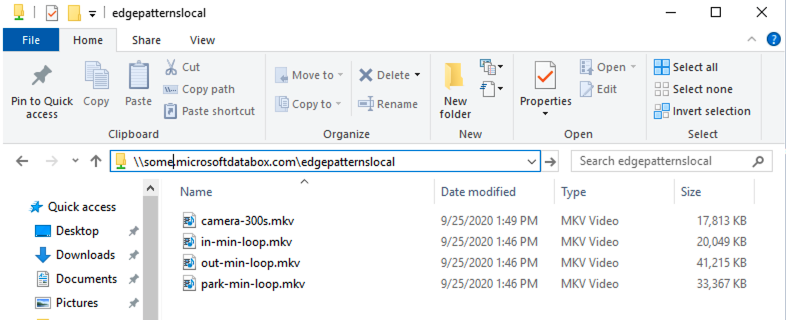
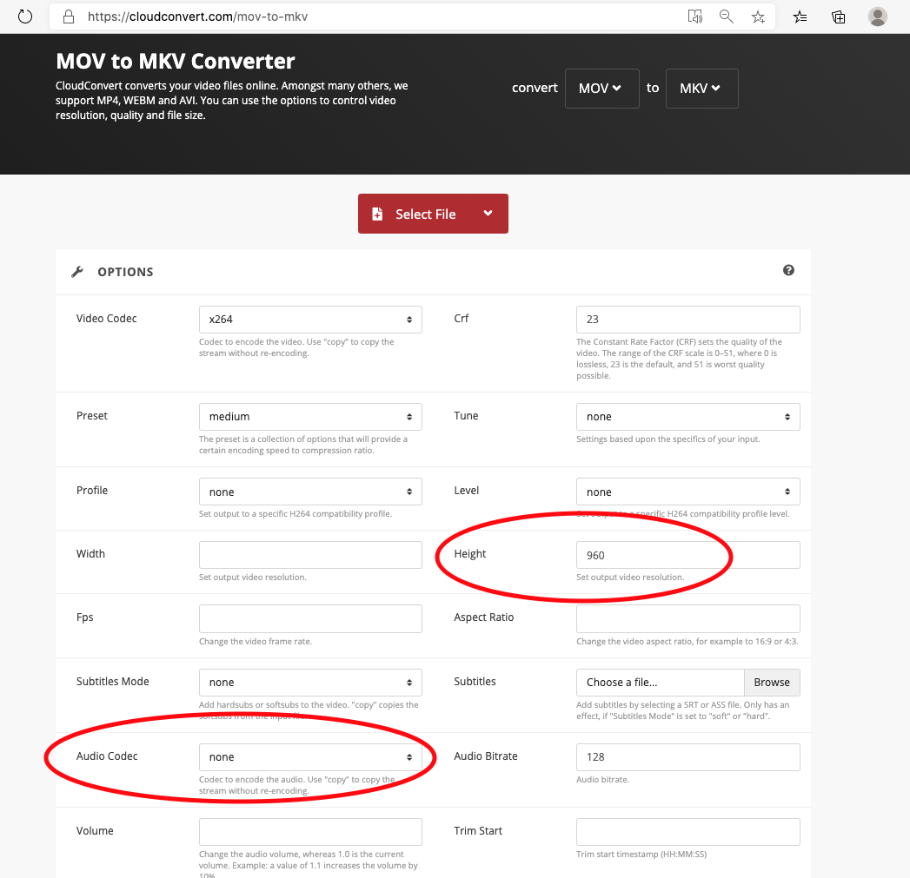
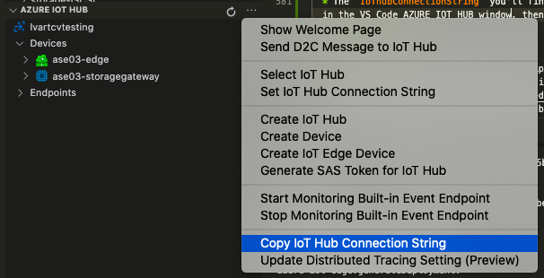
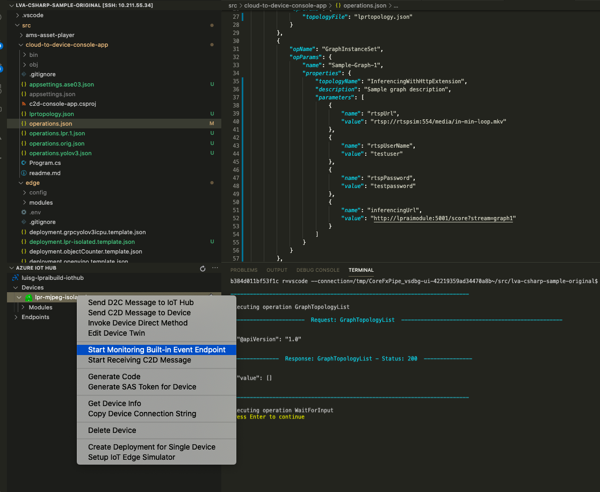
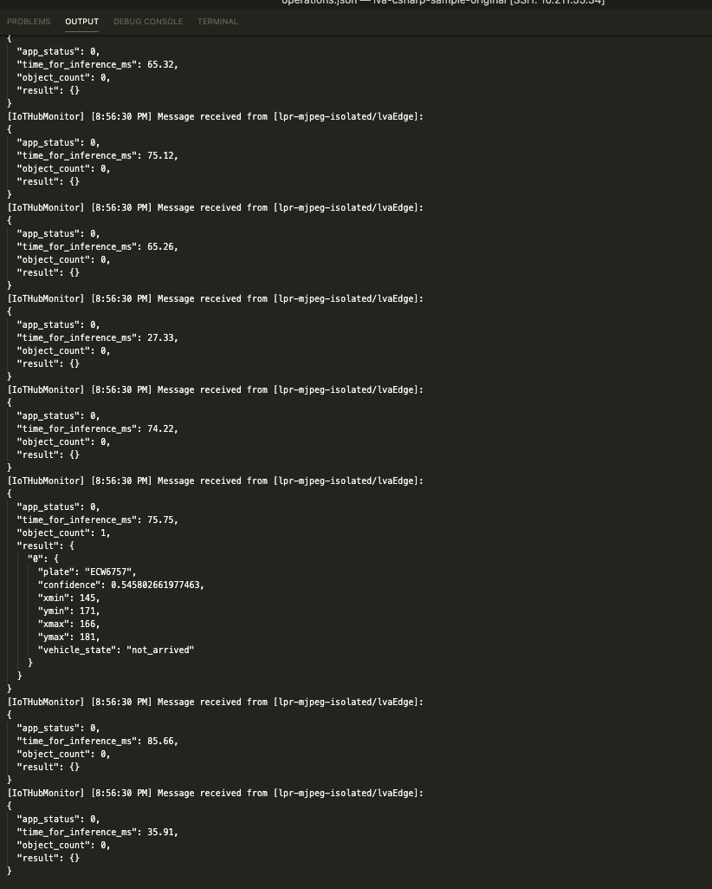
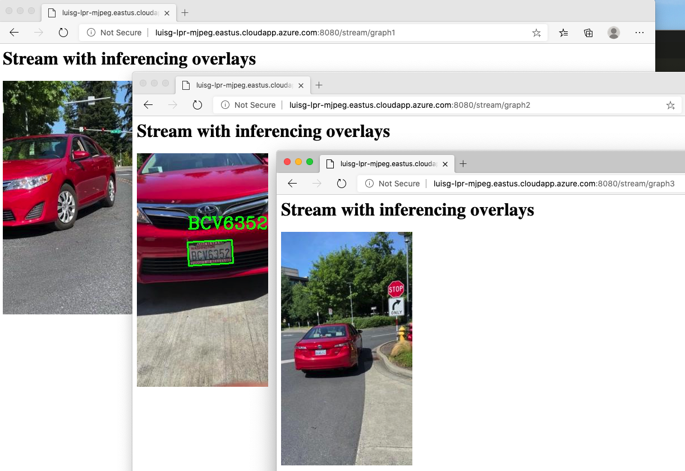

# On Building and Deploying LVA-ALPR
Repo for curbside pick-up demo using ALPR models in Live Video Analytics platform.

## Prerequisites

* An active Azure subscription with these resources deployed in it:
  * a. Resource Group
  * b. IoT Hub
  * c. Storage Account
  * d. Media Services
  * e. Azure container registry
* An [Azure Stack Edge](https://azure.microsoft.com/en-us/products/azure-stack/edge/) Device or a Linux VM (with an NVIDIA GPU with CUDA drivers installed).
* For Azure Stack Edge please [run this scenario](https://docs.microsoft.com/en-us/azure/databox-online/azure-stack-edge-gpu-deploy-sample-module)
* Git: https://git-scm.com/download
* VS Code: https://code.visualstudio.com/Download
* Docker: https://www.docker.com/get-started
* Docker for VS Code Extension: https://marketplace.visualstudio.com/items?itemName=ms-azuretools.vscode-docker
* Azure IoT Tools for VS Code Extension: https://marketplace.visualstudio.com/items?itemName=vsciot-vscode.azure-iot-tools

You can use the [LVA resources setup script](https://github.com/Azure/live-video-analytics/tree/master/edge/setup) to deploy the Azure resources mentioned above.

The script installs a VM acting as an IoT Edge Device. As we're focusing on ASE, we can remove all the extra resources created once the script finishes. **This is an important step to avoid unnecessary costs to apply, so please make sure you do it.** From the resource group, please select all and then delete these types:
* Virtual Machine
* Disk
* Network Securiry Group
* Network Interface
* Bastion
* Public IP Address
* Virtual Network
You can delete the IoT Edge Device thats listed under IoT Edge -> IoT Edge devices on the IoT Hub.

## Architecture



### Design

The solution will ingest video using Live Video Analytics. It will pass frames to a model running on the same edge device.
When a LP is detected, the detection event flows through the associated IoT Hub and is processed by [Time Series Insights](https://azure.microsoft.com/en-us/services/time-series-insights/).

The event will contain:
- the licence plates
- timestamp
- bounding box

[Time Series Insights](https://azure.microsoft.com/en-us/services/time-series-insights/) will aggregate events and update a store when a vehicle is determined to present.
A web app will monitor the store. When a vehicle is present the web app will display an "order" association with the vehicle.

## First steps

- Clone this repo to the development box.

    `git clone https://github.com/Azure-Samples/azure-intelligent-edge-patterns.git`

- `cd` into `Research/Curbside_pickup`

- Within `src/alpr/` create a `.env` file with the following properly replaced. Please fill in all the variables as vscode will use this file to set them where needed.

```
CONTAINER_REGISTRY_USERNAME_myacr="<replace-me>"
CONTAINER_REGISTRY_PASSWORD_myacr="<replace-me>"
SUBSCRIPTION_ID="<replace-me>"
RESOURCE_GROUP="<replace-me>"
AMS_ACCOUNT="<replace-me>"
AAD_TENANT_ID="<replace-me>"
AAD_SERVICE_PRINCIPAL_ID="<replace-me>"
AAD_SERVICE_PRINCIPAL_SECRET="<replace-me>"
INPUT_VIDEO_FOLDER_ON_DEVICE="<replace-me>"
OUTPUT_VIDEO_FOLDER_ON_DEVICE="<replace-me>"
APPDATA_FOLDER_ON_DEVICE="<replace-me>"
```

> If you've created Azure Resources based on the script linked in the [Prerequisites](#prerequisites) section, you can directly copy/paste the contents of `clouddrive/lva-sample/edge-deployment/.env` from one place to the other.

## LPR Image

### Use a prebuilt image
If you want to go straight into action (and save you some precious time in the process), you can use an existing image.

> To do this, you'll need to change the `lpraimodule`'s `image` to: `initmahesh/lpr:1.0` for the deployment template of your choice (VM or ASE based).

### Build your own from source

- Build from `Dockerfile` with new tag from ML solution (`lva_ai_solution`) directory.

> To build the image, use either a Linux box, a Linux container or WSL2 on Windows with Supporting Docker version (see https://code.visualstudio.com/blogs/2019/09/03/wsl2 and https://code.visualstudio.com/blogs/2020/03/02/docker-in-wsl2). As the Dockerfile contains a couple bash .sh calls, it'll fail on Windows. The recommendation is to use a *nix OS for building the image.

    `docker build -t lpr:v.1.1 -f Dockerfile .` (may require `sudo` upfront depending on your setup)

- Tag and Push image to your registry, e.g. (using Azure Container Registry),

    `docker tag lpr:v.1.1 <youracrusername>.azurecr.io/lpr:v.1.1`
    
    `docker push <youracrusername>.azurecr.io/lpr:v1.1`

## Deploying to IoT Edge Device

Depending the operations schema, you may end up using an IoT Edge Device, that sits on a Server (we'll call it VM for short), or into an Azure Stack Edge device (ASE). There're subtle differences into each.

**Be it a VM or ASE, make sure you're reflecting your newly pushed `image:` (under "lpraimodule" in the corresponding Deployment Manifest template).**

### VM based IoT Edge Device
If you're using a [GPU based VM as your IoT Edge Device](docs/runonvm.md), make sure to follow these step.

Template: `src/alpr/deployment.lpr.vm.template.json`

* Make sure folders mapped as Binds, exist on the host VM.
    * input
    * output
    * appdata

    To set these up create a top folder in `/var/iotedgedata` with `mkdir` command. In there add the 3 folders (assuming `cd /var/iotedgedata`):
    `mkdir input`
    `mkdir output`
    `mkdir appdata`

    In your .env file, replace these values with the corresponding ones. For example:

```
INPUT_VIDEO_FOLDER_ON_DEVICE="/var/iotedgedata/input"
OUTPUT_VIDEO_FOLDER_ON_DEVICE="/var/iotedgedata/output"
APPDATA_FOLDER_ON_DEVICE="/var/iotedgedata/appdata"
```

* Then, assign permissions to it and all the subdirectories created (i.e. `chmod -R ug+rw /var/iotedgedata`)

* To deploy the template into target IoT Edge Device, point your Azure IoT Hub to the one where the IoT Edge Device is configured (here's some [help](https://github.com/Microsoft/vscode-azure-iot-toolkit/wiki). Then, follow these steps.
    
    1. Right click on your template (from VS Code) and select "Generate IoT Edge Deployment Manifest"

        
    2. If all goes fine, you'll see a notification. Now click on your template (from VS Code) and select "Generate IoT Edge Deployment Manifest"

        


### ASE based IoT Edge Device
If you're using an Azure Stack Edge (ASE) as your IoT Edge Device, please follow these steps instead)

Template: `src/alpr/deployment.lpr.ase.template.json`

* Make sure your shares are in place for `output`, `input` and `appdata`

    In total, 3 shares are required. 1 Local and 2 Edge ones.
    * Name: inputlocalshare (Local share)
    * Name: outputedgeshare (Edge share)
    * Name: appdataedgeshare (Edge share)
    
    This tutorial shows how to add an Edge Share (Block Blob) and a Local Share (https://docs.microsoft.com/en-us/azure/databox-online/azure-stack-edge-j-series-manage-shares).

    In your .env file, replace these values with the corresponding ones.

```
INPUT_VIDEO_FOLDER_ON_DEVICE="inputlocalshare"
OUTPUT_VIDEO_FOLDER_ON_DEVICE="outputedgeshare"
APPDATA_FOLDER_ON_DEVICE="appdataedgeshare"
```

* To deploy the template into target IoT Edge Device, point your Azure IoT Hub to the one where the IoT Edge Device is configured (here's some [help](https://github.com/Microsoft/vscode-azure-iot-toolkit/wiki). Then, follow these steps.
    
    1. Right click on your template (from VS Code) and select "Generate IoT Edge Deployment Manifest"

        
    2. If all goes fine, you'll see a notification. Now click on your template (from VS Code) and select "Generate IoT Edge Deployment Manifest"

        


## Upload test videos into IoT Edge Device

The videos provided for testing purposes, are the `.mkv` files located at `docs/assets`. We suggest you have a look at these by using VLC or your player of choice (GIVEN ITS CAPABLE OF VLC playback).

### ASE

copy the sample videos into the `Mount` used by the rtspsim. To refresh which one is it, please refer to your .env file and look for the value of `$INPUT_VIDEO_FOLDER_ON_DEVICE`.



To access the shared drive, please follow these steps: https://docs.microsoft.com/en-us/azure/databox-online/azure-stack-edge-j-series-deploy-add-shares

### VM
Ssh into the VM, locate the `input` folder (the specified 'bind' where the simulator will search for the videos), and upload in there the 3 .mkv videos you'll find in `docs/assets`.

> `scp docs/assets/*.mkv user@host:/var/iotedgedata/input`

### How to provide with videos my own videos?
You can supply your own videos. Make sure that when converting, consider a maximum width or height, whatever comes first, of 960 pixels. Also consider that NO AUDIO/CODEC should be selected on your conversion tool of choice. Once cosnverted, you can drop them into your IoT Edge Device input (folder, for a VM. Share, for an ASE). To use them, specify their name into `operations.json` where corresponds (more on this below).

#### To convert your videos before uploading
The simulator requires .MKV videos without audio. We used https://cloudconvert.com/mov-to-mkv online conversion tool with all defaults but Audio and Height (our videos were shot vertically, otherwise we'd changed Width)



## Preparing the sample application

Now that you have run the deployment manifest for your IoT Edge Device, you're ready to see it in action. You can now set a topology and load and initialize some graph instances, based on your camera set (or test videos you want to try).

1. Clone your the Live Video Analytics (LVA) sample app on your preferred stack and open it in Visual Studio Code.

    (Csharp) https://github.com/Azure-Samples/live-video-analytics-iot-edge-csharp

    (Python) https://github.com/Azure-Samples/live-video-analytics-iot-edge-python

2. Navigate to the src/cloud-to-device-app directory and add a file named `lprtopology.json`. Copy this content into it.

```JSON
{
    "@apiVersion": "1.0",
    "name": "InferencingWithHttpExtension",
    "properties": {
        "description": "Analyzing live video using HTTP Extension to send images to an external inference engine",
        "parameters": [
        {
            "name": "rtspUserName",
            "type": "String",
            "description": "rtsp source user name.",
            "default": "testuser"
        },
        {
            "name": "rtspPassword",
            "type": "String",
            "description": "rtsp source password.",
            "default": "testpassword"
        },
        {
            "name": "rtspUrl",
            "type": "String",
            "description": "rtsp Url"
        },
        {
            "name": "inferencingUrl",
            "type": "String",
            "description": "inferencing Url",
            "default": "http://lpraimodule:5001/score"
        },
        {
            "name": "inferencingUserName",
            "type": "String",
            "description": "inferencing endpoint user name.",
            "default": "dummyUserName"
        },
        {
            "name": "inferencingPassword",
            "type": "String",
            "description": "inferencing endpoint password.",
            "default": "dummyPassword"
        },
        {
            "name": "imageEncoding",
            "type": "String",
            "description": "image encoding for frames",
            "default": "jpeg"
        }
        ],
        "sources": [
        {
            "@type": "#Microsoft.Media.MediaGraphRtspSource",
            "name": "rtspSource",
            "transport": "tcp",
            "endpoint": {
            "@type": "#Microsoft.Media.MediaGraphUnsecuredEndpoint",
            "url": "${rtspUrl}",
            "credentials": {
                "@type": "#Microsoft.Media.MediaGraphUsernamePasswordCredentials",
                "username": "${rtspUserName}",
                "password": "${rtspPassword}"
            }
            }
        }
        ],
        "processors": [
        {
            "@type": "#Microsoft.Media.MediaGraphFrameRateFilterProcessor",
            "name": "frameRateFilter",
            "inputs": [
                {
                "nodeName": "rtspSource"
                }
            ],
            "maximumFps":6
        },
        {
            "@type": "#Microsoft.Media.MediaGraphHttpExtension",
            "name": "httpExtension",
            "endpoint": {
            "@type": "#Microsoft.Media.MediaGraphUnsecuredEndpoint",
            "url": "${inferencingUrl}",
            "credentials": {
                "@type": "#Microsoft.Media.MediaGraphUsernamePasswordCredentials",
                "username": "${inferencingUserName}",
                "password": "${inferencingPassword}"
            }
            },
            "image": {
            "scale": {
                "mode": "preserveAspectRatio",
                "width": "416",
                "height": "416"
            },
            "format": {
                "@type": "#Microsoft.Media.MediaGraphImageFormatEncoded",
                "encoding": "${imageEncoding}"
            }
            },
            "inputs": [
            {
                "nodeName": "frameRateFilter"
            }
            ]
        }
        ],
        "sinks": [
        {
            "@type": "#Microsoft.Media.MediaGraphIoTHubMessageSink",
            "name": "hubSink",
            "hubOutputName": "inferenceOutput",
            "inputs": [
            {
                "nodeName": "httpExtension"
            }
            ]
        }
        ]
    }
  }

```

3. In the same directory, look for the `operations.json` file and edit it.

  * Replace line 27 `"topologyUrl": "https://[...]"` for `"topologyFile": "lprtopology.json`

    That block should look like this
```JSON
        {
            "opName": "GraphTopologySet",
            "opParams": {
                "topologyFile": "lprtopology.json"
            }
        },
```
  * In lines 35 and 95, replace the value of `"topologyName"`, from `"MotionDetection"` to `"InferencingWithHttpExtension"`.

4. Getting ready for 3 camera inputs

  * `operations.json` comes with prepared for a single camera, but we'll make it 3. To do that we'll replicate by 3 each of these, renaming where necessary on the graph name.
    * GraphInstanceSet  
    * GraphInstanceActivate
    * GraphInstanceDeactivate
    * GraphInstanceDelete

  * Add a 4th parameter to the `parameters` array to each of the 3 GraphInstanceSet.

```JSON
},
{
    "name": "inferencingUrl",
    "value": "http://lpraimodule:5001/score?stream=[graph-name]"
}
```
    Notice the value url contains a 'stream' parameter to identify it later (at direct streaming time). Provide a unique value for "stream" on each graph instance.

  * Assign a pre-made video to each rtspUrl (GraphInstanceSet)
    
    If you haven't yet, please refer to "Upload test videos into IoT Edge Device", then, come back here.

    Each GraphInstanceSet has a parameter in the parameters array, that defines `"rtspUrl"`. As the sample uses pre-filmed video clips reproduced by the RTSP Simulator, we can instruct each camera to use a different custom video.

```JSON
{
    "name": "rtspUrl",
    "value": "rtsp://rtspsim:554/media/[replace-file-name].mkv"
},
```


    
 **After all the adjustments** here's the resulting `operations.json`.

```JSON
    {
    "apiVersion": "1.0",
    "operations": [
        {
            "opName": "GraphTopologyList",
            "opParams": {}
        },
        {
            "opName": "WaitForInput",
            "opParams": {
                "message": "Press Enter to continue"
            }
        },
        {
            "opName": "GraphInstanceList",
            "opParams": {}
        },
        {
            "opName": "WaitForInput",
            "opParams": {
                "message": "Press Enter to continue"
            }
        },
        {
            "opName": "GraphTopologySet",
            "opParams": {
                "topologyFile": "lprtopology.json"
            }
        },
        {
            "opName": "GraphInstanceSet",
            "opParams": {
                "name": "Sample-Graph-1",
                "properties": {
                    "topologyName": "InferencingWithHttpExtension",
                    "description": "Sample graph description",
                    "parameters": [
                        {
                            "name": "rtspUrl",
                            "value": "rtsp://rtspsim:554/media/in-min-loop.mkv"
                        },
                        {
                            "name": "rtspUserName",
                            "value": "testuser"
                        },
                        {
                            "name": "rtspPassword",
                            "value": "testpassword"
                        },
                        {
                            "name": "inferencingUrl",
                            "value": "http://lpraimodule:5001/score?stream=graph1"
                        }
                    ]
                }
            }
        },
        {
            "opName": "GraphInstanceSet",
            "opParams": {
                "name": "Sample-Graph-2",
                "properties": {
                    "topologyName": "InferencingWithHttpExtension",
                    "description": "Sample graph description",
                    "parameters": [
                        {
                            "name": "rtspUrl",
                            "value": "rtsp://rtspsim:554/media/park-min-loop.mkv"
                        },
                        {
                            "name": "rtspUserName",
                            "value": "testuser"
                        },
                        {
                            "name": "rtspPassword",
                            "value": "testpassword"
                        },
                        {
                            "name": "inferencingUrl",
                            "value": "http://lpraimodule:5001/score?stream=graph2"
                        }
                    ]
                }
            }
        },
        {
            "opName": "GraphInstanceSet",
            "opParams": {
                "name": "Sample-Graph-3",
                "properties": {
                    "topologyName": "InferencingWithHttpExtension",
                    "description": "Sample graph description",
                    "parameters": [
                        {
                            "name": "rtspUrl",
                            "value": "rtsp://rtspsim:554/media/out-min-loop.mkv"
                        },
                        {
                            "name": "rtspUserName",
                            "value": "testuser"
                        },
                        {
                            "name": "rtspPassword",
                            "value": "testpassword"
                        },
                        {
                            "name": "inferencingUrl",
                            "value": "http://lpraimodule:5001/score?stream=graph3"
                        }
                    ]
                }
            }
        },
        {
            "opName": "GraphInstanceActivate",
            "opParams": {
                "name": "Sample-Graph-1"
            }
        },
        {
            "opName": "GraphInstanceActivate",
            "opParams": {
                "name": "Sample-Graph-2"
            }
        },
        {
            "opName": "GraphInstanceActivate",
            "opParams": {
                "name": "Sample-Graph-3"
            }
        },
        {
            "opName": "GraphInstanceList",
            "opParams": {}
        },
        {
            "opName": "WaitForInput",
            "opParams": {
                "message": "The graph instance has been activated. Press Enter to continue and deactivate the graph instance."
            }
        },
        {
            "opName": "GraphInstanceDeactivate",
            "opParams": {
                "name": "Sample-Graph-3"
            }
        },
        {
            "opName": "GraphInstanceDeactivate",
            "opParams": {
                "name": "Sample-Graph-2"
            }
        },
        {
            "opName": "GraphInstanceDeactivate",
            "opParams": {
                "name": "Sample-Graph-1"
            }
        },
        {
            "opName": "GraphInstanceDelete",
            "opParams": {
                "name": "Sample-Graph-3"
            }
        },
        {
            "opName": "GraphInstanceDelete",
            "opParams": {
                "name": "Sample-Graph-2"
            }
        },
        {
            "opName": "GraphInstanceDelete",
            "opParams": {
                "name": "Sample-Graph-1"
            }
        },
        {
            "opName": "GraphInstanceList",
            "opParams": {}
        },
        {
            "opName": "WaitForInput",
            "opParams": {
                "message": "Press Enter to continue"
            }
        },
        {
            "opName": "GraphTopologyDelete",
            "opParams": {
                "name": "InferencingWithHttpExtension"
            }
        },
        {
            "opName": "WaitForInput",
            "opParams": {
                "message": "Press Enter to continue"
            }
        },
        {
            "opName": "GraphTopologyList",
            "opParams": {}
        },
        {
            "opName": "WaitForInput",
            "opParams": {
                "message": "Press Enter to continue"
            }
        }
    ]
}
```

5. Settings

    In the same folder than `operations.json` and `lprtopology.json` create a new file named `appsettings.json` (if already exists, proceed with whats next). Complete these values with the right ones.

```JSON
{
    "IoThubConnectionString" : "<replace-me>",
    "deviceId" : "<replace-me>",
    "moduleId" : "lvaEdge"
}
```
  * The `IoThubConnectionString` you'll find it by right clicking the hellipsis (...) in the VS Code AZURE IOT HUB window, then selecting "Copy IoT Hub Connection String".

  * The `deviceId`, refers to the name of the configured IoT Edge Device. You'll find it listed under "Devices", in VS Code AZURE IOT HUB.

  

## Running & testing

  * Make sure "Cloud to Device - Console App", is selected in the "Run" window.
  * Follow through the steps described in its documentation (https://github.com/Azure-Samples/live-video-analytics-iot-edge-csharp/blob/master/src/cloud-to-device-console-app/readme.md), before running the application.

### Runing and monitoring
Once you're starting the "Cloud to Device - Console App" (F5), start monitoring events from the corresponding event hub.



You can watch the event stream in real time



And you can also view the feeds in real time


### Viewing feeds in Real Time
One of the changes we've done to `operations.json` earlier, was specifying the `?stream=` query parameter for each `inferencingUrl`. With this, we're able to push processed frames into an MJPEG stream we can monitor in real time.

You'll find additional info in https://github.com/Azure/live-video-analytics/tree/master/utilities/video-analysis/yolov3-onnx#view-video-stream-with-inferencing-overlays

**Pay attention to the streaming endpoint URLs.** For cloud based VM, replce the address with your own, or your public IP (making sure port 8080 is allowed for incoming traffic). For ASE, please involve IT, to get the proper address.



## Troubleshooting

* I'm getting bad performance on the test videos I feed to the simulator.

We've seen cases where high quality videos (like those taken with current smartphones). When converting your videos, consider a maximum width or height, whatever comes first, of 960 pixels.

Please report other scenarios.

* Testing videos are failing after transformation.

When converting files, make sure you're getting **no audio** streams.

* When running the sample app, the VM based IoT Edge Device is failing.

Verify your device has a GPU. Here's a way to get an [Azure GPU VM](docs/runonvm.md) with drivers and ready to go. 

---

Please don't hesitate to file an Issue if you are having problems with this sample.


