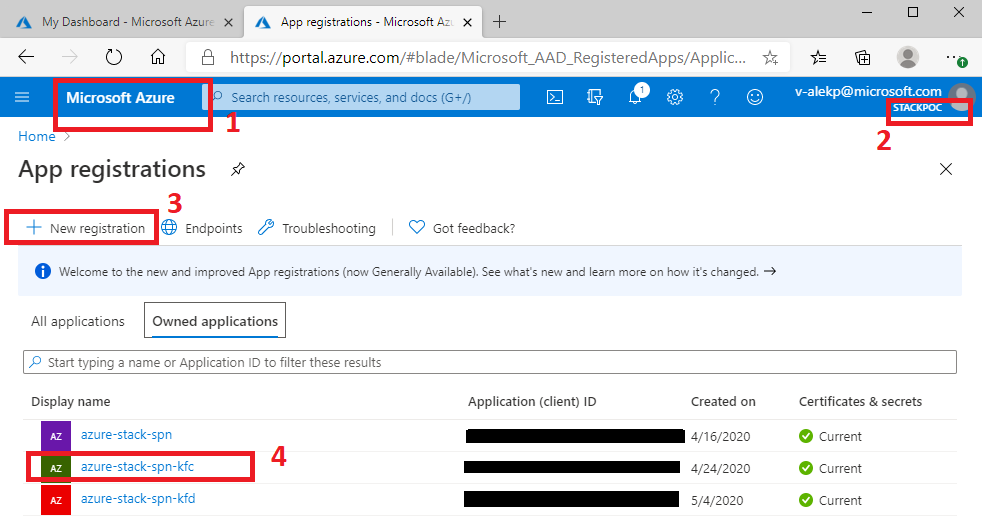
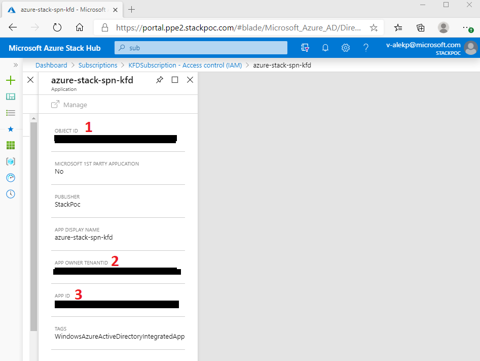

# Acquiring settings

Here is how you could find out your subscription, tenant Id, Service Principal ID, and create a secret On Azure Stack.

Make sure you are on Azure Hub's portal(1), make sure you are on the correct AD (2), this is how to browse to `Subscriptions`
if it is not already pinned on your dashboard.

Select the subscription name you would like to use(or create a new one)

This is how you access Access Control, Click on `Access Control(IAM)`:

You may need to use Azure's Active Directory to create a Service Principal account. Make sure you are in the correct portal, Azure(1), and using correct Active Directory account (2), click on it and click `switch AD account` if needed. Then you will be able to create a new Service Principlal by selecting `New registration`(3). You will see it in the list (4):

Again, button `Add`(2) on this page is not what you need, but once you did the previous step and created the new registration, you see you Service Principal Name in the list(3):

On this screen you can find your `Tenant ID` and `App ID`:

Contact you cloud administrator for more details.

[Back](Readme.md)
