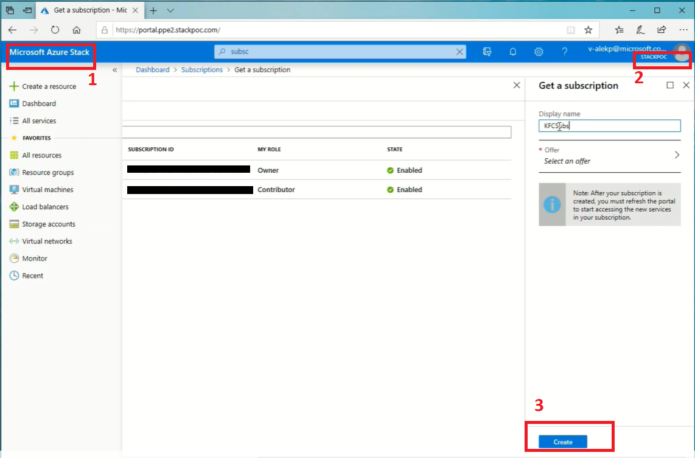
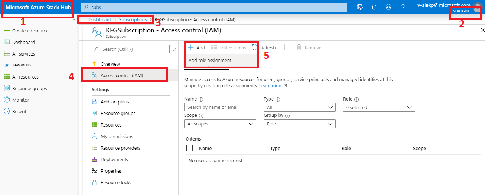

# Creating a subscription

If you have the permissions, you can navigate to `Subscriptions` using
the search bar. Make sure you are on Azure Hub's portal(1), make sure you are on the correct AD (2).
Type in the subscription name you want, and click `Create`(3):

And you should assign the role to the Service Principal you created(see [Creating a Service Principal](creating_service_principal.md)).

[Back](Readme.md)
