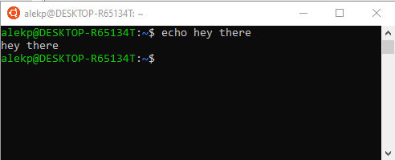
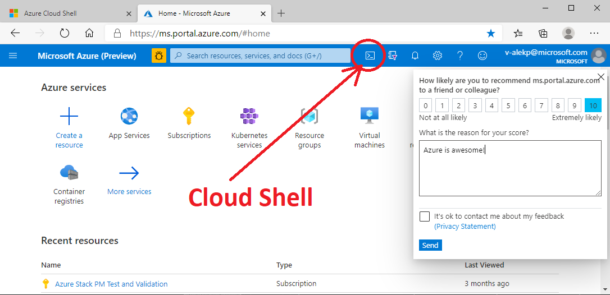
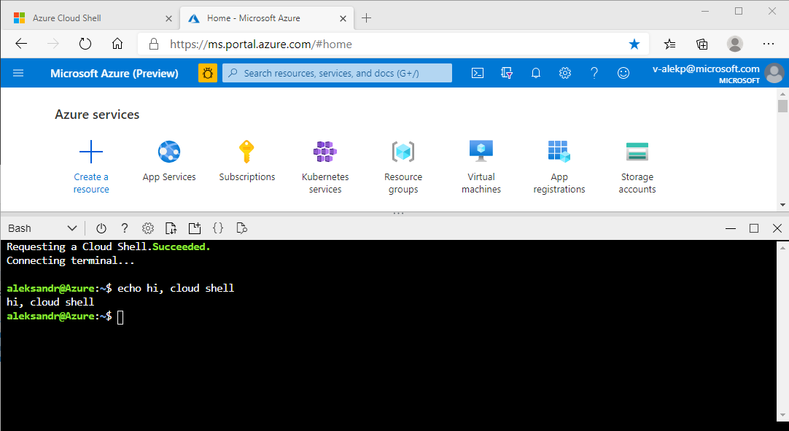
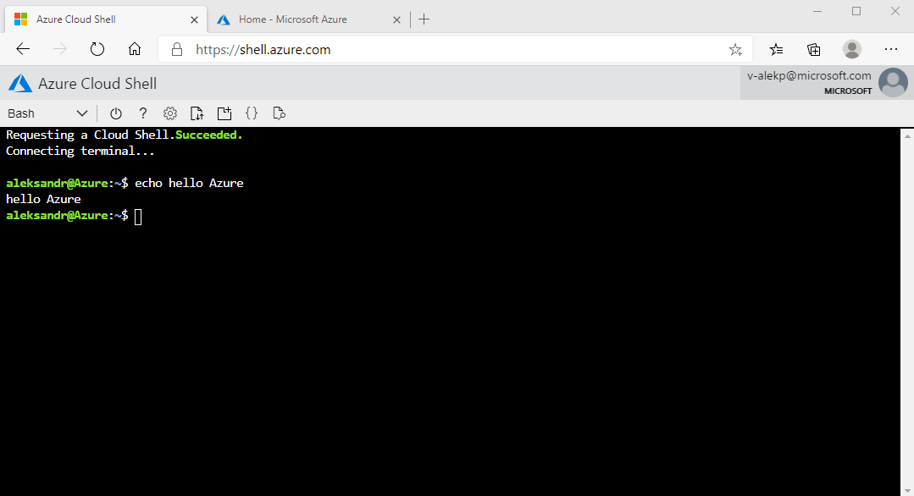

# Recommendations on your development environment

We will be using Microsoft Edge browser, and Ubuntu terminal. Follow these instructions to install Ubuntu on your Windows 10
machine : [https://ubuntu.com/tutorials/ubuntu-on-windows](https://ubuntu.com/tutorials/ubuntu-on-windows)
Pin the shortcut to your task bar for convenience. Try that Ubuntu termianal works, open the app, type a bash command:

Alternatives to it would be VirtualBox or WMVare clients. Or, you can always install Ubuntu directly on your laptop.

You can also use cloud shell. For example, in your Azure Portal:

It will look like so:

You can also go directly to `https://shell.azure.com` URL to open your Azure cloud shell:

Azure Stack does not have a cloud shell, so you could use:

- laptop with Windows 10,
- a "jump" server in your environment. If you do not, we will create one in next few modules.

You will need:

- git (to clone this repository, or your own fork of it)
- web browser
  - to access Azure portals
  - to work with dashboards
  - to lookup updated information
- terminal or a vm.

## Azure Stack Portal and Azure CLI

IMPORTANT: While you might have the premissions to retrieve some information on your
own(see [User Information on Azure](acquiring_settings.md)) or create, but most likely
you will need to ask your cloud administrator. You need the following:

  - The link to your Azure Stack Hub Portal (`https://portal.demo2.stackpoc.com/signin/index/@demo.ondemo.com` in this tutorial)

See additional prerequisites if you are [Installing Kubernetes](installing_kubernetes.md) yourself.

In spirit of infrastracture-as-code paradigm, most of things are better run using command line interface of configuration files.

Clone this repository to use the provided scripts and configuration files. You can do it, for example, using comannd line:

    $ git clone https://github.com/Azure-Samples/azure-intelligent-edge-patterns.git

Then go to the `sbin` directory in Kubeflow section (we will give the description of each of the files
later in this section):

    $ cd Research/kubeflow-on-azure-stack-lab/sbin
    $ ls
    check_status.sh
    clean_evicted.sh
    edit_external_access.sh
    get_kf_board_ip.sh
    get_kubernetes_info.sh
    get_token.sh
    inference.yaml
    kubeflow_install.sh
    kubeflow_uninstall.sh
    persistence.yaml
    start_tb.sh
    tensorboard.yaml

---

[Back](Readme.md)
