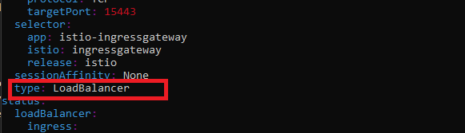

# Installing Kubeflow

The easiest way to install Kubeflow on Azure Stack is to run script `kubeflow_install.sh` from
`sbin` directory. There are other useful scripts, all of which you should be running at
the master node of your Kubernetes cluster:

- kubeflow_install.sh - installs Kubeflow.
- kubeflow_uninstall.sh - uninstalls Kubeflow.
- edit_external_access.sh - runs command to open Kubernetes editor.
- get_kf_board_ip.sh - helps find out the IP address of the Kubeflow dashboard.
- get_kubernetes_info.sh - your Kubernetes infrastructure information.
- get_token.sh - simplifies obtaining a token.
- clean_evicted.sh - kills evicted pods, hopefully you will not need to run this one.
- check_status.sh - to see useful information during installation/uninstallation.

At your Kubernetes master node:

    $ git clone https://github.com/Azure-Samples/azure-intelligent-edge-patterns.git

Make sure you cloned from the right repository and you are on the correct branch.

    $ cd azure-intelligent-edge-patterns/Research/kubeflow-on-azure-stack/sbin

If for some reasons, the scripts are not executable(happens with cross-platform git commits),
update the file permissions:

    $ chmod 755 *.sh

**IMPORTANT:**

**Do NOT stop the script until it finishes. Some Kubernetes errors and warnings are expected
until the system fully functional. After the installer finishes, it takes several minutes
for the containers to create. Kubeflow cluster name, config, and path to kfctl will be
apended to `~/.bashrc` for the `kubeflow_uninstall.sh` to work. You will need to re-login
or run `". ~/.bashrc"` to set the environment variables.**

Run the script:

    $ ./kubeflow_install.sh
    Installing Kubeflow
    Writing logs to "~/kubeflow/install.log"
    ...
    ...
    <a very long process(several minutes), with Kubernetes warnings and errors about the not-yet-created pods>
    ...
    ...
    INFO[0134] Successfully applied application seldon-core-operator  filename="kustomize/kustomize.go:209"
    INFO[0134] Applied the configuration Successfully!       filename="cmd/apply.go:72"
    The installation will take a while, and there will be some time needed to create the pods.
    In a few minutes, check the resources deployed correctly in namespace 'kubeflow'
    kubectl get all -n kubeflow

As we mentioned, if you have done everything correctly, the log will be long and, because
of the nature of Kubernetes, some time is needed for the system to become functional. Even when 
the script ends, you will see something like this, indicating the pods are being created:

For your particular environment, you can modify the definitions in the script, or
pass the parameters in the command line(they overwrite the defaults): 

    --kf_ctl_dir <dir_name>      - where to download and install kfctl
    --kf_name <name>             - name of the Kubeflow cluster
    --kf_username <username>     - user name under which to install Kubeflow
    --kfctl_release_uri <uri>    - kfctl URI
    --kf_dir_base <dir_name>     - the base dir for instances of Kubeflow
    --kf_config_uri <uri>        - config URI of Kubeflow config
    --help              - show help

Feel free to use script `check_status.sh` to monitor the Kubeflow cluster coming up, it
should show you the pods that are being created or terminated. As cluster being created, all pods will
become `Running` and the list will be empty:

    $ ./check_status.sh
    NAMESPACE         NAME                                                           READY   STATUS              RESTARTS   AGE
    istio-system      istio-pilot-677df6b6d4-266mg                                   0/2     ContainerCreating   0          2s
    istio-system      istio-pilot-677df6b6d4-prpzq                                   0/2     Pending             0          2s
    kubeflow          katib-db-manager-54b66f9f9d-7wqms                              0/1     Error               0          71s
    kubeflow          katib-mysql-dcf7dcbd5-tnb7g                                    0/1     ContainerCreating   0          70s
    kubeflow          metadata-db-65fb5b695d-vncwd                                   0/1     ContainerCreating   0          80s
    kubeflow          metadata-grpc-deployment-5c6db9749-jx2tl                       0/1     CrashLoopBackOff    3          80s
    kubeflow          minio-6b67f98977-kltck                                         0/1     ContainerCreating   0          69s
    kubeflow          mysql-85bc64f5c4-9jpfh                                         0/1     ContainerCreating   0          69s
    Press Ctrl-C to stop...
    ^C

When the pods have been created, you can proceed.

To start using Kubeflow, you may want to make Kubeflow Dashboard be visible, so you will need
to change the type of the ingress behavior - from `NodePort` to `LoadBalancer`, using this
command (default editor is vi, to edit you need to press `i`, and to save and exit, `<esc>:wq`):

    $ ./edit_external_access.sh

Or you can patch it like so:

    $ kubectl patch svc/istio-ingressgateway -p '{"spec":{"type": "LoadBalancer"}}' -n istio-system
    service/istio-ingressgateway patched

It will look something like this: 

You can run another script from the sbin directory, `get_kf_board_ip.sh` to get the external
IP when it is ready:

    $ ./get_kf_board_ip.sh
    kubectl get -w -n istio-system svc/istio-ingressgateway
    NAME                   TYPE           CLUSTER-IP   EXTERNAL-IP   PORT          
    istio-ingressgateway   LoadBalancer   10.0.7.257   <pending>     15020:32053/TCP,80:31380/TCP...
    istio-ingressgateway   LoadBalancer   10.0.7.257   88.258.18.69  15020:32053/TCP,80:31380...

So, when it is no longer `<pending>`, it(from the above output, `88.258.18.69`) should be accessible from your browser.

Congratulations, you can now skip to the chapter "Using Dashboard".

### If you choose to do the installation manually. 

The following is done at the master node. If you plan to install Kubeflow clusters often, consider
creating a script with all the commands.

Download the `kfctl` from [Kubeflow releases](https://github.com/kubeflow/kfctl/releases) page.

    $ mkdir kubeflow
    $ cd kubeflow/
    $ wget https://github.com/kubeflow/kfctl/releases/download/v1.0.2/kfctl_v1.0.2-0-ga476281_linux.tar.gz
    ...
    ‘kfctl_v1.0.1-0-gf3edb9b_linux.tar.gz’ saved [31630869/31630869]

    $ tar -xvf kfctl_v1.0.1-0-gf3edb9b_linux.tar.gz

    $ export PATH=$PATH:~/kubeflow/
    $ export KF_NAME=sandboxASkf
    $ export BASE_DIR=/opt/
    $ export KF_DIR=${BASE_DIR}/${KF_NAME}
    $ export CONFIG_URI="https://raw.githubusercontent.com/kubeflow/manifests/v1.0-branch/kfdef/kfctl_k8s_istio.v1.0.2.yaml"
    
Generate and deploy Kubeflow:

    $ sudo mkdir -p ${KF_DIR}
    $ sudo chown azureuser ${KF_DIR}
    $ cd ${KF_DIR}

**IMPORTANT:**

**Do NOT stop this command until it finishes. Some Kubernetes errors and warnings are expected
until the system fully functional. It takes several minutes for the containers to create.**

    $ kfctl apply -V -f ${CONFIG_URI}
    ...
    ...
    <a very long process(several minutes), with Kubernetes warnings and errors about the not-yet-created pods>
    ...
    ...
    INFO[0184] Successfully applied application seldon-core-operator  filename="kustomize/kustomize.go:209"
    INFO[0184] Applied the configuration Successfully!       filename="cmd/apply.go:72"

Check the resources deployed correctly in namespace `kubeflow`. It will take several minutes
for the pods to come up:
  
    $ kubectl get all -n kubeflow

It will show the list of the services and pods for the cluster we just created.

---

[Back](Readme.md)
