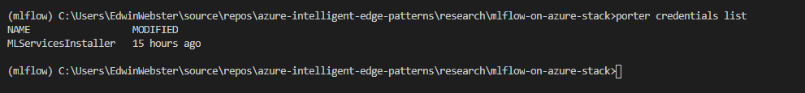

# Kubeflow Installation On Kubernetes using CNAB

This guide demonstrates how to install a Kubeflow on Kubernetes. The instructions below demonstrate how to install using a Cloud Native Application Bundle (CNAB). Please see the document referenced below for manual installation instructions.

**Reference Material:**
- [Manual Installation Instructions](../../installing_kubeflow_manually.md)

**Prerequisite:**
- Will need the k8 cluster ".kubeconfig" file on your local machine to execute commands on the k8 cluster 
- Below instructions are not intended to be run from the master node, but from another Linux dev environment
- Clone the github repo at "/home/user/" path

## Step 1: Install Porter
Make sure you have Porter installed. You can find the installation instructions for your OS at the link provided below.

[Porter Installation Instructions](https://porter.sh/install/)

**NOTE:** be sure to add porter to your PATH so it can find the binaries


## Step 2: Build Porter CNAB
First you will need to navigate to porter directory in the repository. For example 

```sh
cd porter/kubeflow
```

Change the file permissions

```sh
chmod 777 kubeflow.sh
```

Next, you will build the porter CNAB

```sh
porter build
```

## Step 3: Generate Credentials 
This step is needed to connect to your Kubernetes cluster. Enter path to your kubeconfig file when prompted.

```sh
porter credentials generate 
```

Validate that your credential is present by running the below command. You should see something like the below output.
```sh
porter credentials list
```



## Step 4: Use Porter CNAB
Run one of the below commands to interact with the CNAB

To Install (and make sure the pods are up and running):
```sh
porter install --cred KubeflowInstaller
```

To Upgrade (this feature is under development, please uninstall and reinstall instead):
```sh
porter upgrade --cred KubeflowInstaller
```

To Uninstall (and make sure the pods are terminated at the end):
```sh
porter uninstall --cred KubeflowInstaller
```
### Step 5: Check for pods and services
After the installation each of the services gets installed into its own namespace, try below commands to look for pods and services:

```sh
kubectl get pods -n kubeflow
kubectl get svc -n kubeflow
```

What you actually see depends on your system, and because of the nature of Kubernetes, many containers might not exist and run
immediately. Wait until all your containers are created, that is, pass `ContainerCreating` indicator. This is a typical
set of Kubeflow containers, in their own namespace `kubeflow`:

```azureuser@myjump:~$ k get po -n kubeflow
NAME                                                     READY   STATUS     RESTARTS   AGE
admission-webhook-bootstrap-stateful-set-0               1/1     Running    0          9m55s
admission-webhook-deployment-795bb748-twrwj              1/1     Running    0          9m41s
application-controller-stateful-set-0                    1/1     Running    0          13m
argo-ui-657d964995-9rdx5                                 1/1     Running    0          9m41s
cache-deployer-deployment-867cf86c64-qfk98               0/2     Init:0/1   0          9m41s
cache-server-65596854d-6ls2l                             0/2     Init:0/1   0          9m41s
centraldashboard-54c547bd7f-brq8f                        1/1     Running    0          9m41s
jupyter-web-app-deployment-56dc859fdd-9mgrw              1/1     Running    0          9m40s
katib-controller-6fc96fddf8-bdrn7                        1/1     Running    1          9m40s
katib-db-manager-78d458db46-lczq2                        1/1     Running    3          9m40s
katib-mysql-7f9cfccb98-d7nxl                             1/1     Running    0          9m40s
katib-ui-74768457d5-4r2sb                                1/1     Running    0          9m40s
kfserving-controller-manager-0                           2/2     Running    0          9m23s
kubeflow-pipelines-profile-controller-588884d9bb-d2pzl   1/1     Running    0          9m39s
metacontroller-0                                         1/1     Running    0          9m56s
metadata-db-7fc598bbb5-zg5wh                             1/1     Running    0          9m39s
metadata-deployment-7578c6bc46-2sgb2                     1/1     Running    4          9m39s
metadata-envoy-deployment-75df6688bb-xm9tg               1/1     Running    0          9m38s
metadata-grpc-deployment-76d44cfd88-xz8cb                1/1     Running    4          9m38s
metadata-ui-794f6dcc5b-gjpw8                             1/1     Running    0          9m37s
metadata-writer-694c48ccdc-z65wp                         0/2     Init:0/1   0          9m37s
minio-655ddb4d95-kdb7z                                   1/1     Running    0          9m37s
ml-pipeline-5df444d46d-2s74t                             0/2     Init:0/1   0          9m36s
ml-pipeline-persistenceagent-9f5c875d-h7rbp              0/2     Init:0/1   0          9m36s
ml-pipeline-scheduledworkflow-768c4d65d4-ln6kx           0/2     Init:0/1   0          9m35s
ml-pipeline-ui-8589d58598-h4jpb                          0/2     Init:0/1   0          9m35s
ml-pipeline-viewer-crd-5dd6cc5f56-59jwn                  0/2     Init:0/1   0          9m35s
ml-pipeline-visualizationserver-9b67b8b68-8jtdw          0/2     Init:0/1   0          9m35s
mpi-operator-55457d5f54-b9gp4                            1/1     Running    0          9m35s
mxnet-operator-68bf5b4fbc-xgh4j                          1/1     Running    0          9m34s
mysql-56f64cfcc-tv69h                                    0/2     Init:0/1   0          9m34s
notebook-controller-deployment-6f789d748-phdfz           1/1     Running    0          9m34s
profiles-deployment-7c8bf59785-45nmr                     2/2     Running    0          9m34s
pytorch-operator-d449c769b-ffqnn                         1/1     Running    0          9m34s
seldon-controller-manager-68f9f7bff6-tctkf               1/1     Running    0          9m33s
spark-operatorsparkoperator-758795c89b-jls5s             1/1     Running    0          9m55s
spartakus-volunteer-69f5b89c96-vrjw8                     1/1     Running    0          9m23s
tf-job-operator-644f847f5c-4bc4l                         1/1     Running    0          9m33s
workflow-controller-dd8985f4d-vq4d7                      1/1     Running    0          9m33s
```

Here is a typical service list, you will see your own IPs and possibly other items:

```
azureuser@kfkjump:~$ k get svc -A
NAMESPACE         NAME                                           TYPE        CLUSTER-IP     EXTERNAL-IP   PORT(S)                                                                                                                                      AGE
cert-manager      cert-manager                                   ClusterIP   10.0.118.203   <none>        9402/TCP                                                                                                                                     21m
cert-manager      cert-manager-webhook                           ClusterIP   10.0.111.59    <none>        443/TCP                                                                                                                                      20m
default           kubernetes                                     ClusterIP   10.0.0.1       <none>        443/TCP                                                                                                                                      6d20h
default           ml-pipeline-ui-artifact                        ClusterIP   10.0.62.54     <none>        80/TCP                                                                                                                                       15m
default           ml-pipeline-visualizationserver                ClusterIP   10.0.162.174   <none>        8888/TCP                                                                                                                                     15m
istio-system      cluster-local-gateway                          ClusterIP   10.0.28.178    <none>        80/TCP,443/TCP,31400/TCP,15011/TCP,8060/TCP,15029/TCP,15030/TCP,15031/TCP,15032/TCP                                                          21m
istio-system      istio-citadel                                  ClusterIP   10.0.235.197   <none>        8060/TCP,15014/TCP                                                                                                                           21m
istio-system      istio-galley                                   ClusterIP   10.0.49.119    <none>        443/TCP,15014/TCP,9901/TCP                                                                                                                   21m
istio-system      istio-ingressgateway                           NodePort    10.0.6.112     <none>        15020:32463/TCP,80:31380/TCP,443:31390/TCP,31400:31400/TCP,15029:30385/TCP,15030:32636/TCP,15031:30088/TCP,15032:30007/TCP,15443:30465/TCP   21m
istio-system      istio-pilot                                    ClusterIP   10.0.80.196    <none>        15010/TCP,15011/TCP,8080/TCP,15014/TCP                                                                                                       21m
istio-system      istio-policy                                   ClusterIP   10.0.216.66    <none>        9091/TCP,15004/TCP,15014/TCP                                                                                                                 21m
istio-system      istio-sidecar-injector                         ClusterIP   10.0.242.109   <none>        443/TCP,15014/TCP                                                                                                                            21m
istio-system      istio-telemetry                                ClusterIP   10.0.88.219    <none>        9091/TCP,15004/TCP,15014/TCP,42422/TCP                                                                                                       21m
istio-system      prometheus                                     ClusterIP   10.0.113.164   <none>        9090/TCP                                                                                                                                     21m
knative-serving   activator-service                              ClusterIP   10.0.205.241   <none>        80/TCP,81/TCP,9090/TCP                                                                                                                       17m
knative-serving   autoscaler                                     ClusterIP   10.0.169.223   <none>        8080/TCP,9090/TCP,443/TCP                                                                                                                    17m
knative-serving   controller                                     ClusterIP   10.0.202.203   <none>        9090/TCP                                                                                                                                     17m
knative-serving   webhook                                        ClusterIP   10.0.226.70    <none>        443/TCP                                                                                                                                      17m
kube-system       kube-dns                                       ClusterIP   10.0.0.10      <none>        53/UDP,53/TCP,9153/TCP                                                                                                                       6d20h
kube-system       kubernetes-dashboard                           NodePort    10.0.118.156   <none>        443:31071/TCP                                                                                                                                6d20h
kube-system       metrics-server                                 ClusterIP   10.0.52.38     <none>        443/TCP                                                                                                                                      6d20h
kubeflow          admission-webhook-service                      ClusterIP   10.0.101.247   <none>        443/TCP                                                                                                                                      17m
kubeflow          application-controller-service                 ClusterIP   10.0.134.115   <none>        443/TCP                                                                                                                                      21m
kubeflow          argo-ui                                        NodePort    10.0.104.255   <none>        80:31125/TCP                                                                                                                                 17m
kubeflow          cache-server                                   ClusterIP   10.0.50.105    <none>        443/TCP                                                                                                                                      17m
kubeflow          centraldashboard                               ClusterIP   10.0.237.155   <none>        80/TCP                                                                                                                                       17m
kubeflow          jupyter-web-app-service                        ClusterIP   10.0.200.158   <none>        80/TCP                                                                                                                                       17m
kubeflow          katib-controller                               ClusterIP   10.0.205.137   <none>        443/TCP,8080/TCP                                                                                                                             17m
kubeflow          katib-db-manager                               ClusterIP   10.0.41.34     <none>        6789/TCP                                                                                                                                     17m
kubeflow          katib-mysql                                    ClusterIP   10.0.204.209   <none>        3306/TCP                                                                                                                                     17m
kubeflow          katib-ui                                       ClusterIP   10.0.129.194   <none>        80/TCP                                                                                                                                       17m
kubeflow          kfserving-controller-manager-metrics-service   ClusterIP   10.0.252.153   <none>        8443/TCP                                                                                                                                     17m
kubeflow          kfserving-controller-manager-service           ClusterIP   10.0.108.84    <none>        443/TCP                                                                                                                                      17m
kubeflow          kfserving-webhook-server-service               ClusterIP   10.0.81.176    <none>        443/TCP                                                                                                                                      17m
kubeflow          kubeflow-pipelines-profile-controller          ClusterIP   10.0.3.255     <none>        80/TCP                                                                                                                                       17m
kubeflow          metadata-db                                    ClusterIP   10.0.166.181   <none>        3306/TCP                                                                                                                                     17m
kubeflow          metadata-envoy-service                         ClusterIP   10.0.5.55      <none>        9090/TCP                                                                                                                                     17m
kubeflow          metadata-grpc-service                          ClusterIP   10.0.42.240    <none>        8080/TCP                                                                                                                                     17m
kubeflow          metadata-service                               ClusterIP   10.0.203.224   <none>        8080/TCP                                                                                                                                     17m
kubeflow          metadata-ui                                    ClusterIP   10.0.151.3     <none>        80/TCP                                                                                                                                       17m
kubeflow          minio-service                                  ClusterIP   10.0.118.180   <none>        9000/TCP                                                                                                                                     17m
kubeflow          ml-pipeline                                    ClusterIP   10.0.137.169   <none>        8888/TCP,8887/TCP                                                                                                                            17m
kubeflow          ml-pipeline-ui                                 ClusterIP   10.0.130.109   <none>        80/TCP                                                                                                                                       17m
kubeflow          ml-pipeline-visualizationserver                ClusterIP   10.0.77.142    <none>        8888/TCP                                                                                                                                     17m
kubeflow          mysql                                          ClusterIP   10.0.190.195   <none>        3306/TCP                                                                                                                                     17m
kubeflow          notebook-controller-service                    ClusterIP   10.0.48.159    <none>        443/TCP                                                                                                                                      17m
kubeflow          profiles-kfam                                  ClusterIP   10.0.224.199   <none>        8081/TCP                                                                                                                                     17m
kubeflow          pytorch-operator                               ClusterIP   10.0.66.201    <none>        8443/TCP                                                                                                                                     17m
kubeflow          seldon-webhook-service                         ClusterIP   10.0.201.235   <none>        443/TCP                                                                                                                                      17m
kubeflow          tf-job-operator                                ClusterIP   10.0.33.222    <none>        8443/TCP
```

### Step 6: Opening Kubeflow dashboard
To access the dashboard using external connection, replace "type: NodePort" with "type: LoadBalancer" using the patch command:

```sh
$ kubectl patch svc/istio-ingressgateway -p '{"spec":{"type": "LoadBalancer"}}' -n istio-system
service/istio-ingressgateway patched
```
Then the EXTERNAL-IP will become available from:

```sh
$ kubectl get -w -n istio-system svc/istio-ingressgateway
NAME                   TYPE           CLUSTER-IP     EXTERNAL-IP   PORT(S)                          AGE
istio-ingressgateway   LoadBalancer   10.0.123.210   12.34.56.78   15020:30397/TCP,80:31380/TCP,..  7m27s
```


Use external-ip to open it in your browser, and make sure your firewall rules allow HTTP port 80.

You can monitor Kubeflow cluster by looking at the Kubernetes status, you might need to wait to let the pods create containers and start.

For more information see [Installing Kubeflow on Azure](https://www.kubeflow.org/docs/azure/deploy/install-kubeflow/) 

### Step 7: Creating a Notebook Server
Note: you should have MLFlow installed for this step, which can be found here [Installing MLFlow](/Research/mlflow-on-azure-stack/porter/mlflow/Readme.md)

From the Kubeflow dashboard select "Notebook Servers". Pick the namespace you want to create the server under and select "+ New Server".

Enter the desired specs for your server. Make sure the "Custom Image" checkbox is select and input `naedwebs/jupyter-mlflow` in the text field for this option. Click "Launch".
### Step 8: Upload a Notebook

Once your server is running click "Connect". A Jupyter Notebook landing page should load on a new tab. On the right hand side of this page push the "Upload" button and select the MLflow_Tutorial notebook found in the notebooks folder in this repository and hit open. Click the blue "Upload" button that has just appeard. Select the notebook to run it.
