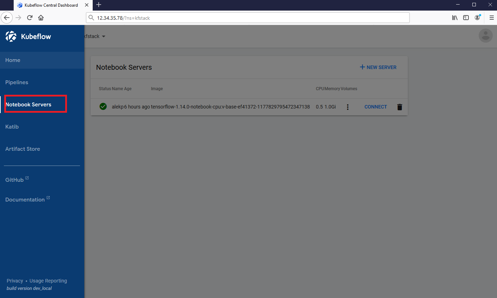
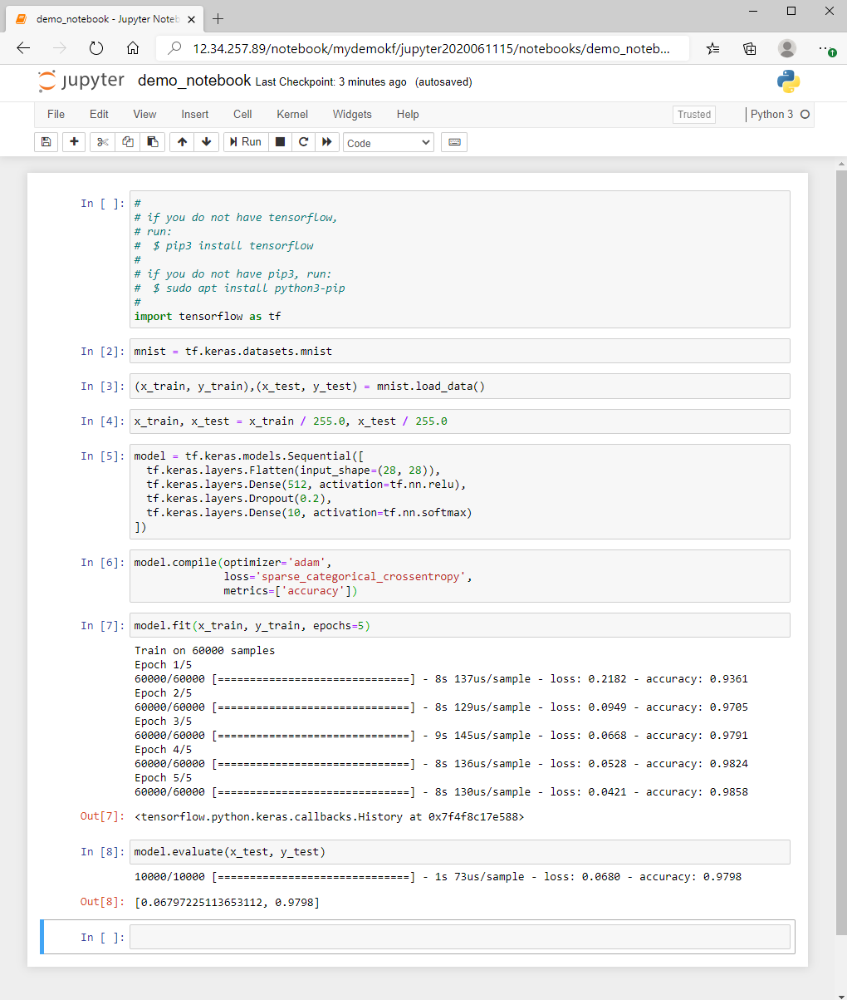

# Jupyter hub

The goal of this lab is:

- Create and use jupyter hub with sample notebook to train and inference on 1 node

# Module 09. Jupyter Servers and Notebooks

## Module 9.0 Creating Jupyter Server

You need to create a namespace to be able to create Jupyter servers. 

## Module 9.1 Jupyter Notebooks

Once you create a server, you can connect to it and upload Python files.

You can click the button `Upload`, and upload the provided `demo_notebook.ipynb`, than click
button `Run` to execute, you should see something like this:

# Module 10. ML with Python

ML/NN and AI more broadly, are mathematical concepts and could be implemented in countless programming languages
and frameworks. In this lab we will use mostly Python, but you are free to pick whatever you are comfortable
with - many of the deployment options are language-agnostic as long as apis are satisfied. 

# Module 13. Tensorboard

# Module 13.0 Tensorboard access

There is another useful tool to monitor some ML applications if
they support it. We provided a sample file to start it in your Kubernetes cluster, `tensorboard.yaml`.
You might contact your cloud administrator to help you establish network access, or you can
use ssh port forwarding to see it via your desktop's `localhost` address and port 6006.

This is how it looks like(run it on the machine where your web browser is):

    $ ssh -NfL 6006:localhost:6006 -i id_rsa_for_kubernetes azureuser@<public_ip_address_or_dns_name>

An alternative would be to create an RDP and XWindows server at the master node and RDP to it.
If you did the ssh port fowarding, you do not need it.

Now you can access the port you forward from your Kubernetes environment:

    $ export PODNAME=$(kubectl get pod -l app=tensorboard -o jsonpath='{.items[0].metadata.name}')
    $ kubectl port-forward ${PODNAME} 6006:6006

# Module 13.1 Tensorboard deployment

Here is how you would connect your Tensorboard with the persistence we discuss next:

    $ cat tb.yaml
    apiVersion: extensions/v1beta1
    kind: Deployment
    metadata:
      labels:
        app: tensorboard
      name: tensorboard
    spec:
      replicas: 1
      selector:
        matchLabels:
          app: tensorboard
      template:
        metadata:
          labels:
            app: tensorboard
        spec:
          volumes:
          - name: samba-share-volume2
            persistentVolumeClaim:
              # claimName: azurefile
              claimName: samba-share-claim
          containers:
          - name: tensorboard
            image: tensorflow/tensorflow:1.10.0
            imagePullPolicy: Always
            command:
             - /usr/local/bin/tensorboard
            args:
            - --logdir
            - /tmp/tensorflow/logs
            volumeMounts:
            - mountPath: /tmp/tensorflow
              #subPath: somedemo55
              name: samba-share-volume2
            ports:
            - containerPort: 6006
              protocol: TCP
          dnsPolicy: ClusterFirst
          restartPolicy: Always

Some of our examples provide data to Tensorboard, see [Working with TensorBoard](working_with_tensorboard.md) for more information.
The simplier PyTorch example we run will log data that looks something like this:

---

[Back to Lab::00](../00-Intro/Readme.md) | [Back to main page](../Readme.md) | [Next to Lab::02](../02-TFJobs/Readme.md)
