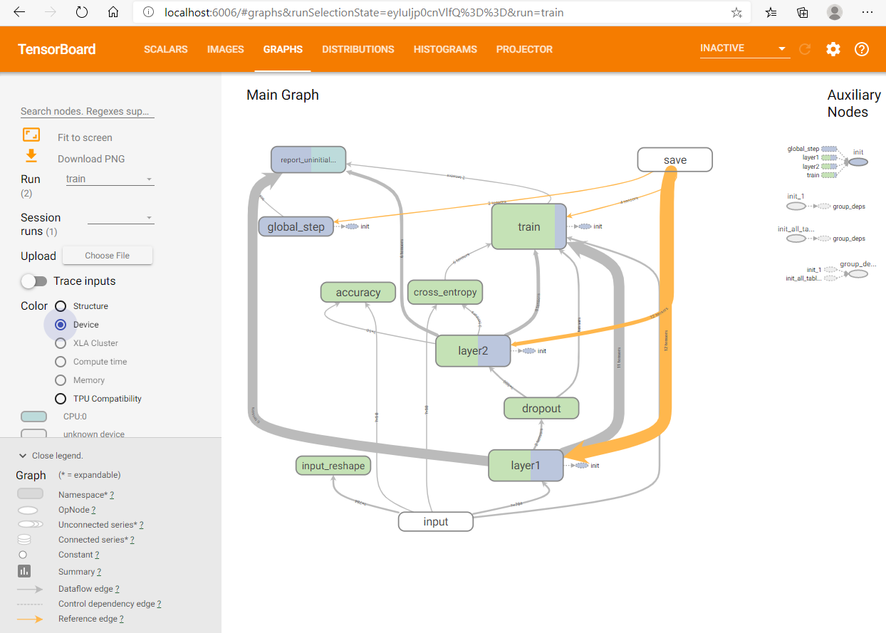

# Working with Tensorboard

Tensorboard is an application that helps visualizing data. It was built to visualize
TensorFlow, but could be used more broadly. For example, in our tutorial we demo
how to use it for TensorFlow and Pytorch.

**Pre-requisite**: You need persistent volume. Follow the steps in [Installing Storage](installing_storage.md) to create a Persistent Volume Claim
that you could use in your Kubernetes deployments.

We could use a generic Tensorboard deplolyment, see `tb_generic.yaml`: 

    $ kubectl create -f tb_generic.yaml

Then as long as your application logs to the same folder that Tensorboard loads from, you will
see the UI. 

You might contact your cloud administrator to help you establish network access, or you can
use ssh port forwarding to see it via your desktop's `localhost` address and port 6006.
This is how it looks like(run it on the machine where your web browser is):

     $ ssh -NfL 6006:localhost:6006 -i id_rsa_for_kubernetes azureuser@<public_ip_address_or_dns_name>

An alternative would be to create an RDP and XWindows server at the master node and RDP to it.
If you did the ssh port fowarding, you do not need it.

Now you can access the port you forward from your Kubernetes environment:

    $ export PODNAME=$(kubectl get pod -l app=tensorboard -o jsonpath='{.items[0].metadata.name}')
    $ kubectl port-forward ${PODNAME} 6006:6006

It will look something like this:

# Links

- https://www.tensorflow.org/tensorboard/

