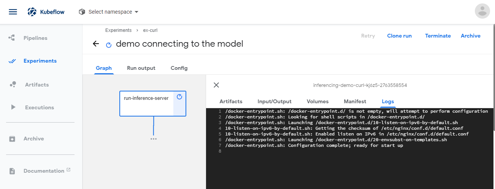

# Pipelines

After a model is created and trained, you have many options of how to use it. You can run inferencing directly
in your script after loading the serialized parameters. Here is how it would look like in one of the
demos we cover, if we de-serialize the `model` and get `data` in the correct format:

    output = model(data)
    pred = output.max(1, keepdim=True)[1]
    print(f"data={data}, predicted={pred}")

it will print the input and output for your inferencing.

A better option would be to create a docker container that functions as an api point to get data and return the results.

You can run the container directly like so, for exmple, forwarding it to your machine's port 5050:

     $ docker run -p 5050:8080 mycontaier_with_model:1.0

Now you can use `curl` or write a simple script to run the inferencing(this is from the MLFlow chapter's example):

    import requests

    predicted_qualities = requests.post('http://localhost:5050/invocations', data=test_x.to_json(orient='split'), headers={'content-type':'application/json; format=pandas-split'})
    parsed_predictions = list(map(float, predicted_qualities.text[1:-1].split(',')))
    (rmse, mae, r2) = eval_metrics(test_y, parsed_predictions)

    print("Elasticnet model (alpha=%f, l1_ratio=%f):" % (alpha, l1_ratio))
    print("  RMSE: %s" % rmse)
    print("  MAE: %s" % mae)
    print("  R2: %s" % r2)

Here is an example of the output:

    Elasticnet model (alpha=0.050000, l1_ratio=0.050000):
      RMSE: 82.16359959591213
      MAE: 69.52472687854122
      R2: -0.02072575078015859

A more scalable way would be to run to these instances in Kubernetes deployment, or a Kubeflow's step.

Here is a draft of a suitable pipeline that would be capable of sanitizing and preparing data, wrap
it into a json if needed, and pass to the model in a container:

    apiVersion: argoproj.io/v1alpha1
    kind: Workflow
    metadata:
      generateName: inferencing-demo-
    spec:
      entrypoint: inferencing-example
      templates:
      - name: inferencing-example
        steps:
        - - name: generate-input
            template: whalesay
        - - name: consume-input
            template: run-model
            arguments:
              artifacts:
              # bind message to the intput-art artifact
              # generated by the generate-input step
              - name: message
                from: "{{steps.generate-input.outputs.artifacts.input-art}}"
    
      - name: whalesay
        container:
          image: docker/whalesay:latest
          command: [sh, -c]
          args: ["echo \"{\\\"x\\\":3.0}\" | tee /tmp/input_request.json"]
        outputs:
          artifacts:
          # generate hello-art artifact from /tmp/input_request.json
          # artifacts can be directories as well as files
          - name: input-art
            path: /tmp/input_request.json
    
      - name: run-model
        inputs:
          artifacts:
          # unpack the message input artifact
          # and put it at /tmp/message
          - name: message
            path: /tmp/message
        container:
          image: alpine:latest
          command: [sh, -c]
          args: ["cat /tmp/message"]

Depending on the application, you may want to communicate with the pipeline via requests to the first
step. Or you can compress it all and have your logic inside of the single container.

    apiVersion: argoproj.io/v1alpha1
    kind: Workflow
    metadata:
      generateName: inferencing-demo-curl-
    spec:
      entrypoint: inferencing-example
      templates:
      - name: inferencing-example
        steps:
        - - name: run-inference-server
            template: run-model
    
      - name: run-model
        container:
          image: nginx:alpine
          ports:
          - containerPort: 80

Now you can see the pod with this service(a place-holder for your model) running if you want:

It is, in the case above, `inferencing-demo-curl-kj6z5-2763558554`.

Another option is to deploy your model as Kubernetes deployment, here is an nginx server you could try:

    apiVersion: apps/v1
    kind: Deployment
    metadata:
      name: my-nginx
      labels:
        app: my-nginx
    spec:
      replicas: 2
      selector:
        matchLabels:
          app: my-nginx
      template:
        metadata:
          labels:
            app: my-nginx
        spec:
          containers:
          - name: my-nginx
            image: nginx:alpine
            ports:
            - containerPort: 80
            resources:
              limits:
                memory: "128Mi" #128 MB
                cpu: "200m" #200 millicpu (.2 cpu or 20% of the cpu)

Now you can increment number of replicas and your service will be automatically scaled.

This is how you can forward the port for this deployment:

    $ kubectl port-forward deployment/my-nginx 7000:80
    Forwarding from 127.0.0.1:7000 -> 80
    Forwarding from [::1]:7000 -> 80
    Handling connection for 7000

And access your server(model containers) using, for example, `curl`:

    $ curl localhost:7000
    <!DOCTYPE html>
    <html>
    <head>
    <title>Welcome to nginx!</title>    
    ...
    </body>
    </html>

Here is an example of how you can connect to the model you trained:

    $ curl --header "Content-Type: application/json" \
                    --request POST \
                    --data '{"X":123,"Y":568}' \
             http://localhost:5050/api/infere
    Elasticnet model (alpha=0.050000, l1_ratio=0.050000):

    RMSE: 82.16359959591213
    MAE: 69.52472687854122
    R2: -0.02072575078015859

In our case, if you built the image from MLFlow section and pushed it to your account,

    $ curl --header "Content-Type: application/json" \
                    --request POST \
                    --data '{"AGE":123,"SEX":1,"BMI":32.1,"BP":101.0}' \
             http://localhost:5050/invocations
    Elasticnet model (alpha=0.050000, l1_ratio=0.050000):

    RMSE: 82.16359959591213
    MAE: 69.52472687854122
    R2: -0.02072575078015859

---

[Back to 04-KFServing](../04-KFServing/Readme.md) | [Back to main page](../Readme.md) | [Next to 06-Katib](../06-Katib/Readme.md)
