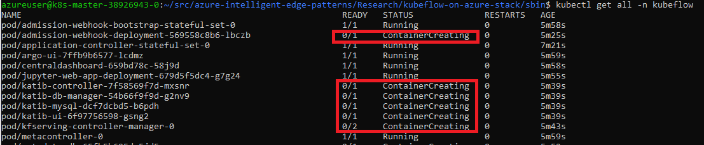
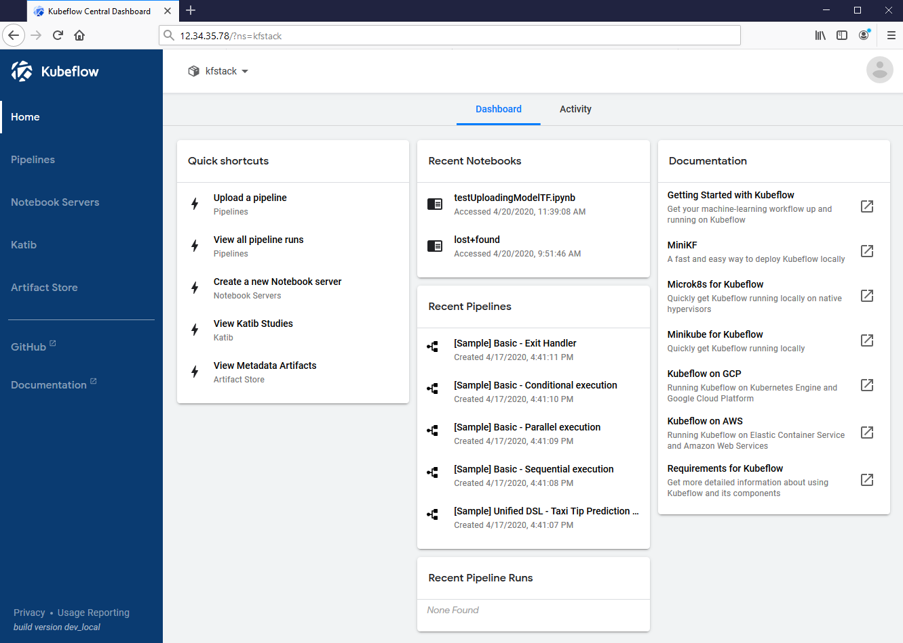
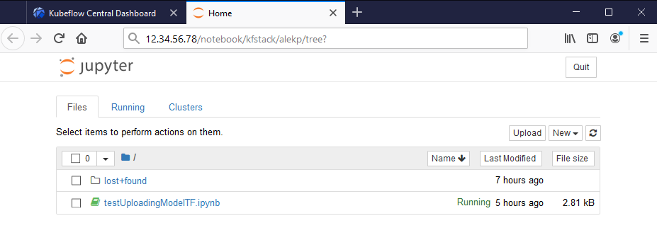

# Kubeflow on Azure Stack

This module demonstrates how to create a Kubeflow cluster on Azure Stack.

Main differences of the detached mode include limitations on:

- Scalability. Can't grow beyond of the hardware on premises.
- Handling of the artifacts(e.g. Docker images).
- How to access software packages(especially third-party).
- How storage is allocated and utilized.

## Prerequisites

The reader is expected to be familiar with the following:

- [Azure](http://azure.com) CLI, and Microsoft Azure subscription covering AKS.
- [Azure Stack Hub](https://azure.microsoft.com/en-us/products/azure-stack/hub/)
- [Kubernetes](https://kubernetes.io/)
- [Kubeflow](https://github.com/kubeflow/kubeflow)
- [Jupyter](https://jupyter.org/).
- [Bash](https://docs.microsoft.com/en-us/azure/cloud-shell/quickstart)

IMPORTANT: While you might have the premissions to retrieve some information on your
own(see [User Information on Azure](acquiring_settings.md)) or create, but most likely
you will need to ask your cloud administrator. You need the following:

  - The link to your Azure Stack Hub Portal (`https://portal.demo2.stackpoc.com/signin/index/@demo.ondemo.com` in this tutorial)

See additional prerequisites if you are [Installing Kubernetes](installing_kubernetes.md) yourself.

## Check the integrity of your Kubernetes cluster

If you already have a Kubernetes cluster you may skip this chapter.

If you do not have a Kubernetes cluster already, follow [Installing Kubernetes](installing_kubernetes.md).

If you did everything correctly, at this point you could ssh to the master node and check
the cluster. You can find master node's public IP address at the Portal(select
subscription `KFDemo2Subscription` and click on the master node):

It would be helpful to record the master ip, and a connecting script containing
something like the following: 

    $ ssh -i ~/.ssh/id_rsa_demokey azureuser@12.345.123.45
    Authorized uses only. All activity may be monitored and reported.
    Welcome to Ubuntu 16.04.6 LTS (GNU/Linux 4.15.0-1061-azure x86_64)
    ...

    azureuser@k8s-master-27515788-0:~$ kubectl cluster-info
    Kubernetes master is running at https://kube-rg3-123456.demoe2.cloudapp.example.com
    CoreDNS is running at https://...
    kubernetes-dashboard is running at https://...
    Metrics-server is running at https://...
    To further debug and diagnose cluster problems, use 'kubectl cluster-info dump'.

    azureuser@k8s-master-27515788-0:~$ kubectl get nodes
    NAME                       STATUS   ROLES    AGE   VERSION
    k8s-linuxpool-27515788-0   Ready    agent    22m   v1.15.5
    k8s-linuxpool-27515788-1   Ready    agent    22m   v1.15.5
    k8s-linuxpool-27515788-2   Ready    agent    22m   v1.15.5
    k8s-master-27515788-0      Ready    master   22m   v1.15.5

## Install Kubeflow

The easiest way to install Kubeflow on Azure Stack is to run script `kubeflow_install.sh` from
`sbin` directory. There are other useful scripts, all of which you should be running at
the master node of your Kubernetes cluster:

- kubeflow_install.sh - installs Kubeflow.
- kubeflow_uninstall.sh - uninstalls Kubeflow.
- get_kf_board_ip.sh - helps find out the IP address of the Kubeflow dashboard.
- get_kubernetes_info.sh - your Kubernetes infrastructure information.
- get_token.sh - simplifies obtaining a token.
- clean_evicted.sh - kills evicted pods, hopefully you will not need to run this one.

At your Kubernetes master node:

    $ git clone https://github.com/Azure-Samples/azure-intelligent-edge-patterns.git
    $ cd azure-intelligent-edge-patterns/Research/kubeflow-on-azure-stack/sbin
    $ ./kubeflow_install.sh
    Installing Kubeflow
    Writing logs to "~/kubeflow/install.log"
    ...
    ...
    INFO[0134] Successfully applied application seldon-core-operator  filename="kustomize/kustomize.go:209"
    INFO[0134] Applied the configuration Successfully!       filename="cmd/apply.go:72"
    The installation will take a while, and there will be some time needed to create the pods.
    In a few minutes, check the resources deployed correctly in namespace 'kubeflow'
    kubectl get all -n kubeflow

If you have done everything correctly, the log will be long and, because of the nature
of Kubernetes, some time is needed for the system to become functional. Even when 
the script ends, you will see something like this, indicating the pods are being created:

For your particular environment, you can modify the definitions in the script, or
pass the parameters in the command line(they overwrite the defaults): 

    --kf_ctl_dir        - where to download and install kfctl
    --kf_name           - name of the Kubeflow cluster
    --kf_username       - user name under which to install Kubeflow
    --kfctl_release_uri - kfctl URI
    --kf_dir_base       - the base dir where you can install multiple instances of Kubeflow
    --kf_config_uri     - config URI of Kubeflow config
    --help              - show help

To start using Kubeflow, you may want to make Kubeflow Dashboard be visible, so you will need
to change the type of the ingress behavior - from `NodePort` to `LoadBalancer`, using this:

    $ kubectl edit -n istio-system svc/istio-ingressgateway

It will look something like this: 

You can run another script from the sbin directory, `get_kf_board_ip.sh` to get the external
IP when it is ready:

    $ get_kf_board_ip.sh
    kubectl get -w -n istio-system svc/istio-ingressgateway
    NAME                   TYPE           CLUSTER-IP   EXTERNAL-IP   PORT          
    istio-ingressgateway   LoadBalancer   10.0.7.257   <pending>     15020:32053/TCP,80:31380/TCP...
    istio-ingressgateway   LoadBalancer   10.0.7.257   88.258.18.69  15020:32053/TCP,80:31380...

So, when it is no longer `<pending>`, it(from the above output, `88.258.18.69`) should be accessible from your browser.

Congratulations, you can now skip to the chapter "Using Kubeflow".

### If you chose to do the installation manually. 

The following is done at the master node. If you plan to install Kubeflow clusters often, consider
creating a script with all the commands.

Download the `kfctl` from [Kubeflow releases](https://github.com/kubeflow/kfctl/releases) page.

    $ mkdir kubeflow
    $ cd kubeflow/
    $ wget https://github.com/kubeflow/kfctl/releases/download/v1.0.2/kfctl_v1.0.2-0-ga476281_linux.tar.gz
    ...
    ‘kfctl_v1.0.1-0-gf3edb9b_linux.tar.gz’ saved [31630869/31630869]

    $ tar -xvf kfctl_v1.0.1-0-gf3edb9b_linux.tar.gz

    $ export PATH=$PATH:~/kubeflow/
    $ export KF_NAME=sandboxASkf
    $ export BASE_DIR=/opt/
    $ export KF_DIR=${BASE_DIR}/${KF_NAME}
    $ export CONFIG_URI="https://raw.githubusercontent.com/kubeflow/manifests/v1.0-branch/kfdef/kfctl_k8s_istio.v1.0.2.yaml"
    
Generate and deploy Kubeflow:

    $ sudo mkdir -p ${KF_DIR}
    $ sudo chown azureuser ${KF_DIR}
    $ cd ${KF_DIR}
    $ kfctl apply -V -f ${CONFIG_URI}
    ...
    INFO[0184] Successfully applied application seldon-core-operator  filename="kustomize/kustomize.go:209"
    INFO[0184] Applied the configuration Successfully!       filename="cmd/apply.go:72"

Check the resources deployed correctly in namespace `kubeflow`
  
    $ kubectl get all -n kubeflow

It will show the list of the services and posd for the cluster we just created.

## Using dashboard

To access the dashboard using external connection, replace `"type: NodePort"` with `"type: LoadBalancer"` using the editor:

    $ kubectl edit -n istio-system svc/istio-ingressgateway
    service/istio-ingressgateway edited

Then the EXTERNAL-IP will become available from:

    $ kubectl get -w -n istio-system svc/istio-ingressgateway
    NAME                   TYPE           CLUSTER-IP     EXTERNAL-IP   PORT(S)                          AGE
    istio-ingressgateway   LoadBalancer   10.0.123.210   12.34.56.78   15020:30397/TCP,80:31380/TCP,..  7m27s

Open it in your browser, and make sure your firewall rules allow HTTP port 80.

You can monitor Kubeflow cluster by looking at the Kubernetes status, you might need to wait to let the pods create containers and start.

For more information see [Installing Kubeflow on Azure](https://www.kubeflow.org/docs/azure/deploy/install-kubeflow/)

## Using Kubeflow

You need to create a namespace to be able to create Jupyter servers. 

Once you create a server, you can connect to it and upload Python files.

## Next Steps

The following resources might help during troubleshooting or modifications:

- https://docs.microsoft.com/en-us/azure/cloud-shell/quickstart
- https://docs.microsoft.com/en-us/azure/aks/gpu-cluster
- https://docs.microsoft.com/en-us/azure-stack/asdk/asdk-install
- https://docs.microsoft.com/en-us/azure-stack/user/azure-stack-kubernetes-aks-engine-deploy-linux
- https://docs.microsoft.com/en-us/azure-stack
- https://docs.microsoft.com/en-us/azure-stack/user/azure-stack-kubernetes-aks-engine-deploy-cluster
