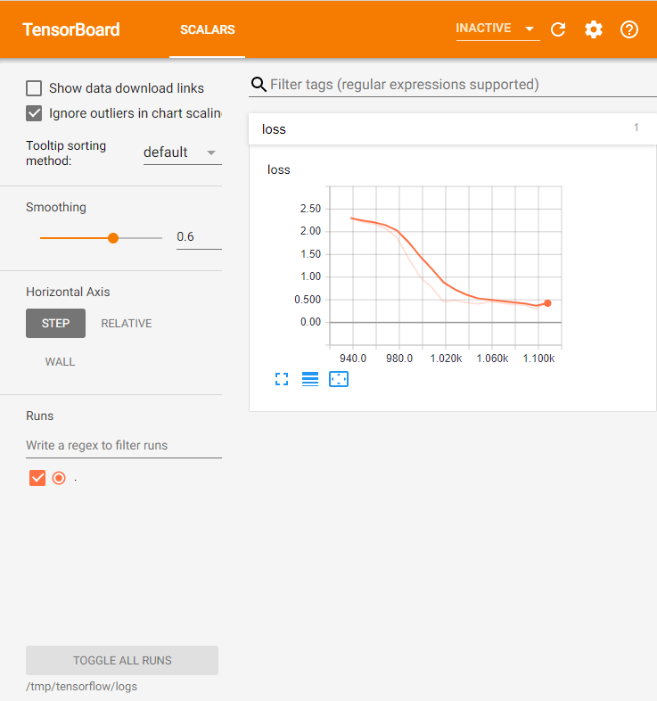

# PyTorch on Kubeflow on Azure Stack

This module demonstrates how to run PyTorch jobs on Kubeflow cluster on Azure Stack.

[PyTorch](https://github.com/pytorch/pytorch) is a popular open source machine learning framework, it has Python and C++ interfaces, primarily developed by Facebook's AI Research Lab. PyTorch is rooted in [Torch library](https://github.com/torch/torch7).

# Prerequisites

Previous familiarity with the following is recommended:

- [Kubernetes](https://kubernetes.io/)
- [Docker](https://www.docker.com/)
- [PyTorch](https://pytorch.org/)
- [Azure](http://azure.com)
- [Kubeflow](https://github.com/kubeflow/kubeflow)

For obvious reasons, distributed training of the models is easier to see if the cluster has more than one node in its pool, and, respectively, at least that amount of the replicas for the worker conterner instances.

**IMPORTANT: for the demo, you will need to have a DockerHub account, replace `rollingstone` with your
own account name in the commands and .yamls below.**

# Installation

Please see the `Kubeflow on Azure Stack` module of this repository, or [https://www.kubeflow.org](https://www.kubeflow.org) for details of using Kubeflow and installing it on Azure or Azure Stack.

`PyTorchJob` is a custom workload, and you should see it among the registered custom resources:

    azureuser@k8s-master-36519982-0:~$ kubectl get crd | grep pytorch
    pytorchjobs.kubeflow.org        2020-05-06T01:30:27Z

It is also recommended, but not necessary, to have Kubernetes Dashboard running on the cluster.

# Preparing the workload

There are numerous samples on Internet, we will run a popular scenario from Kubeflow's repository, 
[Kubernetes Custom Resource and Operator for PyTorch jobs](https://github.com/kubeflow/pytorch-operator/)

There is a suitable verion of the container we could use, `kubeflow/pytorch-dist-mnist-test:1.0`.  
If you would like to build your own, to create a container image for thisPyTorch implementation of
`mnist` test, use the `Dockerfile` provided in `docker` subfolder:

    $ cd Research/kubeflow-on-azure-stack/pytorch-on-kubeflow/docker

Login to your Docker account:

    $ docker login
    ... enter the credentials if needed ...

Build the image (if you use your own Dockerfile pass it with `-f`):

    $ docker build -t rollingstone/pytorch-dist-mnist-test:1.0 .
    ...
    Installing collected packages: protobuf, tensorboardX
    Successfully installed protobuf-3.11.3 tensorboardX-1.6
    Removing intermediate container ec09ff6313fc
     ---> 4b0a54547898
    Step 3/5 : WORKDIR /var
     ---> Running in cf5f07ebafe1
    Removing intermediate container cf5f07ebafe1
     ---> cf29e1d83880
    Step 4/5 : ADD mnist.py /var
     ---> ceb1c0fa86a1
    Step 5/5 : ENTRYPOINT ["python", "/var/mnist.py"]
     ---> Running in 2e1e21b9da40
    Removing intermediate container 2e1e21b9da40
     ---> e994ff422c13
    Successfully built e994ff422c13
    Successfully tagged rollingstones/pytorch-dist-mnist-test:1.0

Push the image to the container repository, `dockerhub.com`, but you are free to use anything else
accessible from your Azure Stack, for example Azure Container Registry:

    $ docker push rollingstone/pytorch-dist-mnist-test:1.0
    The push refers to repository [docker.io/rollingstones/pytorch-dist-mnist-test]
    572ac5ea9881: Pushed
    7fd017433577: Pushed
    030e99c2f82e: Mounted from pytorch/
    ...
    1c09cb49d6f7: Mounted from pytorch/
    31c002c8a6fd: Mounted from pytorch/pytorch
    1.0: digest: sha256:5692389457668900875677888123456 size: 2620

Check that your image is available(at web portal, or by deleting it locally and fetching it).  
Of course, if you do not plan to modify or debug, you can use the pre-built
`kubeflow/pytorch-dist-mnist-test:1.0`, or other alternatives.

# Running distributed training

To keep things simple, let's presume we have a cluster without GPUs. If you do have GPUs, uncomment the line `"#nvidia.com/gpu: 1"` in the .yaml file below. If you do not want to use GPUs, you can add argument `"--no-cuda"` to disable and see how much slower it will work.

    $ cat pytorch_job_mnist_gloo_demo.yaml
    apiVersion: "kubeflow.org/v1"
    kind: "PyTorchJob"
    metadata:
    name: "pytorch-dist-mnist-gloo-demo"
    spec:
    pytorchReplicaSpecs:
        Master:
        replicas: 1
        restartPolicy: OnFailure
        template:
            spec:
            containers:
                - name: pytorch
                image: rollingstone/pytorch-dist-mnist-test:1.0
                args: ["--backend", "gloo"]
                resources:
                    limits:
                    #  nvidia.com/gpu: 1
        Worker:
        replicas: 3
        restartPolicy: OnFailure
        template:
            spec:
            containers:
                - name: pytorch
                image: rollingstone/pytorch-dist-mnist-test:1.0
                args: ["--backend", "gloo"]
                resources:
                    limits:
                    #  nvidia.com/gpu: 1

To run PyTorch job:

    $ kubectl create -f pytorch_job_mnist_gloo_demo.yaml
    pytorchjob.kubeflow.org/pytorch-dist-mnist-gloo-demo created

Shortly after, you should see the pods up-and-running:

    $ kubectl get pods
    NAME                                     READY   STATUS             RESTARTS   AGE
    ...
    pytorch-dist-mnist-gloo-demo-master-0   1/1     Running            0          3m7s
    pytorch-dist-mnist-gloo-demo-worker-0   0/1     PodInitializing    0          3m7s
    pytorch-dist-mnist-gloo-demo-worker-1   0/1     PodInitializing    0          3m7s
    pytorch-dist-mnist-gloo-demo-worker-2   0/1     PodInitializing    0          3m7s
    ...

At standard Kubernetes Dashboard you could see the pods:

To get the information about the running PyTorch workload:

    $ kubectl get pytorchjob
    NAME                             STATE       AGE
    ...
    pytorch-dist-mnist-gloo-demo     Succeeded   17m
    ...
    
To get the details about your particular PyTorch job:

    $ kubectl describe pytorchjob pytorch-dist-mnist-gloo-demo
    Name:         pytorch-dist-mnist-gloo-demo
    Namespace:    default
    Labels:       <none>
    Annotations:  <none>
    API Version:  kubeflow.org/v1
    Kind:         PyTorchJob
    Metadata:
    Creation Timestamp:  2020-05-13T00:02:06Z
    Generation:          1
    Resource Version:    4417243
    Self Link:           /apis/kubeflow.org/v1/namespaces/default/pytorchjobs/pytorch-dist-mnist-gloo-demo
    UID:                 a7617036-0779-49a7-aff0-52314f290bb5
    Spec:
    Pytorch Replica Specs:
        Master:
        Replicas:        1
        Restart Policy:  OnFailure
        Template:
            Spec:
            Containers:
                Args:
                --backend
                gloo
                --no-cuda
                Image:  rollingstone/pytorch-dist-mnist-test:1.0
                Name:   pytorch
                Resources:
                Limits:  <nil>
        Worker:
        Replicas:        3
        Restart Policy:  OnFailure
        Template:
            Spec:
            Containers:
                Args:
                --backend
                gloo
                --no-cuda
                Image:  rollingstone/pytorch-dist-mnist-test:1.0
                Name:   pytorch
                Resources:
                Limits:  <nil>
            Volumes:
                Name:  local-storage
                Persistent Volume Claim:
                Claim Name:  local-storage
    Status:
    Completion Time:  2020-05-13T00:06:32Z
    Conditions:
        Last Transition Time:  2020-05-13T00:02:06Z
        Last Update Time:      2020-05-13T00:02:06Z
        Message:               PyTorchJob pytorch-dist-mnist-gloo-demo is created.
        Reason:                PyTorchJobCreated
        Status:                True
        Type:                  Created
        Last Transition Time:  2020-05-13T00:02:09Z
        Last Update Time:      2020-05-13T00:02:09Z
        Message:               PyTorchJob pytorch-dist-mnist-gloo-demo is running.
        Reason:                PyTorchJobRunning
        Status:                False
        Type:                  Running
        Last Transition Time:  2020-05-13T00:06:32Z
        Last Update Time:      2020-05-13T00:06:32Z
        Message:               PyTorchJob pytorch-dist-mnist-gloo-demo is successfully completed.
        Reason:                PyTorchJobSucceeded
        Status:                True
        Type:                  Succeeded
    Replica Statuses:
        Master:
        Succeeded:  1
        Worker:
        Succeeded:  3
    Start Time:     2020-05-13T00:02:06Z
    Events:
    Type    Reason                   Age   From              Message
    ----    ------                   ----  ----              -------
    Normal  SuccessfulCreatePod      17m   pytorch-operator  Created pod: pytorch-dist-mnist-gloo-demo-master-0
    Normal  SuccessfulCreateService  17m   pytorch-operator  Created service: pytorch-dist-mnist-gloo-demo-master-0
    Normal  SuccessfulCreatePod      17m   pytorch-operator  Created pod: pytorch-dist-mnist-gloo-demo-worker-0
    Normal  SuccessfulCreatePod      17m   pytorch-operator  Created pod: pytorch-dist-mnist-gloo-demo-worker-1
    Normal  SuccessfulCreatePod      17m   pytorch-operator  Created pod: pytorch-dist-mnist-gloo-demo-worker-2
    Normal  PyTorchJobSucceeded      13m   pytorch-operator  PyTorchJob pytorch-dist-mnist-gloo-demo is successfully completed.
    

You can also monitor CPU usage on nodes while your PyTorchJob is running:

Here is a sample of the output:

    $ k logs pytorch-dist-mnist-gloo-demo-worker-2
    WORLD_SIZE is 5
    RANK is 3
    MASTER_ADDR is pytorch-dist-mnist-gloo-demo-master-0
    MASTER_PORT is 23456
    dist.is_available() is True
    device is cpu
    Using distributed PyTorch with gloo backend
    Downloading http://yann.lecun.com/exdb/mnist/train-images-idx3-ubyte.gz
    Downloading http://yann.lecun.com/exdb/mnist/train-labels-idx1-ubyte.gz
    Downloading http://yann.lecun.com/exdb/mnist/t10k-images-idx3-ubyte.gz
    Downloading http://yann.lecun.com/exdb/mnist/t10k-labels-idx1-ubyte.gz
    Processing...
    Done!
    creating a Distributor
    Total epochs: 10
    Train Epoch: 1 [0/60000 (0%)]   loss=2.3000
    Train Epoch: 1 [640/60000 (1%)] loss=2.2135
    Train Epoch: 1 [1280/60000 (2%)]        loss=2.1704
    Train Epoch: 1 [1920/60000 (3%)]        loss=2.0766
    Train Epoch: 1 [2560/60000 (4%)]        loss=1.8679
    ...
    Train Epoch: 1 [58240/60000 (97%)]      loss=0.1922
    Train Epoch: 1 [58880/60000 (98%)]      loss=0.2036
    Train Epoch: 1 [59520/60000 (99%)]      loss=0.0645
    accuracy=0.9666

If you mounted the persistent storage to your cluster as described in [Installing Storage](../installing_storage.md), you can attach it to your `PyTorchJob`(i.e. using provided .yaml):

    $ kubectl create -f pytorch_job_mnist_gloo_demo-with-persistence.yaml
    pytorchjob.kubeflow.org/pytorch-dist-mnist-gloo-demo created

And not you can see the snapshots of your model:

    $ ls /mnt/shares/kfjbuffer/
    data
    mnist_cnn_epoch1.pt
    mnist_cnn_epoch2.pt
    mnist_cnn_epoch3.pt
    mnist_cnn_epoch4.pt
    mnist_cnn_epoch5.pt
    mnist_cnn.pt
    events.out.tfevents.1592502623.pytorch-dist-mnist-gloo-demo2-master-0
    events.out.tfevents.1592502630.pytorch-dist-mnist-gloo-demo2-worker-1
    events.out.tfevents.1592502631.pytorch-dist-mnist-gloo-demo2-worker-0
    events.out.tfevents.1592502632.pytorch-dist-mnist-gloo-demo2-worker-3
    events.out.tfevents.1592502635.pytorch-dist-mnist-gloo-demo2-worker-2
    events.out.tfevents.1592502640.pytorch-dist-mnist-gloo-demo2-master-0
    events.out.tfevents.1592502640.pytorch-dist-mnist-gloo-demo2-worker-0
    events.out.tfevents.1592502640.pytorch-dist-mnist-gloo-demo2-worker-1
    events.out.tfevents.1592502640.pytorch-dist-mnist-gloo-demo2-worker-3
    events.out.tfevents.1592502641.pytorch-dist-mnist-gloo-demo2-worker-2

Look at the logs to see the progress:

    $ kubectl logs pytorch-dist-mnist-gloo-demo2-master-0
    WORLD_SIZE is 5
    RANK is 0
    MASTER_ADDR is localhost
    MASTER_PORT is 23456
    dist.is_available() is True
    device is cpu
    Using distributed PyTorch with gloo backend
    creating a Distributor
    Total epochs: 5
    args.save_model: True
    args.dir: "/tmp/mnist-data"
    Train Epoch: 1 [0/60000 (0%)]   loss=2.3000
    Train Epoch: 1 [640/60000 (1%)] loss=2.2135
    Train Epoch: 1 [1280/60000 (2%)]        loss=2.1704
    ...
    Train Epoch: 5 [58240/60000 (97%)]      loss=0.0068
    Train Epoch: 5 [58880/60000 (98%)]      loss=0.0423
    Train Epoch: 5 [59520/60000 (99%)]      loss=0.0119
    saving model to "/tmp/mnist-data/mnist_cnn_epoch5.pt"...
    accuracy=0.9872
    saving model to 'mnist_cnn.pt'...

And, since in our example we used tensorboardX to write summaries, if you connected the `Tensorboard` logs properly,
you will see your data in the Tensorboard:

See more on PyTorch at [https://github.com/pytorch/pytorch](https://github.com/pytorch/pytorch)

# Links

For more information:

- https://www.kubeflow.org/docs/components/training/pytorch
- https://github.com/kubeflow/pytorch-operator
