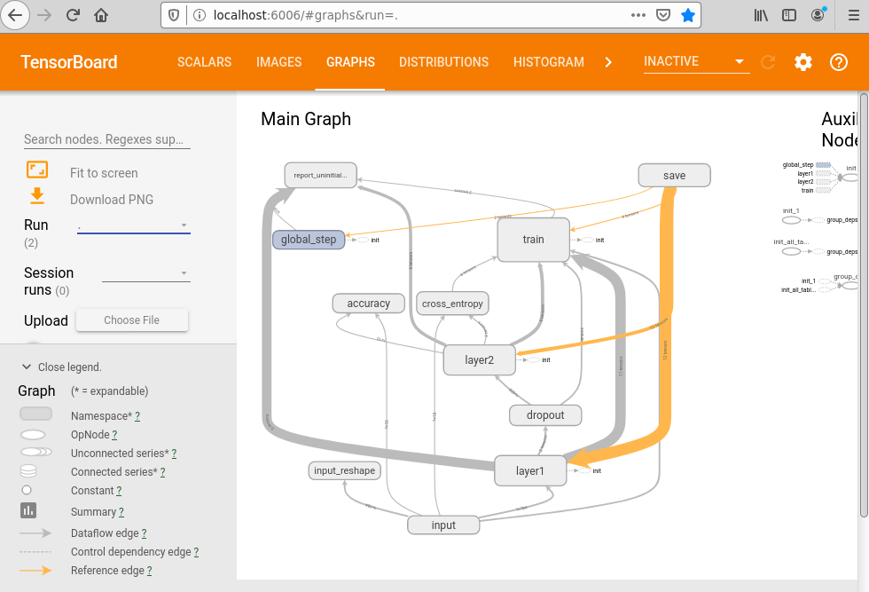
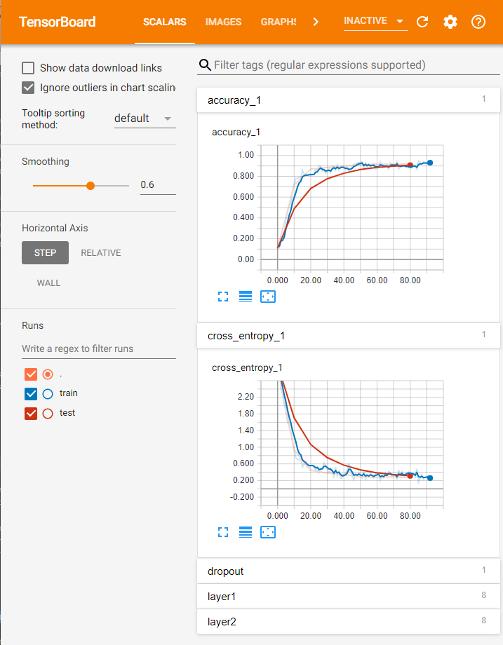

# Tensorflow on Kubeflow on Azure Stack

This module demonstrates how to run TensorFlow jobs on Kubeflow cluster on Azure Stack.

[TensorFlow](https://www.tensorflow.org/) is a popular open source machine learning framework.
It was initially developed by the Google Brain team for internal Google use, and later released under
the Apache License 2.0.

# Prerequisites

Previous familiarity with the following is recommended:

- [Kubernetes](https://kubernetes.io/)
- [Docker](https://www.docker.com/)
- [TensorFlow](https://tensorflow.org/)
- [Azure](http://azure.com)
- [Kubeflow](https://github.com/kubeflow/kubeflow)

For obvious reasons, distributed training of the models is easier to see if the cluster has more than one node in its pool, and, respectively, at least that amount of the replicas for the worker conterner instances.

**IMPORTANT: for the demo, you will need to have a DockerHub account, replace `rollingstone` with your
own account name in the commands and .yamls below.**

# Installation

Please see the `Kubeflow on Azure Stack` module of this repository, or [https://www.kubeflow.org](https://www.kubeflow.org) for details of using Kubeflow and installing it on Azure or Azure Stack.

`TFJob` is a custom workload, and you should see it among the registered custom resources:

    azureuser@k8s-master-36519982-0:~$ kubectl get crd | grep tfjob
    tfjobs.kubeflow.org          2020-05-06T01:30:30Z

It is also recommended, but not necessary, to have Kubernetes Dashboard running on the cluster.

# Building Docker image for distributed mnist model for e2e test

We will run a popular scenario from Kubeflow's repository, 
[K8s Custom Resource and Operator For TensorFlow jobs](https://github.com/kubeflow/tf-operator/)

You do not have to re-build the image, you can use `kubeflow/tf-dist-mnist-test:1.0`. If you do decide to use your own image, here is how you could build it:

    $ cd tensorflow-on-kubeflow/dist-mnist-e2e-test

Login to your Docker account(we use account `"rollingstone"`, but you will need to substitute it for your own
in all commands and .yamls):

    $ docker login
    ... enter the credentials if needed ...

Build the image:

    $ docker build -f Dockerfile -t rollingstone/tf-dist-mnist-test:1.0 ./
    Sending build context to Docker daemon  18.94kB
    Step 1/3 : FROM tensorflow/tensorflow:1.5.0
    1.5.0: Pulling from tensorflow/tensorflow
    1be7f2b886e8: Pull complete
    ...
    7cec7dc064fc: Pull complete     
    Digest: sha256:273cd3c514feb7f93efa3c3e03361969dd3276dbe8267482eb67f5921fb66c0b
    Status: Downloaded newer image for tensorflow/tensorflow:1.5.0
    ---> a2d1671e8a93
    Step 2/3 : ADD . /var/tf_dist_mnist
    ---> 0cb4d841948b
    Step 3/3 : ENTRYPOINT ["python", "/var/tf_dist_mnist/dist_mnist.py"]
    ---> Running in 7defb9c160d7
    Removing intermediate container 7defb9c160d7
    ---> b9fc305fb63a
    Successfully built b9fc305fb63a
    Successfully tagged rollingstone/tf-dist-mnist-test:1.0

And to push to DockerHub or another container registry or artifactory:

    $ docker push rollingstone/tf-dist-mnist-test:1.0
    The push refers to repository [docker.io/rollingstone/tf-dist-mnist-test]
    ce40b6a5f992: Pushed 
    c04a36d9e118: Mounted from tensorflow/tensorflow
    ...
    sha256:af441000275fe99aa463d36a814c1b3b38a7d5de45a131f38d97971119730a6a size: 3038

# Running a TFJob

Create a tf_job_mnist-e2e-test.yaml file, it should look like the one we provided:

    $ cat tf_job_mnist-e2e-test.yaml
    apiVersion: "kubeflow.org/v1"
    kind: "TFJob"
    metadata:
      name: "dist-mnist-for-e2e-test-demo"
    spec:
      tfReplicaSpecs:
        PS:
          replicas: 1
          restartPolicy: OnFailure
          template:
            spec:
              containers:
                - name: tensorflow
                  image: rollingstone/tf-dist-mnist-test:1.0
        Worker:
          replicas: 3
          restartPolicy: OnFailure
          template:
            spec:
            containers:
              - name: tensorflow
                image: rollingstone/tf-dist-mnist-test:1.0

To run a TFJob:

    $ kubectl create -f tf_job_mnist-e2e-test.yaml

You should see the pods being initialized:

    $ kubectl get pods
    NAME                                     READY   STATUS              RESTARTS   AGE
    ...
    dist-mnist-for-e2e-test-demo-ps-0        0/1     ContainerCreating   0          23s
    dist-mnist-for-e2e-test-demo-worker-0    0/1     ContainerCreating   0          23s
    dist-mnist-for-e2e-test-demo-worker-1    0/1     ContainerCreating   0          23s
    dist-mnist-for-e2e-test-demo-worker-2    0/1     ContainerCreating   0          23s

Then pods will be running, and, finally, getting to status `Completed`:

    $ kubeclt get pods
    NAME                                    READY   STATUS             RESTARTS   AGE
    ...
    dist-mnist-for-e2e-test-demo-worker-0     0/1     Completed          0          9m21s
    dist-mnist-for-e2e-test-demo-worker-1     0/1     Completed          0          9m21s
    dist-mnist-for-e2e-test-demo-worker-2     0/1     Completed          0          9m21s

Here is an example of the log on a worker node:

    $ kubectl logs dist-mnist-for-e2e-test-demo-worker-0
    /usr/local/lib/python2.7/dist-packages/h5py/__init__.py:36: FutureWarning: Conversion of the second argument of issubdtype from `float` to `np.floating` is deprecated. In future, it will be treated as `np.float64 == np.dtype(float).type`.
    from ._conv import register_converters as _register_converters
    2020-05-13 19:30:28.384657: I tensorflow/core/platform/cpu_feature_guard.cc:137] Your CPU supports instructions that this TensorFlow binary was not compiled to use: SSE4.1 SSE4.2 AVX AVX2 AVX512F FMA
    2020-05-13 19:30:28.385503: I tensorflow/core/distributed_runtime/rpc/grpc_channel.cc:215] Initialize GrpcChannelCache for job ps -> {0 -> dist-mnist-for-e2e-test-my-ps-0.default.svc:2222}
    2020-05-13 19:30:28.385534: I tensorflow/core/distributed_runtime/rpc/grpc_channel.cc:215] Initialize GrpcChannelCache for job worker -> {0 -> localhost:2222, 1 -> dist-mnist-for-e2e-test-my-worker-1.default.svc:2222, 2 -> dist-mnist-for-e2e-test-my-worker-2.default.svc:2222}
    2020-05-13 19:30:28.386049: I tensorflow/core/distributed_runtime/rpc/grpc_server_lib.cc:324] Started server with target: grpc://localhost:2222
    WARNING:tensorflow:From /var/tf_dist_mnist/dist_mnist.py:239: __init__ (from tensorflow.python.training.supervisor) is deprecated and will be removed in a future version.
    Instructions for updating:
    Please switch to tf.train.MonitoredTrainingSession
    2020-05-13 19:30:37.526195: I tensorflow/core/distributed_runtime/master_session.cc:1017] Start master session 1ddfe25446c51488 with config: device_filters: "/job:ps" device_filters: "/job:worker/task:0" allow_soft_placement: true
    Successfully downloaded train-images-idx3-ubyte.gz 9912422 bytes.
    Extracting /tmp/mnist-data/train-images-idx3-ubyte.gz
    Successfully downloaded train-labels-idx1-ubyte.gz 28881 bytes.
    Extracting /tmp/mnist-data/train-labels-idx1-ubyte.gz
    Successfully downloaded t10k-images-idx3-ubyte.gz 1648877 bytes.
    Extracting /tmp/mnist-data/t10k-images-idx3-ubyte.gz
    Successfully downloaded t10k-labels-idx1-ubyte.gz 4542 bytes.
    Extracting /tmp/mnist-data/t10k-labels-idx1-ubyte.gz
    job name = worker
    task index = 0
    Worker 0: Initializing session...
    Worker 0: Session initialization complete.
    Training begins @ 1589398237.717394
    1589398237.837679: Worker 0: training step 1 done (global step: 0)
    1589398237.849407: Worker 0: training step 2 done (global step: 1)
    1589398237.860992: Worker 0: training step 3 done (global step: 2)
    ...
    1589398297.489717: Worker 0: training step 5745 done (global step: 19996)
    1589398297.505792: Worker 0: training step 5746 done (global step: 19997)
    1589398297.517557: Worker 0: training step 5747 done (global step: 20000)
    Training ends @ 1589398297.517635
    Training elapsed time: 59.800241 s
    After 20000 training step(s), validation cross entropy = 2882.02

What is worth pointing out is that the nodes are being assigned individual indices:

    2020-05-13 19:30:28.385503: I tensorflow/core/distributed_runtime/rpc/grpc_channel.cc:215] Initialize GrpcChannelCache for job ps -> {0 -> dist-mnist-for-e2e-test-my-ps-0.default.svc:2222}
    2020-05-13 19:30:28.385534: I tensorflow/core/distributed_runtime/rpc/grpc_channel.cc:215] Initialize GrpcChannelCache for job worker -> {0 -> localhost:2222, 1 -> dist-mnist-for-e2e-test-my-worker-1.default.svc:2222, 2 -> dist-mnist-for-e2e-test-my-worker-2.default.svc:2222}
    2020-05-13 19:30:28.386049: I tensorflow/core/distributed_runtime/rpc/grpc_server_lib.cc:324] Started server with target: grpc://localhost:2222

# Persistence for models and data

If you would like to save the results of model training, you can do so from you scripts
using the Kubernetes volumes you mount. However, on Azure Stack you do not have `azurefile`
available yet, but there are many other options, e.g. you can use a network storage.

Please follow [Installing Storage](../installing_storage.md) to create `samba-share-claim` we
will be using in our .yaml files. Talk to your Azure Stack administrator to discuss other
available options in your team.

If everything is done correctly, you should be able to see the sc, pvc, and pv on your cluster,
and the common location on your nodes(`/mnt/shares/kfbuffer` in this tutorial).

    $ kubectl get pvc
    NAME                STATUS   VOLUME               CAPACITY   ACCESS MODES   STORAGECLASS    AGE
    samba-share-claim   Bound    samba-share-volume   20Gi       RWX            local-storage   2m24s

    $ kubectl get pv
    NAME                                       CAPACITY   ACCESS MODES   RECLAIM POLICY   STATUS   CLAIM                                   STORAGECLASS    REASON   AGE
    ...
    samba-share-volume                         20Gi       RWX            Retain           Bound    default/samba-share-claim               local-storage            2m41s
    ...

Now, from your script in the container you can write to that folder your serialized models during the intermediate
steps. It is better to let the master node (with rank 0) to do the logging and serialization. And the master node
should do the deserialization if needed.

Your updated .yaml should look something like:

    $ cat tf_job_mnist-e2e-test-with_persistence.yaml
    apiVersion: "kubeflow.org/v1"
    kind: "TFJob"
    metadata:
      name: "dist-mnist-for-e2e-test-demo"
    spec:
      tfReplicaSpecs:
        PS:
          replicas: 1
          restartPolicy: OnFailure
          template:
            spec:
              containers:
              - name: tensorflow
                image: kubeflow/tf-dist-mnist-test:1.0
                volumeMounts:
                - mountPath: "/tmp/mnist-data"
                  name: samba-share-volume2
              volumes:
              - name: samba-share-volume2
                persistentVolumeClaim:
                  claimName: samba-share-claim
        Worker:
          replicas: 3
          restartPolicy: OnFailure
          template:
            spec:
              containers:
              - name: tensorflow
                image: kubeflow/tf-dist-mnist-test:1.0
                volumeMounts:
                - mountPath: "/tmp/mnist-data"
                  name: samba-share-volume2
              volumes:
              - name: samba-share-volume2
                persistentVolumeClaim:
                  claimName: samba-share-claim

For our example, we save the `checkpoint`, model metadata and other information at our shared volume,
a typical run would be:

    $ kubectl create -f tf_job_mnist-e2e-test-with_persistence.yaml

And soon after, you should see the serialized model in your folder:

    $ ls /mnt/shares/kfbuffer/
    checkpoint                                                             model.ckpt-0.meta
    events.out.tfevents.1592351909.dist-mnist-for-e2e-test-demo2-worker-0  t10k-images-idx3-ubyte.gz
    graph.pbtxt                                                            t10k-labels-idx1-ubyte.gz
    model.ckpt-0.data-00000-of-00001                                       train-images-idx3-ubyte.gz
    model.ckpt-0.index                                                     train-labels-idx1-ubyte.gz

For more tutorials and How-Tos, see TensorFlow's [save_and_load.ipynb](https://github.com/tensorflow/docs/blob/master/site/en/tutorials/distribute/save_and_load.ipynb) example notebook.

## Tensorboard

There is another useful tool to monitor some ML applications if they support it. We provided a sample file to start it in your Kubernetes cluster, `tensorboard.yaml`.

A concrete example of a tensorboard-using script is in folder `mnist-w-tb`. You will need your
github account to build the image(substitute `rollingstone` for yours) and run:

    $ cd mnist-w-tb
    $ docker build -t rollingstone/tf-mnist-w-tb:latest .
    $ docker push rollingstone/tf-mnist-w-tb:latest
    $ kubectl create -f tb.yaml
    $ kubectl create -f tfjob.yaml

You might contact your cloud administrator to help you establish network access, or you can
use ssh port forwarding to see it via your desktop's `localhost` address and port 6006.

    $ export PODNAME=$(kubectl get pod -l app=tensorboard -o jsonpath='{.items[0].metadata.name}')
    $ kubectl port-forward ${PODNAME} 6006:6006

It will look something like this:

Another tab shows the input images (train/test):

There are scalars the model logged:

And histograms for different parameters:

There is a projector that animates the points in the NN layer dimensions:

## Next Steps

Proceed to [PyTorch on Kubeflow Tutorial](../pytorch-on-kubeflow/Readme.md) tutorial to learn how to run `PyTorchJob`s.

# Links

For further information:

- https://www.kubeflow.org/docs/components/training/tftraining/
- https://www.tensorflow.org/
- https://github.com/Azure/kubeflow-labs
