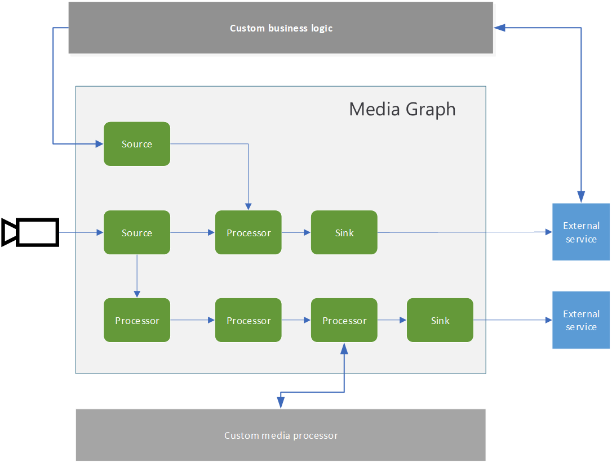

# Media Graph

Media Graph lets you define where media should be captured from, how it should be processed, and where the results should be delivered. A media graph consists of source, processor, and sink nodes. The diagram below provides a graphical representation of a media graph. 

 

  

 

A media graph can have one or more of the following types of nodes:

* **Source nodes** enable capturing of media into the media graph. Media in this context, conceptually, could be an audio stream, a video stream, a data stream, or a stream that has audio, video, and/or data combined together in a single stream.
* **Processor nodes** enable processing of media within the media graph.
* **Sink nodes** enable delivering the processing results to services and apps outside the media graph.

Live Video Analytics enables you to manage Media Graphs via two entities – “Graph Topology” and “Graph Instance”. A graph topology enables you to define a blueprint of a media graph, with parameters as placeholders for values. This topology defines what nodes are used in the media graph, and how they are connected within it. A graph instance enables you to provide values for parameters in a graph topology. The graph instance can then be activated to enable the flow of data.

You can learn more about this in the [media graph](https://docs.microsoft.com/azure/media-services/live-video-analytics-edge/media-graph-concept) concept page.
