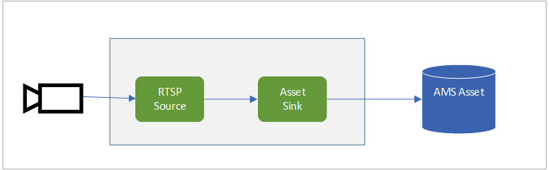

# Continuous video recording to an Azure Media Services Asset

This topology enables you to capture video from an RTSP-capable camera, and continuously record it to an Azure Media Services Asset. You can read more about the continuous video recording scenario in [this](https://docs.microsoft.com/azure/media-services/live-video-analytics-edge/continuous-video-recording-concept.md) documentation page. This topology is also used in [this](https://docs.microsoft.com/azure/media-services/live-video-analytics-edge/continuous-video-recording-tutorial) tutorial.

In the topology, you can see that it uses
* segmentLength of PT0M30S or 30 seconds, which means the edge module waits until at least 30 seconds worth of video has been aggregated before it uploads data to the Asset. Increasing the value of segmentLength has the benefit of further lowering your storage transaction costs. However, it will increase the latency for playback of the video through Azure Media Services.

 

  

 
