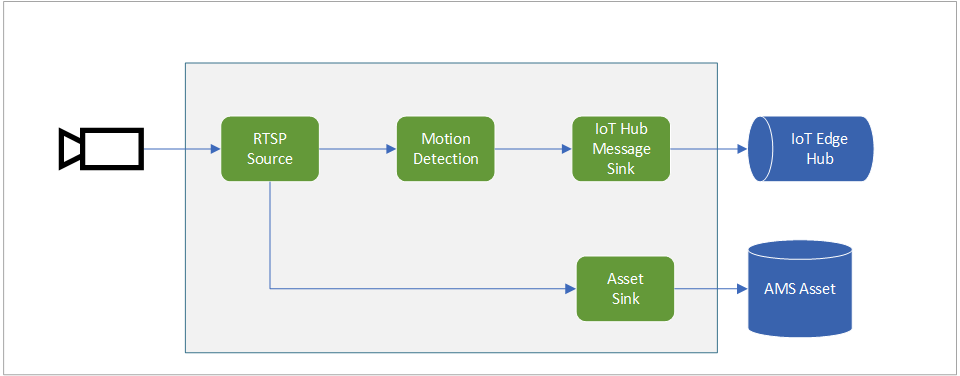

# Continuous video recording with Motion Detection

This topology enables you to continuously record the video to an Azure Media Services Asset. You can read more about the relevant settings in [this](https://github.com/Azure/live-video-analytics/blob/master/MediaGraph/topologies/cvr-asset/readme.md) page.

Additionally, this topology enables you to run motion analysis on a live feed from an RTSP-capable camera. The video is screened for the presence of motion. When motion is detected, relevant inference events are generated and published to the IoT Hub.

 

  

 
