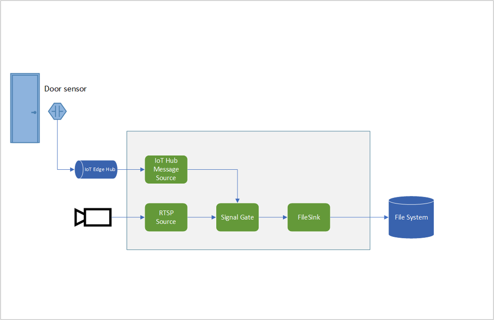

# Event-based recording of video to files based on messages sent via IoT Edge Hub

This topology enables you to record video clips to the local file system of the edge device whenever an external sensor sends a message to the media graph. The diagram below shows a door sensor as an external module, but it could be any sensor or app sending the message.  

Note: This topology is similar to the [topology](../evr-hubMessage-assets/topology.json) where you record video clips only when desired objects are detected. To trigger recording of video with this topology, you will need to send events to the IoT Hub message source node. An option to accomplish this is to deploy another IoT Edge module which generates events. You would then configure message routing in the IoT Edge deployment manifest to send those events from the latter module to the IoT Hub message source node in this topology.

 

  

 
