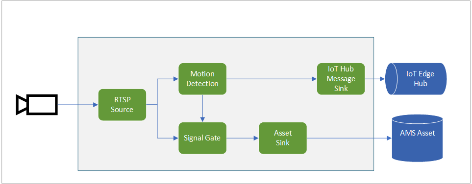

# Event-based video recording to Assets based on motion events

This topology enables you perform event-based recording. The video from an RTSP-capable camera is analyzed for the presence of motion. When motion is detected, those events are published to the IoT Edge Hub. In addition, the motion events are used to trigger the signal gate processor node which will send frames to the asset sink node when motion is present. As a result, new Assets are created containing clips where motion was detected. You can see how this topology is used in [this](https://docs.microsoft.com/azure/media-services/live-video-analytics-edge/detect-motion-record-video-clips-media-services-quickstart) quickstart.

 

  

 
