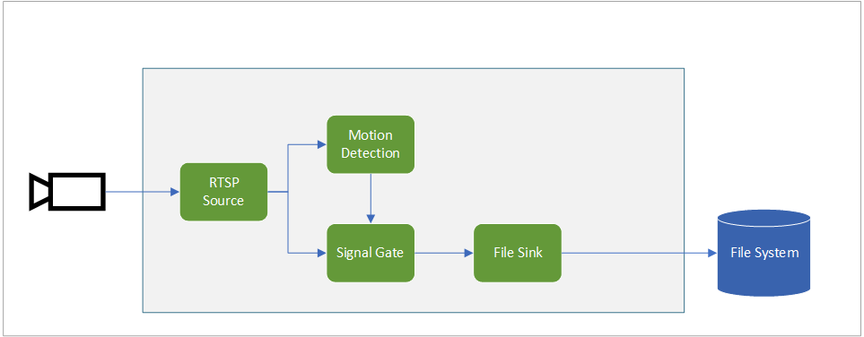

# Event-based video recording to local files based on motion events

This topology enables you perform event-based recording. The video from an RTSP-capable camera is analyzed for the presence of motion. When motion is detected, events are sent to a signal gate processor node which opens, sending frames to a file sink node. As a result, new files (MP4 format) are created on the local file system of the Edge device, containing the frames where motion was detected. You can see how this topology is used in [this](https://docs.microsoft.com/azure/media-services/live-video-analytics-edge/detect-motion-record-video-clips-edge-devices-quickstart) quickstart.

Note: the topology creates new MP4 files each time motion is detected. Over time, this can fill up the local filesystem. You should monitor the contents of the output directory and prune older files as necessary.
 

  

 
