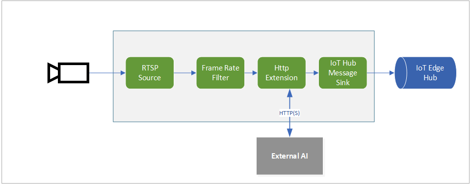

# Analyzing live video using HTTP Extension to send images to an external inference engine.   

This topology enables you to run video analytics on a live feed from an RTSP-capable camera. A subset of the video frames from the camera (as controlled by the frame rate filter processor node) are converted to images, and sent to an external AI inference engine. The results are then published to the IoT Edge Hub. You can see how this topology is used in [this](https://docs.microsoft.com/azure/media-services/live-video-analytics-edge/use-your-model-quickstart) quickstart.

 

  

 
