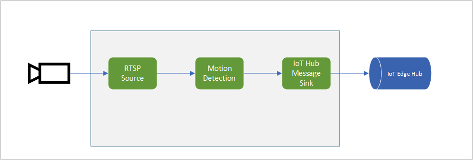

# Analyzing live video to detect motion and emit events

The video from an RTSP-capable camera is analyzed for the presence of motion. When motion is detected, those events are published to the IoT Hub. You can see how this topology is used in [this](https://docs.microsoft.com/azure/media-services/live-video-analytics-edge/get-started-detect-motion-emit-events-quickstart) quickstart.

 

  

 
