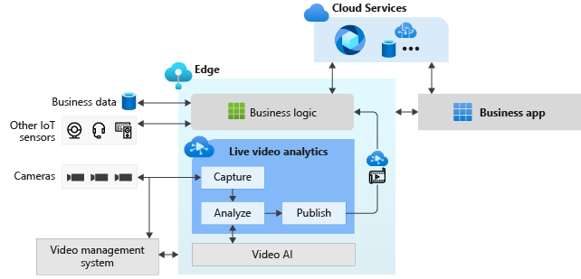

# Live Video Analytics

## Introduction

[Live video analytics](https://azure.microsoft.com/en-us/services/media-services/live-video-analytics/) (LVA) is a new capability of Azure Media Services. LVA provides a platform for you to build intelligent video applications that span the edge and the cloud. The platform offers the capability to capture, record, analyze live video and publish the results (video and/or video analytics) to Azure services (in the cloud and/or the edge). The platform can be used to enhance IoT solutions with video analytics. 

## Live video analytics on IoT Edge

Live video analytics on IoT Edge is an [IoT Edge module](http://docs.microsoft.com/en-us/azure/marketplace/iot-edge-module). It offers functionality that can be combined with other Azure edge modules such as Stream Analytics on IoT Edge, Cognitive Services on IoT Edge as well as Azure services in the cloud such as Media Services, Event Hub, Cognitive Services, etc. to build powerful hybrid (i.e. edge + cloud) applications. Live video analytics on IoT Edge is designed to be a pluggable platform, enabling you to plug video analysis edge modules (e.g. Cognitive services containers, custom edge modules built by you with open source machine learning models or custom models trained with your own data) and use them to analyze live video without worrying about the complexity of building and running a live video pipeline.

With Live video analytics on IoT Edge, you can continue to use your CCTV cameras with your existing video management systems (VMS) and build video analytics apps independently. Live video analytics on IoT Edge can be used in conjunction with existing computer vision SDKs and toolkits to build cutting edge hardware accelerated live video analytics enabled IoT solutions. The diagram below illustrates this.

 

  

 

## This repo

This repository is a starting point to learn about and engage in LVA open source projects.This repository is not an official LVA product support location, however, we will respond to issues filed here as best we can.
To start implementing one of the samples go to [Jupyter Notebook Samples](utilities/video-analysis/notebooks/readme.md)

## Contributing

This project welcomes contributions and suggestions. Most contributions require you to agree to a Contributor License Agreement (CLA) declaring that you have the right to, and actually do, grant us the rights to use your contribution. For details, visit https://cla.opensource.microsoft.com.

When you submit a pull request, a CLA bot will automatically determine whether you need to provide a CLA and decorate the PR appropriately (e.g., status check, comment). Simply follow the instructions provided by the bot. You will only need to do this once across all repos using our CLA.

To find opportunities for contributions, please search for "Contributions needed" section in Readme.md of any folder.

## License

This repository is licensed with the [MIT license](https://github.com/Azure/live-video-analytics/blob/master/LICENSE).

## Microsoft Open Source Code of Conduct

This project has adopted the [Microsoft Open Source Code of Conduct](https://opensource.microsoft.com/codeofconduct/).

Resources:

- [Microsoft Open Source Code of Conduct](https://opensource.microsoft.com/codeofconduct/)
- [Microsoft Code of Conduct FAQ](https://opensource.microsoft.com/codeofconduct/faq/)
- Contact [opencode@microsoft.com](mailto:opencode@microsoft.com) with questions or concerns
