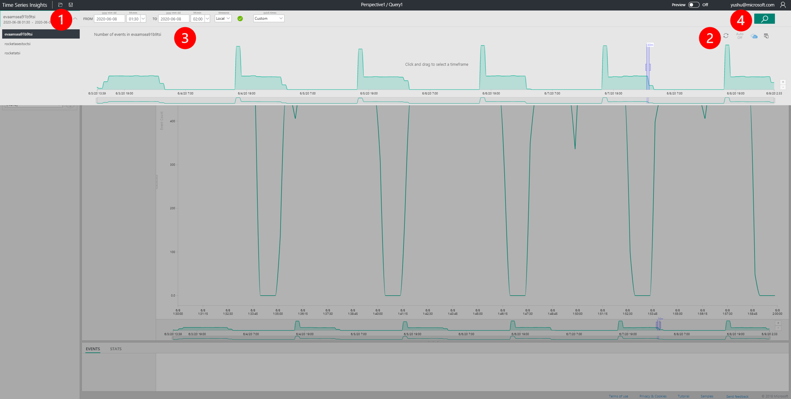

# Output Format & Interpretations

LVA sends decoded frames as binary data to Rocket using HTTP POST at a prespecified frame rate `frameRate`. Counting results from Rocket are serialized as a JSON object, and sent back to LVA as response of the corresponding POST request. 

## Local image output
You can view the output images inside `/lvarocket/output` on the edge device. Results from different modules are sent to different directories (e.g., `output_bgsline` for background subtraction-based detector) whereas `output_all` has images from all modules. Name of each file consists of frame ID, module name, and confidence score. Below are few sample results from running pipeline `1` on `sample.mkv`. You should also see results printed in [OUTPUT in VS Code](#monitoring-iot-edge-module-to-iot-hub-message-flow) during running.   
  
The above illustration shows that at frame 720, background subtraction detected an object, tiny YOLO DNN confirmed it was a car with a confidence of 0.69, which is below the pre-defined threshold of 0.8. Hence, heavy YOLOv3 was called and a car was confirmed with a confidence of 0.81. 
  
In another example, at frame 4073, tiny YOLO detected a car with confidence score of 0.94. Hence the heavy model was not invoked. 
  
Finally, at frame 2131, background subtraction detected a moving object but tiny YOLO model found it does not belong to the class of interest (i.e., car). Hence, heavy model was not called and counts remained the same. 


## Output data format
Sample Rocket counting and detection results in JSON are shown below.

### Sample Rocket counting result
```json
{
  "inferences": [
    {
      "other": {
        "count": 2, //number of lines defined in line configuration file
        "inferenceTime": 11.6495 //processing time of the frame
      },
      "subtype": "statistics",
      "type": "other"
    },
    {
      "event": {
        "name": "Left-entrance", //name of the line defined in line configuration file
        "properties": {
          "accumulated": 0, //accumulated counts
          "count": 0 //counts from the current frame
        }
      },
      "subtype": "lineCounting",
      "type": "event"
    },
    {
      "event": {
        "name": "Right-exit",
        "properties": {
          "accumulated": 0,
          "count": 0
        }
      },
      "subtype": "lineCounting",
      "type": "event"
    }
  ]
}
```

### Sample Rocket detection result
```json
{
    "inferences": [
        {
            "other": {
                "count": 3, //number of objects detected in the frame
                "inferenceTime": 375.0266 //processing time of the frame
            },
            "subtype": "statistics",
            "type": "other"
        },
        {
            "entity": {
                "box": {
                    "h": 0.5625,
                    "l": 0.2109375,
                    "t": 0.203125,
                    "w": 0.5221354166666666
                },
                "tag": {
                    "confidence": 0.9932199120521545,
                    "value": "bicycle"
                }
            },
            "type": "entity"
        },
        {
            "entity": {
                "box": {
                    "h": 0.14583333333333334,
                    "l": 0.6171875,
                    "t": 0.14756944444444445,
                    "w": 0.27734375
                },
                "tag": {
                    "confidence": 0.913067102432251,
                    "value": "truck"
                }
            },
            "type": "entity"
        }
    ]
}
```

## Monitoring the output of the LVA edge module
In the sample media graph topology, we define the pipeline to send video analytics inference result (json payload) to IoT Hub Sink. Below we show two ways to examine the output. 

### Monitoring IoT Edge Module to IoT Hub Message flow
In VSCode, under "AZURE IOT HUB" panel (shown in the below screenshot):
* Right click on the device name
* "Start Monitoring Built-In Event Endpoint"  
  
* You will see the message flow with inference results and the video chunk logs that are sent to Cloud AMS service


### Monitoring the output using Azure Time Series Insights
We can also monitor messages and visualize the data with Azure Time Series Insights (ATSI) service.  

1) From the portal, create an ATSI service https://portal.azure.com (Details on how to create and more: https://docs.microsoft.com/en-us/azure/time-series-insights/)

2) Give a name and set related fields in ATSI Create window. Finally click on the "Next: Event Source" button (see 3 on the image below)  
  

3) Fill in the form by defining an event source and selecting an existing IoT Hub (which you created before). Fill the rest of the fields and finally click create.  
  

4) Click the link to open the explorer UI:  
  

Based on above [JSON inference output](#output-data-format), we can filter out counts based on lines, and visualize a specific time range. Below are two examples.

1) Initial ATSI window. Select time range to monitor events (1: refresh chart, 2: select time 3: apply and search time range).  
  

2) View the analytic module's output, json messages in a table format.  
  
  

3) Split and visualize the results by detection lines.   
  
