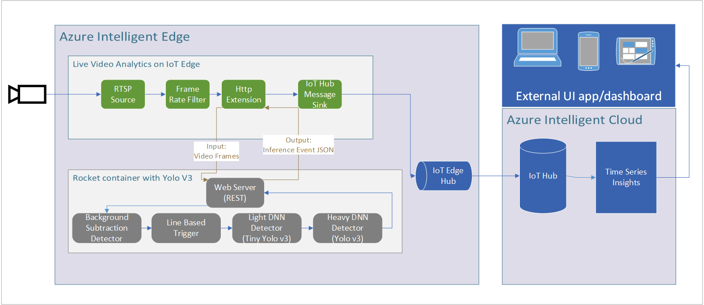
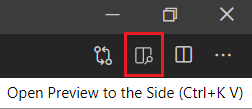

# Live Video Analytics with Microsoft Rocket

[Live video analytics on IoT Edge (LVA)](https://azure.microsoft.com/en-us/services/media-services/live-video-analytics/) is a new capability of Azure Media Services. LVA provides a platform for you to build intelligent video applications that span the edge and the cloud. The platform offers the capability to capture, record, analyze live video and publish the results (video and/or video analytics) to Azure services (in the cloud and/or the edge). The platform can be used to enhance IoT solutions with video analytics.

[Microsoft Rocket](https://aka.ms/rocket) is  highly extensible software stack to empower everyone to build practical real-world live video analytics applications for object detection & object counting (e.g., cars driving through an intersection), and alerting on objects of interest (e.g., when a customer enters a store). Rocket supports (and has been tested) in many real-world use cases including [directional traffic volumes on live videos from traffic intersections](https://bellevuewa.gov/sites/default/files/media/pdf_document/2020/Video%20Analytics%20Towards%20Vision%20Zero-Traffic%20Video%20Analytics-12262019.pdf), monitoring parking lot occupancies, and counting passengers entering & exiting train stations. Rocket platform’s features are summarized inside :memo:[Rocket-features-and-pipelines.pdf](https://aka.ms/Microsoft-Rocket-LVA-features-and-pipelines.pdf).

We provide a reference architecture with instructions to build and deploy a live video analytics application using [LVA](https://azuremarketplace.microsoft.com/en/marketplace/apps/azure-media-services.live-video-analytics-edge?tab=Overview), [Azure IoT Hub](https://azure.microsoft.com/en-us/services/iot-hub/), and [Microsoft Rocket](https://aka.ms/rocket). While the instructions enable the deployment of pre-built Rocket container, we also provide the steps to checkout the Rocket code, modify the solution, and build your own custom Rocket container.

## Included vision modules and DNNs

This reference application sample includes: 
1)	Rocket docker container with OpenCV vision modules as well as the YOLOv3 DNN pre-trained with the [MS-COCO classes](https://gist.github.com/AruniRC/7b3dadd004da04c80198557db5da4bda). It supports GPU execution.
2)	Sample Jupyter notebook code to use the Rocket docker container with LVA.
3)	Graph topology and IoT Edge deployment manifest template to orchestrate the live video analytics pipeline. 

## Architecture Diagram

Below is the general architecture of the video analytics pipeline used in this sample. LVA provides the infrastructure to ingest, decode and relay video frames to the Microsoft Rocket container, which in turn uses its cascaded video pipeline for analytics. The results are shipped back to LVA and sent to services and applications in Azure.

## Supported Cameras

All cameras that use RTSP streaming for their live videos are supported by this reference application. To analyze stored video files, please check out this [sample project](https://github.com/Azure/live-video-analytics/tree/master/utilities/rtspsim-live555) for instructions on simulating a RTSP stream from a video file, and deploying it as an edge module into your container registry. You can analyze your video file by pointing this reference application to the simulated RTSP stream of the video file.

## Running LVA & Rocket Sample on Jupyter Notebooks

### Terminology
Throughout the samples, we refer to three different terms. Here are descriptions for each of them for future reference:

<ol type="a">
  <li>Development PC: the machine you are currently using to run this sample.</li>
  <li>IoT Edge Device: another machine (be it a virtual machine or a computationally light powered mini PC) used to run LVA on the Edge. This IoT Edge device must be installed with a Debian-based Unix system with x64/AMD64 architecture. ARM processors are not supported yet.  </li>
  <li>Azure Cloud Services: cloud-based services run on Azure datacenters (e.g., Azure Media Services, Azure Storage).  </li>
</ol>

Per your preference, your development PC and your IoT Edge device can be the same machine (i.e., developing, debugging, and deploying this sample all on the same IoT Edge device).

### Pre-requisites (~15 minutes)

1. Install the [requirements for running LVA on Jupyter](../../utilities/video-analysis/notebooks/common/requirements.md) on your development PC.

2. After installing all of the requirements, [clone](https://code.visualstudio.com/Docs/editor/versioncontrol#_cloning-a-repository) [this repository](/../../) locally into your development PC and open the repository with VSCode. 

3. Locate this Readme page in your local repository and it may be easier to continue reading the following sections in VSCode. You can preview Markdown (`.md`) pages by pressing `Ctrl+Shift+V` to open a full-screen window or by clicking the preview button on the top toolbar in VSCode.   
   
    

### Getting Started (~30 minutes)

1. On VSCode, [set up the environment](../../utilities/video-analysis/notebooks/common/setup_environment.ipynb) so that we can test and deploy LVA.
   >[!NOTE]
   >Jupyter notebooks (`.ipynb`) may take several seconds to render in VSCode, and possibly more than 30 seconds on GitHub.

2. Create the required [Azure services.](../../utilities/video-analysis/notebooks/common/create_azure_services.ipynb)

3. You will need a development PC and also an IoT Edge device to run LVA and Rocket container. If you don't have a physical IoT Edge device, you can [create an Azure virtual machine and configure it properly.](../../utilities/video-analysis/notebooks/common/create_azure_vm.ipynb)
    > [!NOTE]
    > If you want to run the following sections, you must create a GPU accelerated VM such as the Standard_NC6 VM, which has an NVidia GPU.

4. Please [install the appropriate drivers and IoT Edge Runtime](../../utilities/video-analysis/notebooks/common/install_iotedge_runtime_gpu.md) on the Azure VM. 

### Run LVA & Rocket on an IoT Edge Device (~25 minutes)

1. **Optional:** [Build your own customized Rocket Docker image.](./notebooks/build_rocket_image.ipynb) You can also choose to deploy a pre-built Rocket image with LVA and skip this step. The pre-built image is used by default in Step 3 below.

2. For this sample, you are going to utilize Rocket’s ability to count and alert when objects cross lines of interest in a frame. A sample line configuration file is provided for the [sample video file](https://aka.ms/lva-rocket-videosample) at your convenience. However, to learn more about configuring your own lines of interest, please read this [section.](./notebooks/line_configuration.md)

3. Follow this [section](./notebooks/deploy_to_iot_edge_device.ipynb) to deploy LVA & Rocket to your IoT Edge Device.  

### Monitor and Interpret the Output (~20 minutes)

1. Read and follow the [final section](./notebooks/output_format_and_interpretations.md) to learn how to monitor and interpret the output from LVA & Rocket. 

### Tested Specifications 
| Setup | Development PC                                                   | IoT Edge Device             | Testing Status |
|-------|------------------------------------------------------------------|-----------------------------|----------------|
| 1     | Physical PC - OS: Ubuntu 18.04 - Python 3.6.9, Pip 3             | Azure VM - OS: Ubuntu 18.04 | Passed         |
| 2     | Azure VM - OS: Ubuntu 18.04 - Python 3.6.9, Pip 3                | Azure VM - OS: Ubuntu 18.04 | Passed         |
| 3     | Physical PC - OS: MacOS 15 - Python 3.6.9, Pip 3                 | Azure VM - OS: Ubuntu 18.04 | Passed         |

## Information links

•	Microsoft Rocket webpage – http://aka.ms/rocket  
•	Microsoft Research blog – https://www.microsoft.com/en-us/research/blog/project-rocket-platform-designed-for-easy-customizable-live-video-analytics-is-open-source/  
•	Webinar on Microsoft Rocket – https://note.microsoft.com/MSR-Webinar-Microsoft-Rocket-Registration-Live.html

## Contents

| Folders              | Description                                       |
|----------------------|---------------------------------------------------|
| notebooks			   | Collection of Jupyter notebooks				   |
| csharp 			   | Collection of utilities written in C#			   |									

