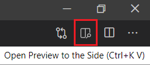

# LVA YoloV3 iCPU ONNX Sample on Jupyter Notebooks 
The following instructions will enable you to run a [YoloV3](http://pjreddie.com/darknet/yolo/) [ONNX](http://onnx.ai/) model on Live Video Analytics (LVA) using Jupyter notebooks. This sample is specific for Intel® CPU accelerated IoT Edge devices. 

## Prerequisites
1. Install the [requirements for running LVA on Jupyter](../../../common/requirements.md) on your development PC.
2. After installing all of the requirements, [clone](https://code.visualstudio.com/Docs/editor/versioncontrol#_cloning-a-repository) the [LVA repository](/../../) locally into your development PC and open the repository with VSCode. 
3. Locate this Readme page in your local repository and continue reading the following sections on VSCode. You can preview Markdown (`.md`) pages by pressing `Ctrl+Shift+V` to open a full-screen window or by clicking the preview button on the top toolbar in VSCode.  
   
    
    

   > [!NOTE]
   > For pictures to render on VSCode, you must have the entire [live-video-analytics](/../..) folder open in your VSCode workspace.
   
   >  [!IMPORTANT]   
   > Going forward, we will be using VSCode to run this sample. Please navigate to VSCode to continue.
   
## Getting Started
1. In VSCode, [set up the environment](../../../common/setup_environment.ipynb) so that we can test and deploy LVA.
   >[!NOTE]
   >Jupyter notebooks (`.ipynb`) may take several seconds to render in VSCode.
2. Create the required [Azure services](../../../common/create_azure_services.ipynb).
3. You will need an IoT Edge device to deploy the LVA and this sample generated containers. If you don't have a physical IoT Edge device, you can create an [Azure virtual machine](../../../common/create_azure_vm.ipynb).

    >  [!IMPORTANT]   
    > If you want to run the following sections, you must create a CPU accelerated VM such as the Standard_DS3_v2 VM, which has an Intel® CPU.

<!--
    Change the following steps based on specific instructions.
-->

## Install Drivers for IoT Edge Device
1. If your VM has an Intel® CPU, [install](../../../common/install_iotedge_runtime_cpu.md) IoT Edge runtime and the required tools for your VM. 

## Build a Docker Image of the Inference Server
The following sections will explain how to build a Docker container image of an inference server solution that uses AI logic (i.e., YoloV3 for object detection) on a CPU accelerated IoT Edge Device.
1. Create a [YoloV3 inference engine](create_yolov3_icpu_inference_engine.ipynb). The inference engine wrapper will retrieve image data, analyze it, and return the analysis as output.
2. Create a [local Docker image](create_yolov3_icpu_container_image.ipynb) to containerize the ML solution. The ML solution consists of a web application and an inference server.
3. Finally, [update the deployment manifest template file](create_yolov3_icpu_deployment_manifest.ipynb) with a custom template based on this sample. Notice that there is a pre-built deployment manifest template named [deployment.lva_common.template.json](../../../common/deployment.lva_common.template.json), which will be used to generate a new template with specific parameters for this sample.

## Deploy Your Docker Image
The image below summarizes the deployment scheme of LVA. As the image indicates, LVA can utilize containers hosted on the Internet, on a local network, or even on a local machine.

  

The following sections will explain how to deploy your Docker image and run media graphs on LVA. 

1. Upload the [container image](../../../common/upload_container_image_to_acr.ipynb) to Azure Container Registry (ACR).
2. Once the image has been uploaded onto ACR, you can now [deploy the inference server](../../../common/deploy_iotedge_modules.ipynb) to an IoT Edge device using a deployment manifest. 

## Deploy Media Graphs and Test LVA
1. To run inferences, [deploy media graphs](../../../common/deploy_media_graph.ipynb) to trigger the inference server.
2. Once the media graphs are deployed, [monitor the output](../../../common/monitor_output.md) of the inference server and test to see if it works as desired.
3. Finally, [deactivate and delete](../../../common/delete_media_graph.ipynb) the media graphs to stop the inferences.
