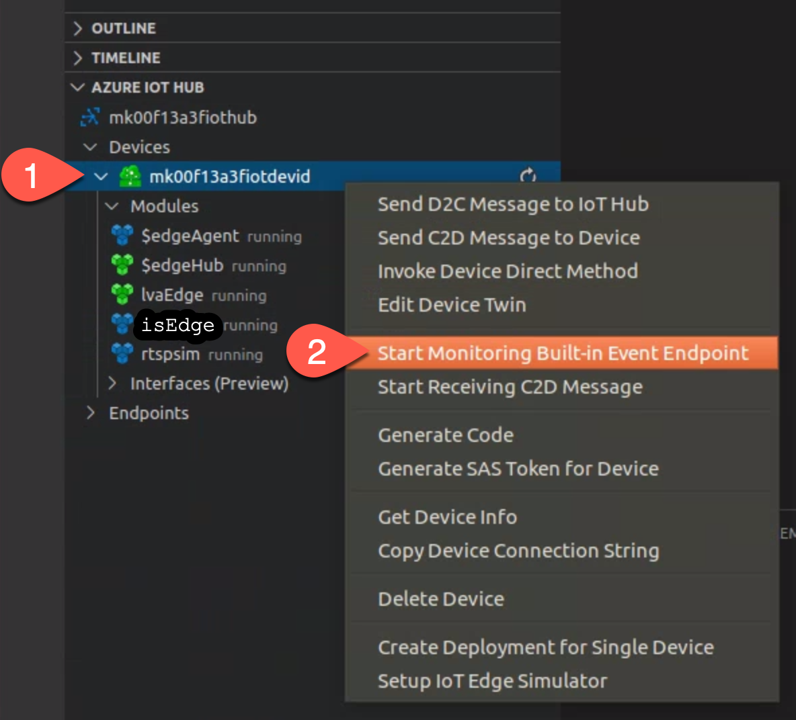
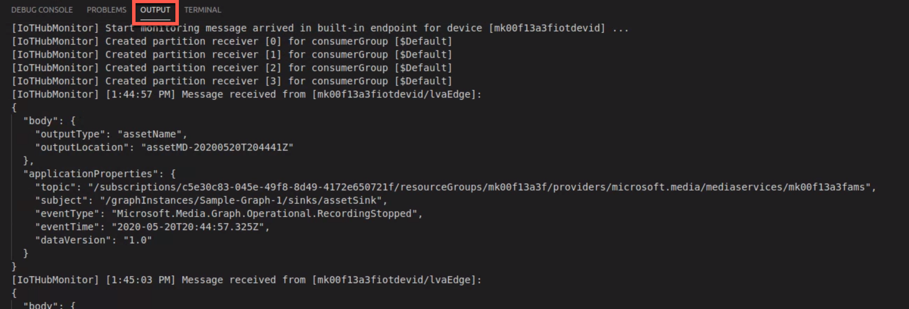
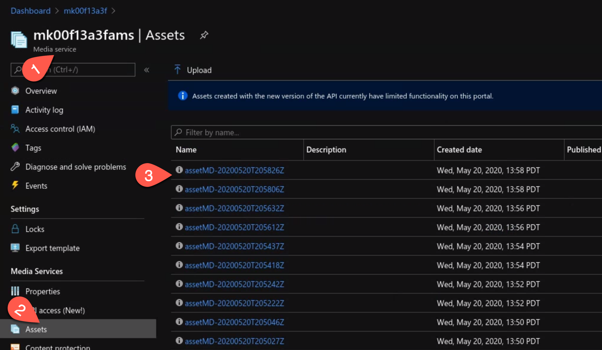
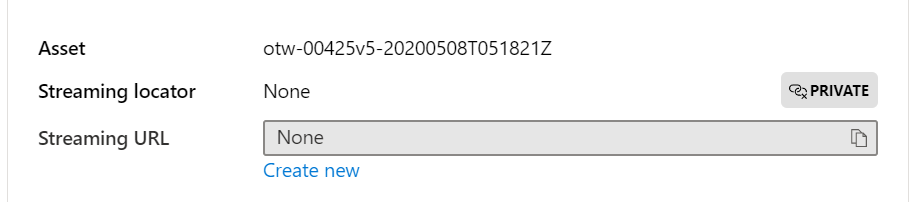

# Monitoring the Output of the Inference Server

In the sample media graph topology, we defined two "sink" nodes:  
* Sink 1 - sends the inference result (Json payload) to IoT Hub
* Sink 2 - sends the stream chunks (where motion detected) into Azure Media Services

## Monitoring IoT Edge Module and IoT Hub Message Flow
In VSCode, under the "AZURE IOT HUB" panel,  
1. Right click on the device name.  
2. Click on "Start Monitoring Built-In Event Endpoint".  

   

3. You will see the message flow with inference results and the video chunk logs that are sent to Azure Media Services cloud service.  

   

## Monitoring the archived video streams in Azure Media Services
On the Azure portal, explore the resource group used to create LVA and open the Azure Media Services resource that we created earlier in this sample. In the "assets" section of Azure Media Services, you will see chunks of recording where motion was detected.

   

To play these clips, click on the desired asset. Then, locate the "Streaming URL" textbox and click on the "Create new" link. In the pane that opens for "Add streaming locator", accept the defaults and hit "Add" at the bottom. In the Asset details page, the video player should now load to the first frame of the video, and you can hit the play button.

   

## Next Steps

If all the inference server works as expected, return to the Readme page to continue.   