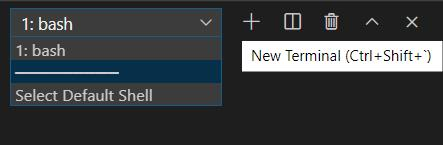
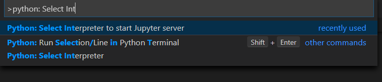

# Requirements for LVA Jupyter Notebook Samples 

## Install the Required Tools
To run LVA on Jupyter notebooks, you will first need to install the following tools on your development PC.  

1. There are many ways to run, manage, and update Jupyter notebooks. Out of the many options, we recommend using Visual Studio Code (VSCode) because it has extensions for running and managing IoT devices as well. Install [Visual Studio Code](https://code.visualstudio.com/docs/setup/setup-overview) if you do not already have it installed.  

    > <span style="color:red; font-weight:bold"> [!IMPORTANT] </span>  
    > All of the commands in this sample should work as intended on machines running Ubuntu 18.04 and MacOS. If you are using a machine running Windows, you can try either of the following solutions:
    > <br><br>Option 1: Turn on the [Windows Subsystem for Linux](https://code.visualstudio.com/remote-tutorials/wsl/enable-wsl) setting. Afterwards, you will have to log out from your PC and log back in. Then, [upgrade to WSL 2](https://docs.microsoft.com/en-us/windows/wsl/install-win10) and download [Ubuntu 18.04 terminal](https://www.microsoft.com/en-us/p/ubuntu-1804-lts/9n9tngvndl3q?rtc=1&activetab=pivot:overviewtab) from the Microsoft store. When installing the tools below, use the Ubuntu terminal and install the Ubuntu versions of the applications. When running the Jupyter notebooks, first install the [Remote - WSL extension](https://marketplace.visualstudio.com/items?itemName=ms-vscode-remote.remote-wsl) and then [switch the terminal setting](https://code.visualstudio.com/docs/remote/wsl#_open-a-remote-folder-or-workspace) in VSCode so that the WSL terminal is used.
    > <br><br>Option 2: Install [Git Bash](https://git-scm.com/downloads). When installing the tools below, use the Git Bash terminal. When running the Jupyter notebooks, [open VSCode](https://code.visualstudio.com/docs/editor/command-line#_launching-from-command-line) using the Git Bash terminal and [switch the terminal setting](https://code.visualstudio.com/docs/editor/integrated-terminal) so that the Bash terminal is used. You will now be able to run Bash commands on Jupyter notebooks using VSCode.  
    Make sure that in VSCode terminal window, you click the dropdown and select **bash**    
    

2. To run the Jupyter notebooks, you will need to have [Python](https://www.python.org/downloads/) version >=3.6 and [Pip](https://pypi.org/project/pip/) version >=19.0 installed on your machine.  

3. In Visual Studio Code and install the following extensions:  
    - [Python extension](https://marketplace.visualstudio.com/items?itemName=ms-python.python) 
    - [Azure IoT Tools](https://marketplace.visualstudio.com/items?itemName=vsciot-vscode.azure-iot-tools)     
## Install Docker
Later in this sample, we will be using Docker to containerize our inference server solution to create a container image. On your development PC, install Docker based on your operating system:
* [MacOS](https://docs.docker.com/docker-for-mac/install/)
* [Linux](https://docs.docker.com/engine/install/)
* [Windows on WSL](https://docs.docker.com/docker-for-windows/wsl/)
* [Windows on Git Bash](https://docs.docker.com/docker-for-windows/install/)

> <span style="color:grey; font-weight:bold"> [!TIP] </span>  
> If you are using a Unix-based development PC (e.g., running Ubuntu, MacOS, or Windows with WSL), you may run into Docker issues related to account permissions in later sections of this sample. Instead of the command `sudo docker`, we recommend using the `docker` command without the `sudo` prefix. To run Docker commands on Linux without the `sudo` command, follow the Docker instructions for [managing Docker as a non-root user](https://docs.docker.com/install/linux/linux-postinstall/). Afterwards, you will have to log out from your development PC and log back in.

## Create Azure Account
Because this sample utilizes Azure, you will need an active Azure subscription to run the following sections. If you do not have an active Azure subscription, you can [create a free Azure account](https://azure.microsoft.com/free/?WT.mc_id=A261C142F). 

## Install the Azure CLI
We will mainly be interacting with Azure through Jupyter, but for this to work, you will need to install the [Azure command-line interface](https://docs.microsoft.com/en-us/cli/azure/install-azure-cli?view=azure-cli-latest), version >=2.7.
> <span style="color:red; font-weight:bold"> [!WARNING] </span>  
> If you are using Windows with **Git bash** as your development PC, please download **Azure CLI for Windows** and instal Azure CLI from the bash terminal.  
> If you are using Windows with **WSL 2** as your development PC, please download **Azure CLI for Debian/Ubuntu** and install Azure CLI from the WSL 2 terminal.


## Install Jupyter
To get started with Jupyter on VSCode, you first need to have Jupyter installed on your development PC. 

In VSCode, open the terminal window and run the following command:
```
pip3 install jupyter
```
> [!NOTE]    
> We used `pip3` in the command above because we are running Python 3. In your case, use `pip` or `pip3` depending on your installed version of Python.

## Working with Jupyter Notebooks on VSCode
If you are not familiar with running Jupyter notebooks, we recommend getting started with this tutorial on running [Jupyter on VSCode](https://code.visualstudio.com/docs/python/jupyter-support). When you are running Jupyter on VSCode, be sure to activate the right Python environment for VSCode by using the Command Palette (`Ctrl+Shift+P`) and searching for `Python: Select Interpreter to start Jupyter server`. Choose the appropriate version of Python that matches your needs.



## Next Steps
In the following sections of this sample, there will be descriptions and instructions in Markdown cells in each of the Jupyter notebooks. Please carefully read these desctiptions and instructions before running the code cells, in order to ensure successful execution of the sample.

After having all the requirements from this section satisfied on your development PC, return to the previous Readme page.
