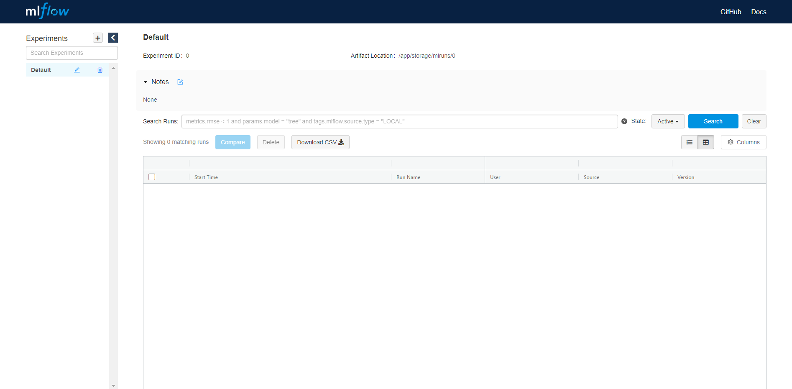

# MLflow and Kubeflow Installation On Kubernetes

This guide demonstrates how to install a remote MLflow Tracking Server on Kubernetes. The instructions below demonstrate how to install using a Cloud Native Application Bundle (CNAB). Please see the document referenced below for manual installation instructions.

**Reference Material:**
- [Manual Installation Instructions](./docs/manual_installation.md)

**Prerequisite:**
- Will need the k8 cluster ".kubeconfig" file on your local machine to execute commands on the k8 cluster 
- Below instructions are not intended to be run from the master node, but from another Linux dev environment
- Clone the github repo at "/home/user/" path

## Step 1: Install Porter
Make sure you have Porter installed. You can find the installation instructions for your OS at the link provided below.

[Porter Installation Instructions](https://porter.sh/install/)

**NOTE:** be sure to add porter to your PATH so it can find the binaries


## Step 2: Build Porter CNAB
First you will need to navigate to porter directory in the repository. For example 

```sh
cd ./research/mlflow-on-azure-stack/porter
```
Change the file permissions

```sh
chmod 777 mlflow.sh
chmod 777 kubeflow.sh
```
Next, you will build the porter CNAB

```sh
porter build
```

## Step 3: Generate Credentials 
This step is needed to connect to your Kubernetes cluster

```sh
porter credentials generate 
```
Enter path to your kubeconfig file when prompted

Validate that your credential is present by running the below command. You should see something like the below output.
```sh
porter credentials list
```


## Step 4: Use Porter CNAB
Run one of the below commands to interact with the CNAB

```sh
porter install --cred MLServicesInstaller
porter upgrade --cred MLServicesInstaller
porter uninstall --cred MLServicesInstaller
```
### Step 5: Check for pods and services
After the installation each of the services gets installed into its own namespace, try below commands to look for pods and services:

```sh
kubectl get pods -n mlflow
kubectl get pods -n kubeflow
```
### Step 6: Opening Kubeflow dashboard
To access the dashboard using external connection, replace "type: NodePort" with "type: LoadBalancer" using the patch command:

```sh
$ kubectl patch svc/istio-ingressgateway -p '{"spec":{"type": "LoadBalancer"}}' -n istio-system
service/istio-ingressgateway patched
```
Then the EXTERNAL-IP will become available from:

```sh
$ kubectl get -w -n istio-system svc/istio-ingressgateway
NAME                   TYPE           CLUSTER-IP     EXTERNAL-IP   PORT(S)                          AGE
istio-ingressgateway   LoadBalancer   10.0.123.210   12.34.56.78   15020:30397/TCP,80:31380/TCP,..  7m27s
```
 

Use external-ip to open it in your browser, and make sure your firewall rules allow HTTP port 80.

You can monitor Kubeflow cluster by looking at the Kubernetes status, you might need to wait to let the pods create containers and start.

For more information see [Installing Kubeflow on Azure](https://www.kubeflow.org/docs/azure/deploy/install-kubeflow/) 

### Step 7: Opening MLflow dashboard
To access the dashboard using external connection, first we need to get the external-ip:

```sh
$ kubectl get svc -n mlflow
NAME             TYPE           CLUSTER-IP    EXTERNAL-IP     PORT(S)          AGE
mlflow-service   LoadBalancer   10.0.176.78   52.250.47.209   5000:31148/TCP   19m
```
Use external-ip to open it in your browser, and make sure your firewall rules allow HTTP port 5000.



### Step 8: Creating a Notebook Server

From the Kubeflow dashboard select "Notebook Servers". Pick the namespace you want to create the server under and select "+ New Server".

Enter the desired specs for your server. Make sure the "Custom Image" checkbox is select and input `naedwebs/jupyter-mlflow` in the text field for this option. Click "Launch".
### Step 9: Upload a Notebook

Once your server is running click "Connect". A Jupyter Notebook landing page should load on a new tab. On the right hand side of this page push the "Upload" button and select the MLflow_Tutorial notebook found in the notebooks folder in this repository and hit open. Click the blue "Upload" button that has just appeard. Select the notebook to run it.
