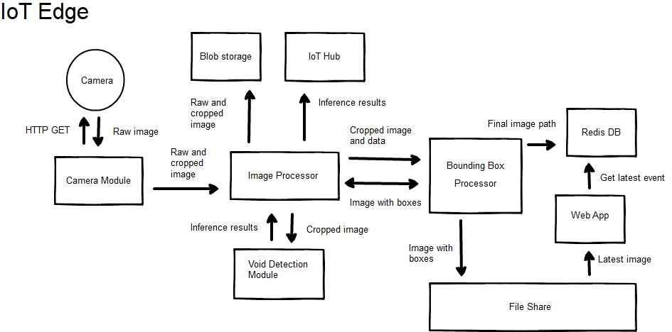

# Deploy an Edge-based Machine Learning Solution
## About this sample
### Overview
This sample will help you deploy a solution that does rapid
inferencing on an Azure Data Box Edge or an Azure Stack with an IoT Edge VM.

### Included Models
This sample includes containers with models trained on a sample dataset for inferencing on CPUs, GPUs, and FPGAs. Data Box Edge supports CPU and FPGA inferencing, Azure Stack supports CPU inferencing, and Azure support all three technologies.

### General Architecture
Below is a general architecture for this sample. Diagrams for each specific implementation can be found with the instructions for that implementation.

### Supported Cameras
Cameras that use RTSP streams or have an HTTP endpoint for images are natively supported, but the code can be extended to other stream types.

### Instructions
- [Data Box Edge](./data-box-edge.md)
- [Azure Stack](./azure-stack.md)

# Next Steps

  - Learn more about Azure Stack, Data Box Edge and the Intelligent Edge, at [aka.ms/intelligentedge](https://aka.ms/intelligentedge)

  - Learn more about hybrid cloud applications, see [Hybrid Cloud
    Solutions](https://aka.ms/azsdevtutorials)

  - Modify the code to this sample on
    [GitHub](https://github.com/Azure-Samples/azure-intelligent-edge-patterns).
