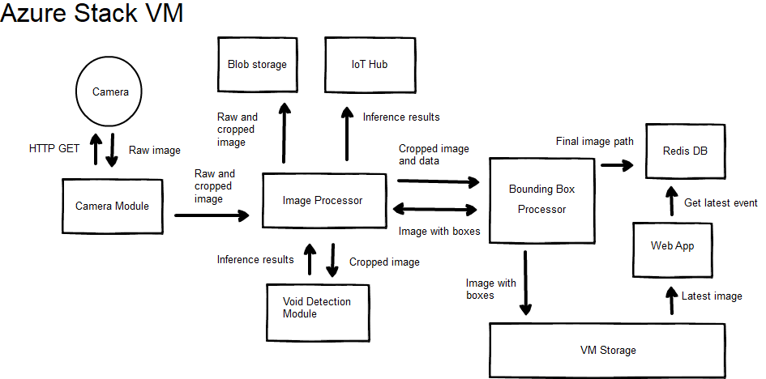

# Azure Stack

In this article you'll learn how to:
  - Deploy a set of modules to an IoT Edge VM on Azure Stack
  - Set up an application that uses Azure Stack for rapid inference at
    the edge.

## Architecture



## How to run this sample
### Prerequisites
Before you begin, make sure you have:
  - A tenant subscription Azure Stack Integrated System or Azure Stack Development Kit
  - A Linux virtual machine with IoT Edge set up and associated to an IoT Hub. For more information, go to [Install the Azure IoT Edge runtime on Debian-based Linux systems](https://docs.microsoft.com/en-us/azure/iot-edge/how-to-install-iot-edge-linux).

  - An Azure subscription
      - If you don't have an Azure subscription, create a free account
        before you begin.
      - An Azure Container Registry (ACR).
          - **Make a note of the ACR login server, username, and
            password.**
  - The following development resources:
      - Azure CLI 2.0    
      - Docker CE.    
      - Visual Studio Code.    
      - Azure IoT Tools for Visual Studio Code.    
      - Python extension for Visual Studio Code.    
      - Python    
      - Pip for installing Python packages (typically included with your
        Python installation).

## Azure Environment
Setup your Azure Environment by following these [steps](./azure-resources.md)


## Add a device to the the IoT Hub
1.  Open the settings for the IoT Hub in the Azure Portal
1.  Under **Automatic Device Management**, select **IoT Edge**
1.  Add an IoT Edge Device, give the device a meaninful Device ID
1.  Copy the **Primary Connection String**


## Prepare the IoT Edge VM

1.  Make a note of the virtual machine's IP address.
1.  Create a folder on the IoT Edge VM for images from the camera.
1.  Edit the `/etc/iotedge/config.yaml` file, under **provisioning**, set the **device_connection_string** to the **Primary Connection String** from the last section
1.  Save the file
1.  Restart the iotedge daemon, type:  `sudo systemctl restart iotedge`


## Get the Code

1.  Clone or download the code.
```
  git clone https://github.com/azure-samples/azure-intelligent-edge-patterns
```
## Configure and Build Containers
1.  Open the “edge-ai-void-detection” folder in Visual Studio Code.
1.  Fill in the values in the .env.template file :
    * Set the CONTAINER_REGISTRY_* values with your ACR credentials, 	registry name, and login server
    * Set EXTERNAL_IP_ADDRESS to the public IP address of the IoT Edge VM
    * Set SHARE_NAME to name of the folder you created earlier.
    * Replace the value for BLOB_STORAGE_SAS_URL with the Connection String created when you created the SAS token for the Storage Account.
    * If you want to disable uploading images to Azure blobl storage, replace the value for UPLOAD_TO_BLOB_STORAGE with NO.
    * Set CAMERA_TYPE to one of "HTTP", "RTSP", or "simulator".
    * Set ML_MODEL_TYPE to CPU
1.  Rename the file to ".env".
1.  Sign into Docker by entering the following command in the Visual Studio Code integrated 
    terminal. Use the username, password, and login
    server that you copied from your Azure container registry in the
    first section. You can also retrieve these values from the Access
    keys section of your registry in the Azure portal.    
`docker login -u 'ACR username' -p 'ACR password' 'ACR login
        server'`
1.  In the VS Code explorer, right-click the deployment.iotedgevm.template.json
    file and select Build and Push IoT Edge solution.  The containers will be
    pushed to the container registry.

## Deploy to Azure Stack

You can also deploy modules using the Azure IoT Hub Toolkit extension
(formerly Azure IoT Toolkit extension) for Visual Studio Code. You
already have a deployment manifest prepared for your scenario, the
deployment.json file. All you need to do now is select a device to
receive the deployment.

1.  In the VS Code command palette, run Azure IoT Hub: Select IoT Hub.

1.  Choose the subscription and IoT hub that contain the IoT Edge device
    that you want to configure.

1.  In the VS Code explorer, expand the Azure IoT Hub Devices section.

1.  Right-click the name of your IoT Edge device, then select Create
    Deployment for Single Device.

1.  Select the `deployment.iotedgevm.amd64.json` file in the config folder and then click
    Select Edge Deployment Manifest. Do not use the
    `deployment.iotedgevm.template.json` file.

1.  Click the refresh button. You should see \[modules running\]

## Test Your Solution

See results with a [PowerBi Report](../PowerBi/PowerBi.md)