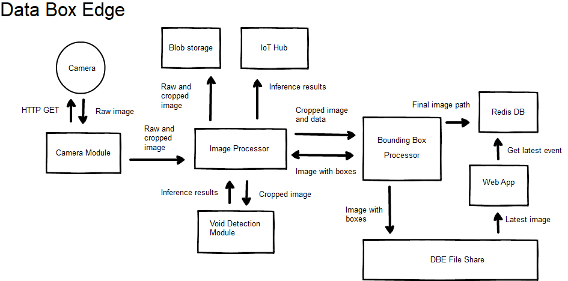

# Data Box Edge

In this article you'll learn how to:
  - Deploy a set of modules to a Data Box Edge
  - Use the integrated FPGA on a Data Box Edge.
  - Set up an application that uses Data Box Edge for rapid inference at
    the edge.

## Architecture



## How to run this sample
### Prerequisites
Before you begin, make sure you have:
  - A Data Box Edge that is running
      - The device also has an associated IoT Hub resource.
      - The device has Edge compute role configured. For more
        information, go to [<span class="underline">Configure
        compute</span>](https://docs.microsoft.com/en-us/azure/databox-online/data-box-edge-deploy-configure-compute#configure-compute) for
        your Data Box Edge.
      - Ensure that the Data Box Edge can run Project Brainwave
        workloads.

  - An Azure subscription
      - If you don't have an Azure subscription, create a free account
        before you begin.
      - An Azure Container Registry (ACR).
          - **Make a note of the ACR login server, username, and
            password.**
  - The following development resources:
      - Azure CLI 2.0    
      - Docker CE.    
      - Visual Studio Code.    
      - Azure IoT Tools for Visual Studio Code.    
      - Python extension for Visual Studio Code.    
      - Python    
      - Pip for installing Python packages (typically included with your
        Python installation).
  - Optional: This Edge-based Machine Learning Solution may be deployed as
        an IoT Edge device within a deployment generated by 
		[AI Video Intelligence Solution Accelerator](https://github.com/Azure-Samples/AI-Video-Intelligence-Solution-Accelerator). To do this, simply
		follow the [instructions for generating the deployment](https://github.com/Azure-Samples/AI-Video-Intelligence-Solution-Accelerator#deploy-the-ai-video-intelligence-solution-accelerator)
		and skip the remaining steps, which cover Edge device creation.

## Azure Environment
Setup your Azure Environment by following these [steps](./azure-resources.md)

## Prepare the Data Box Edge

1.  Make sure that the Data Box Edge has the compute role enabled. Make
    a note of the compute role’s IP address.
2.  Create a local-only share on the Data Box Edge. Make a note of its
    name.

## Get the Code

1.  Clone or download the code.
```
  git clone https://github.com/azure-samples/azure-intelligent-edge-patterns
```
## Configure and Build Containers
1.  Open the “edge-ai-void-detection” folder in Visual Studio Code.
1.  Fill in the values in the .env.template file :
    * Set the CONTAINER_REGISTRY_* values with your ACR credentials, 	registry name, and login server<br/>
	**Optional:** If you are deploying  this Edge-based Machine Learning Solution as an
	IoT Edge device within a deployment generated by 
		[AI Video Intelligence Solution Accelerator](https://github.com/Azure-Samples/AI-Video-Intelligence-Solution-Accelerator), 
    * Set SHARE_NAME to name of the folder you created earlier.
    * Set EXTERNAL_IP_ADDRESS to the public IP address of the Data Box Edge compute role
    * Replace the value for BLOB_STORAGE_SAS_URL with the Connection String created when you created the SAS token for the Storage Account.
    * If you want to disable uploading images to Azure blobl storage, replace the value for UPLOAD_TO_BLOB_STORAGE with NO.
    * Set CAMERA_TYPE to one of "HTTP", "RTSP", or "simulator".
    * Set ML_MODEL_TYPE to FPGA
1. Change the .env.tempate's `DATA_DESTINATION` value from `redis` to `iothub`.
1.  Rename the file to ".env".
1.  Sign into Docker by entering the following command in the Visual
    Studio Code integrated terminal. Push your module image to your
    Azure container registry. Use the username, password, and login
    server that you copied from your Azure container registry in the
    first section. You can also retrieve these values from the Access
    keys section of your registry in the Azure portal.    
`docker login -u 'ACR username' -p 'ACR password' 'ACR login
        server'`
1.  In the VS Code explorer, right-click the deployment.template.json
    file and select Build and Push IoT Edge solution.

## Deploy to Data Box Edge

You can also deploy modules using the Azure IoT Hub Toolkit extension
(formerly Azure IoT Toolkit extension) for Visual Studio Code. You
already have a deployment manifest prepared for your scenario, the
deployment.json file. All you need to do now is select a device to
receive the deployment.

1.  In the VS Code command palette, run Azure IoT Hub: Select IoT Hub.

2.  Choose the subscription and IoT hub that contain the IoT Edge device
    that you want to configure.

3.  In the VS Code explorer, expand the Azure IoT Hub Devices section.

4.  Right-click the name of your IoT Edge device, then select Create
    Deployment for Single Device.

5.  Select the deployment.amd64 file in the config folder and then click
    Select Edge Deployment Manifest. Do not use the
    deployment.template.json file.

6.  Click the refresh button. You should see \[modules running\]

## Test Your Solution

See results with a [PowerBi Report](../PowerBi/PowerBi.md)