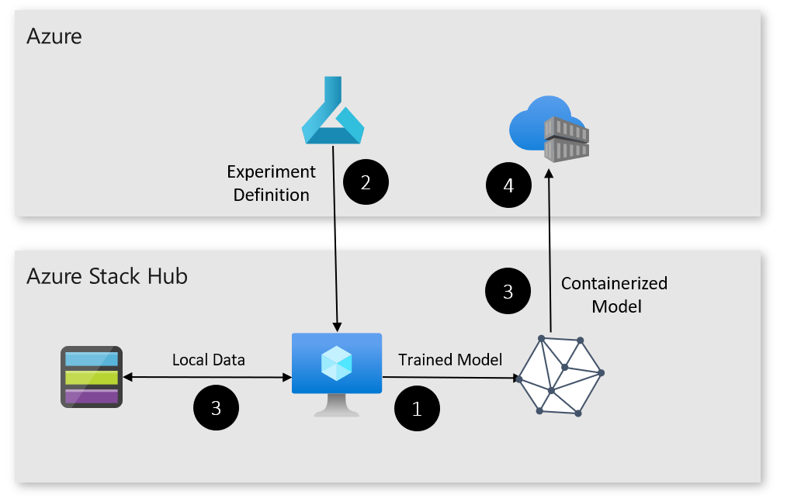

# Deploy an Edge Training Solution
This article describes how to deploy a solution trains a model on Azure Stack Hub compute,using Azure ML, allowing you to use on-premises training to create ML models.

In this article you learn how to:

  - Deploy Cloud Native Application Bundles at the edge. To learn about
    CNAB and Porter, [go here](https://porter.sh/).

  - Deploy and attach a VM to Azure ML on Azure Stack Hub

  - Use Azure ML for training at the edge.



Learn more about this solution
[here](https://docs.microsoft.com/en-us/azure-stack/user/hybrid-solution-retail-footfall-detection?view=azs-1908).

## Prerequisites

Before you begin, make sure you have:

  - An Azure Stack Development Kit or Azure Stack Integrated System.
    
      - The Azure Stack should have Azure App Service installed.
    
      - You should have a subscription on the Azure Stack with App
        Service and Storage Quota.

  - An Azure subscription
    
      - If you don't have an Azure subscription, create a free account
        before you begin.

  - Two service principals
    
      - One configured for Azure, with access to the Azure Subscription.
    
      - One configured for Azure Stack, with access to the Azure Stack
        subscription.
    
      - To learn more about creating service principals, go
        [here](https://docs.microsoft.com/en-us/cli/azure/create-an-azure-service-principal-azure-cli?view=azure-cli-latest#create-a-service-principal).

  - The following development resources:
    
      - Azure CLI 2.0
    
      - Docker CE.
    
      - Porter.
    
      - Visual Studio Code.
    
      - Azure IoT Tools for Visual Studio Code.
    
      - Python extension for Visual Studio Code.
    
      - Python

## Get the Code

1.  Clone or download the code.

> <https://github.com/azure-samples/azure-intelligent-edge-patterns>

## Deploy the Cloud Application

Use the Porter CLI to generate a credential set, then deploy the cloud
application.

1.  Porter will generate a set of credentials that will automate
    deployment of the application. You’ll need:
    
    - Azure Service Principal ID
    - Azure Service Principal Key
    - Azure Service Principal Tenant DNS
    - Azure Subscription ID
    - Azure Stack Service Principal ID
    - Azure Stack Service Principal Key
    - Azure Stack Service Principal Tenant DNS
    - Azure Stack Subscription ID
    - Training VM Password (must comply with Azure's password requirements)

2.  Run the credential generation process and follow the prompts.

```
porter creds generate --tag intelligentedge/edge-training-deployment:0.1.0
```
3.  Porter also requires a set of insecure parameters to run. Create a
    text file and enter the following text. Ask your Azure Stack’s
    administrator if you don’t know some of the required values.

> The resource suffix should be a unique string of letters and numbers,
> no longer than 8 characters, to ensure that your deployment’s
> resources have unique names across Azure.

```
azure_stack_tenant_arm="Your Azure Stack Tenant Endpoint"
azure_stack_storage_suffix="Your Azure Stack Storage Suffix"
azure_stack_keyvault_suffix="Your Azure Stack KeyVault Suffix"
resource_suffix="Any unique string here."
azure_location="Any Azure region here."
azure_stack_location="Your Azure Stack’s location identifier here."
```
Save the text file and make a note of its path.

4.  You’re now prepared to deploy the cloud application with Porter. Run
    the deployment command and watch as resources are deployed to Azure
    and Azure Stack.
```
porter install edge-training –tag intelligentedge/edge-training-deployment:0.1.0 –creds edge-training-deployment –param-file "path-to-cloud-parameters-file.txt"
```
5.  Once deployment is complete, make a note of the Azure ML workspace's name, and the training VM's IP Address.

## Train the Model

1. To train a model using edge compute, follow the steps [here](https://docs.microsoft.com/en-us/azure/machine-learning/service/tutorial-train-deploy-model-cli), skipping the steps to create a resource group, create a workspace, and create a compute target for training.


## Remove Your Solution

If you’d like to remove your solution, run the following commands using
Porter, using the same parameter files that you created for deployment.

```
porter uninstall edge-training –tag intelligentedge/edge-training-deployment:0.1.0 –creds edge-training-deployment –param-file "path-to-cloud-parameters-file.txt"

```

# Next Steps

  - Learn more about Azure Stack and the Intelligent Edge, see [here](https://aka.ms/hybridpatterns).

  - Learn more about hybrid cloud applications, see [Hybrid Cloud
    Solutions.](https://aka.ms/hybridpatterns)

  - Modify the code to this sample on
    [GitHub](https://github.com/Azure-Samples/azure-intelligent-edge-patterns).
