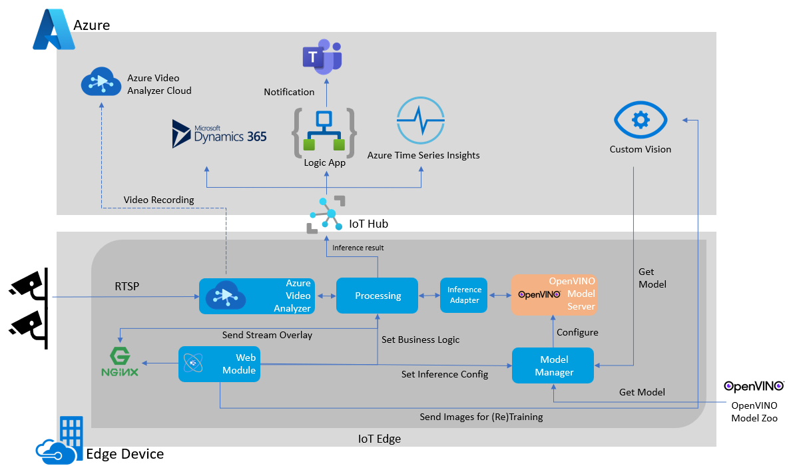

| description                                                                                                                                                                                                                          | products                                                               | page_type       | description                     |
| ------------------------------------------------------------------------------------------------------------------------------------------------------------------------------------------------------------------------------------ | ---------------------------------------------------------------------- | --------------- | ------------------------------- |
| This is an easy-to-use UI solution showing how to realize a your own machine learning solution concept in a single day without requiring any Machine Learning expertise, run with hardware accleration on edge with retraining loop. | -Azure Stack  -Azure Percept  -Custom Vision -Onnxruntime -OpenVINO Model Server -OpenVINO  -Azure IoTEdge -AVA -RTSP Source  -HTTP/GRPC Extension   | sample solution | -json -python -javascript |

# Vision on Edge (VoE)

Vision on Edge (VoE) is an open-source tool that accelerates and simplifies the journey of building vision-based intelligent edge solutions using Machine Learning (ML). VoE helps you with extracting insights and actions from RTSP IP cameras using a no-code UI that runs and processes streams locally on your edge device.

Check out [this video](https://www.youtube.com/watch?v=17UW6veK7SA) to see brief introduction in action and understand how the value is delivered:

## Overview

Gaining meaningful insights from the physical world can be quite complex and time consuming. Camera is quickly becoming the one universal sensor that can capture the essence of the physical world for many different use cases. To be able to reason about your desired events happening in the physical world using cameras you need to be able to ingest, process and reason about many camera streams at once. Creating a video ingestion process with only 1 camera is not an easy task but creating a scalable, yet extensible video pipeline is even more difficult. In addition, understanding things/objects in the physical world requires algorithms that are not easy to build without specialized knowledge and resources. 

VoE combines the power of Azure services such as Custom Vision and Video Analyzer in one simple and easy to use local UI that helps you:
- Connect and view your IP cameras
- Train your own custom ML models from scratch using training data from your IP cameras
- Create a more complex AI Skill/Logic by combining your custom ML models with already trained models from our model zoo
- Deploy your hardware optimized ML models on your IP camera streams to extract insights and create actions locally or in the cloud

# Table of Content

- [Concepts & Prerequisites](#concepts-and-prerequisites)
  * [Hardware](#hardware)
  * [Services](#services)
- [Architecture](#architecture)
- [Get Started](#get-started-vision-on-edge-installer)
  * [For Azure IoT Edge](#for-azure-iotedge-devices-recommended)
    + [Option 1: Azure Shell Installer](#option-1-azure-shell-installer-recommended)
    + [Option 2: Azure ARM Template](#option-2-azure-arm-template)
- [Other Tutorials](#other-tutorials)
  * [Video Tutorials](#video-tutorials)
  * [Upload your own video to be processed](#upload-your-own-video-to-be-processed)
- [Privacy Notice](#privacy-notice)

## Concepts and Prerequisites

## Hardware

You need to have one of the following:

- **Azure Stack Edge**: A portfolio of devices that bring the compute, storage and intelligence to the edge right where data is created. Find out more [here](https://azure.microsoft.com/en-us/products/azure-stack/edge/)
- **Azure Stack HCI**: A hyperconverged infrastructure (HCI) cluster solution that hosts virtualized Windows and Linux workloads and their storage in a hybrid, on-premises environment. Find out more [here](https://docs.microsoft.com/en-us/azure-stack/hci/overview). You can either:
  - Create a linux VM in your HCI environment by following [this](https://docs.microsoft.com/en-us/azure-stack/hci/manage/vm) and then follow this to [install IoT Edge](https://docs.microsoft.com/en-us/azure/iot-edge/how-to-install-iot-edge-linux) in your VM.
  
or

- **Simulated Azure IoTEdge device** (such as a PC or VM on Azure): Set up Azure IoTEdge on your simulated device : [Instructions on Linux](https://docs.microsoft.com/en-us/azure/iot-edge/how-to-install-iot-edge-linux).
 
#### NOTE: This solution is only supported on Linux based VMs configured with Azure IoTEdge. 

Vision on Edge (VoE) also uses/requires a few Azure services for its various capabilities. Some of these services will be automatically deployed for you (during VoE installation) while others may need you to pre-deploy them before installing VoE. Please follow the VoE installation paths discussed below for more information.

## Services

Check out the architecture below to see how Vision on Edge uses various services to function. Depending on your deployment target VoE will need the following Azure services as prerequisites:

- IoTEdge Devices: Azure Custom Vision + IoT Hub + Azure Video Analyzer (Recommended). Only VM deployment is supported.

# Architecture

# Get Started: Vision on Edge Installer

## For Azure IoTEdge Devices (Recommended)

### Option 1: Azure Shell Installer (Recommended)

Please follow the [instructions given here](Tutorial/Shell-installer-Tutorial.md) to install VoE using Azure Shell.

### Option 2: Azure ARM Template

Please follow [the following document](Tutorial/Tutorial_ARM_TemplateDeployment.md) to learn more about our Azure ARM deployment.

# Other Tutorials 

## Video Tutorials

- Tutorial 1: Azure Shell Installer [https://youtu.be/6sDILwkP1yc]

- Tutorial 2 - Start with prebuilt scenario [https://youtu.be/dihAdZTGj-g]

- Tutorial 3 - Start with creating new project, capture images, tagging images and deploy [https://youtu.be/cCEW6nsd8xQ]

- Tutorial 4 - Retraining and improve your model [https://youtu.be/OxK9feR_T3U]

- Tutorial 5: Advance capabilities setting [https://youtu.be/Bv7wxfFEdtI]

## Upload your own video to be processed

If you don't have camera devices to connect to your VoE deployment, you can use your own videos by uploading them to your edge device. Please follow the instruction [here](https://github.com/Azure-Samples/azure-intelligent-edge-patterns/blob/master/factory-ai-vision/Tutorial/UploadVideo.md).

# Privacy Notice

The software may collect information about your use of the software and send it to Microsoft.
Microsoft may use this information to provide services and improve our products and services.
You may turn off the telemetry as described in the repository or clicking settings on top right
corner. Our privacy statement is located at [https://go.microsoft.com/fwlink/?LinkID=824704](https://go.microsoft.com/fwlink/?LinkID=824704)
. You can learn more about data collection and use in the help documentation and our privacy
statement. Your use of the software operates as your consent to these practices.
