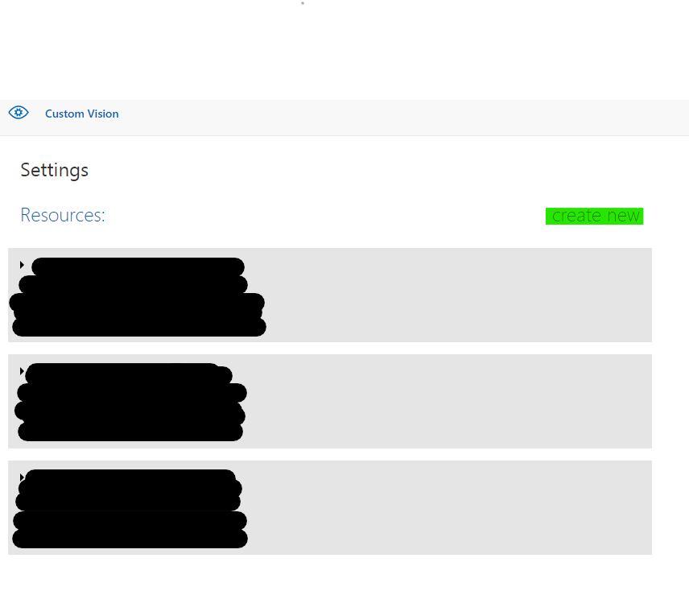
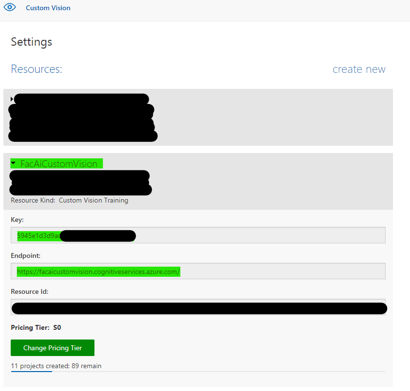

# Deploy VisionOnEdge solution on AKS and AKS-HCI using our Helm Chart

Kubernetes provides a distributed platform for containerized applications. In this tutorial, you will learn how to deploy VisionOnEdge solution to an Azure Kubernetes Service (AKS) cluster on the cloud or Azure Stack HCI (AKS-HCI).

## Prerequisites

Before you start, you would need an Azure subscription. If you don't have an Azure subscription, you can create one for free on the  [Azure sign-up page](https://aka.ms/createazuresubscription).

This article assumes that you have an existing AKS/AKS-HCI cluster deployed and have access to the cluster using `kubectl` command (more information [here](https://kubernetes.io/docs/tasks/access-application-cluster/access-cluster/#accessing-for-the-first-time-with-kubectl)). If you need an AKS/AKS-HCI cluster, Please see the following documentation to create your desired cluster:

- AKS:  
  - [Create using the Azure CLI](https://github.com/MicrosoftDocs/azure-docs/blob/master/articles/aks/kubernetes-walkthrough.md) or 
  - [Create using the Azure portal](https://github.com/MicrosoftDocs/azure-docs/blob/master/articles/aks/kubernetes-walkthrough-portal.md)
- AKS-HCI (recommended for edge deployment): 
  - [Create using PowerShell](https://docs.microsoft.com/en-us/azure-stack/aks-hci/kubernetes-walkthrough-powershell) or
  - [Create using Windows Admin Center](https://docs.microsoft.com/en-us/azure-stack/aks-hci/setup) 
  - If you don't have access to an Azure Stack HCI and would still like to evaluate AKS-HCI please follow [this evaluation guide](https://github.com/Azure/aks-hci/tree/main/eval) that deploys AKS-HCI inside of an Azure VM.

You need the Azure CLI version 2.0.59 or later installed and configured. Run `az --version` to find the version. If you need to install or upgrade, see [Install Azure CLI](https://github.com/MicrosoftDocs/azure-docs/blob/master/cli/azure/install-azure-cli).

Lastly, the device that you are using to deploy VoE needs to have the latest version Helm installed. If you don't have helm installed, you can do so by following the [instructions here](https://helm.sh/docs/intro/install/). 

## Deploy/Configure Required Azure Resources

VisionOnEdge uses/requires the following two Azure resources to function. Azure IoT Hub and registered IoT Edge devices within IoT Hub act as a messaging broker that enables the communication between VisionOnEdge deployment and the Azure Cloud. Azure Custom Vision, on the other hand, is used for training ML models, optimizing for customer-specific workloads.  

### IoT Hub

#### Create IoT Hub and Register an IoT Edge Device

If you already have an IoT Hub deployment with a registered IoT Edge device, you can skip this step. Otherwise:

1. Follow the "Create an IoT hub" section of [this document](https://docs.microsoft.com/en-us/azure/iot-edge/quickstart-linux?view=iotedge-2018-06#create-an-iot-hub) to create an IoT Hub resource on Azure. 
2. Follow the "Register an IoT Edge device" section of [this document](https://docs.microsoft.com/en-us/azure/iot-edge/quickstart-linux?view=iotedge-2018-06#register-an-iot-edge-device) to register an IoT Edge device (AKS/AKS-HCI cluster will be the edge device for messaging purposes)

#### Retrieve your IoT Hub and IoT Edge device's connection string

You need your Azure IoT Hub and registered IoT Edge device's connection string during deployment to AKS/AKS-HCI. Please retrieve the appropriate connection strings using the following commands:

For IoT Hub connection string:

`az iot hub connection-string show --hub-name <your_iothub_name>`

For IoT Edge device connection string:

`az iot hub device-identity connection-string show --hub-name <your_iothub_name> --device-id <your_edge_device_name>`

### Custom Vision

#### Create a Custom Vision Resource

If you already have a Custom Vision Resource, you can skip this step. Otherwise, create a Custom Vision Resource by visiting [the following link](https://www.customvision.ai/projects#/settings) and selecting "create new".

#### Retrieve your Custom Vision key and endpoint:

You need your Custom Vision key and endpoint during deployment to AKS/AKS-HCI. You can retrieve them by going to [the following link](https://www.customvision.ai/projects#/settings) and expanding your desired custom vision resource.

## Deploy VoE onto AKS/AKS-HCI

Now you are ready to deploy VoE onto your AKS/AKS-HCI cluster. Make sure the system that you are using to deploy VoE has access to your cluster (you can perform `kubectl` commands against your cluster)

### Create a values.yaml file

### Deploy VisionOnEdge

## Helm Chart Parameters

