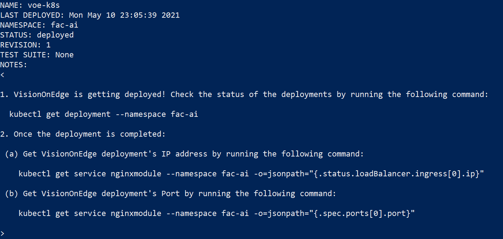

# VisionOnEdge Helm Chart

## Helm Chart Parameters and Information

  

Helm chart for VisionOnEdge(VoE) application that deploys VoE modules onto Kubernetes. 

#### Note: You can only deploy OpenCV implementation of VoE onto Kubernetes. LVA implementation is not yet available for deployment onto Kubernetes. 

### Values

| Key | Type | Default | Description |
|-----|------|---------|-------------|
| azureIoT.hubConnectionString* | string | `nil` | Your Azure IoT Hub Connection String |
| azureIoT.edgeConnectionString* | string | `nil` | Your Azure IoT Edge Device Connection String |
| customVision.endPoint* | string | `nil` | Your Azure Custom Vision Endpoint |
| customVision.key* | string | `nil` | Your Azure Custom Vision Key |
| runtime.accelerator | string | `nil` | Sets the runtime of the solution to GPU or VPU. There are two possible values: "GPU" and "VPU". This value does not install Nvidia, Intel drivers so make sure your cluster has a GPU/VPU and the drivers are properly installed before enabling GPU or VPU |
| runtime.stackEdge | bool | `false` | If runtime.accelerator is equal to "GPU", it is used/required to properly install VoE on Azure Stack Edge to take advantage of its GPUs |
| runtime.storageSize | string | `"5Gi"` | Size of the Storage Volume used by UploadModule and RtspSimModule |
| captureModule.affinity | object | `{}` | Affinity rule for CaptureModule |
| captureModule.tolerations | list | `[]` | Tolerations for CaptureModule |
| inferenceModule.affinity | object | `{}` | Affinity rule for InferenceModule |
| inferenceModule.tolerations | list | `[]` | Tolerations for InferenceModule |
| inferenceModule.cpuLimit | string | `nil` | Sets a CPU Limit for InferenceModule |
| nginxModule.affinity | object | `{}` | Affinity rule for NginxModule |
| nginxModule.tolerations | list | `[]` | Tolerations for NginxModule |
| nginxModule.port | int | `8181` | Your deployments port. You will use this port to view and interact with Solutions' UI |
| predictModule.affinity | object | `{}` | Affinity rule for PredictModule |
| predictModule.tolerations | list | `[]` | Tolerations for PredictModule |
| predictModule.cpuLimit | string | `nil` | Sets a CPU Limit for PredictModule |
| predictModule.numGPUs | int | `1` | Sets the number of GPUs that can be used by PredictModule  |
| rtspsimModule.affinity | string | `nil` | Affinity rule for RtspSimModule |
| rtspsimModule.tolerations | string | `nil` | Tolerations for RtspSimModule |
| uploadModule.affinity | object | `{}` | Affinity rule for UploadModule |
| uploadModule.tolerations | list | `[]` | Tolerations for UploadModule |
| webModule.affinity | object | `{}` | Affinity rule for WebModule |
| webModule.tolerations | list | `[]` | Tolerations for WebModule |

***These values are required during installation.** 


## Use the Helm Chart

Assuming you have a namespace named `fac-ai` you can install, upgrade and delete VoE using the following commands:

### Install

You can deploy VisionOnEdge to AKS/AKS-HCI by (replace <...> with path to your values.yaml created above):

```
helm install voe-k8s https://aka.ms/VoEHelm -f <path-to-your-values.yaml-file> -n fac-ai
```

You should see the following after deployment: 



#### Note: CPU is the default runtime during deployment, you can enable GPU runtime for the solution by using the following flag `--set runtime.GPU=true` during installation. Please make sure appropriate Nvidia drivers are installed on all your Kubernetes nodes. For AKS, you can follow [this documentation](https://docs.microsoft.com/en-us/azure/aks/gpu-cluster#install-nvidia-device-plugin) to install appropriate drivers. 

### Upgarde/Update:

You can upgrade your deployment by: 

```
helm upgarde voe-k8s https://aka.ms/VoEHelm --reuse-values -n fac-ai -f <path-to-your-values.yaml-file>
```

The command above will reuse values used in your previous release unless you override them using the `values.yaml` file. If you don't want to use values from the previous release you can instead use the following command: 

```
helm upgarde voe-k8s https://aka.ms/VoEHelm -n fac-ai -f <path-to-your-values.yaml-file>
```

### Delete

You can delete your deployment by:

```
helm delete voe-k8s -n fac-ai
```
