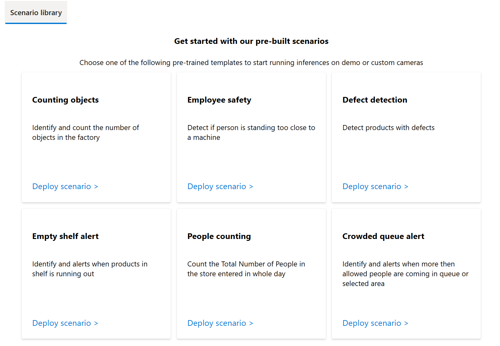
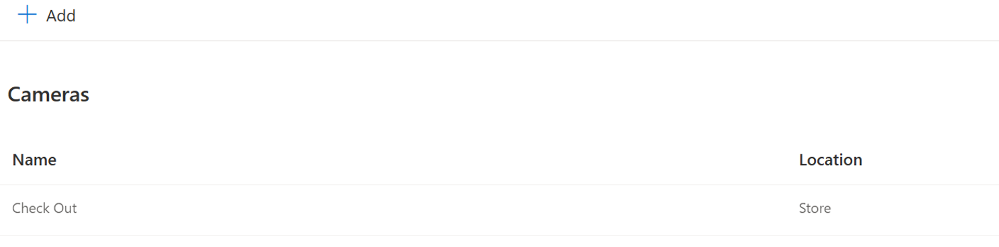
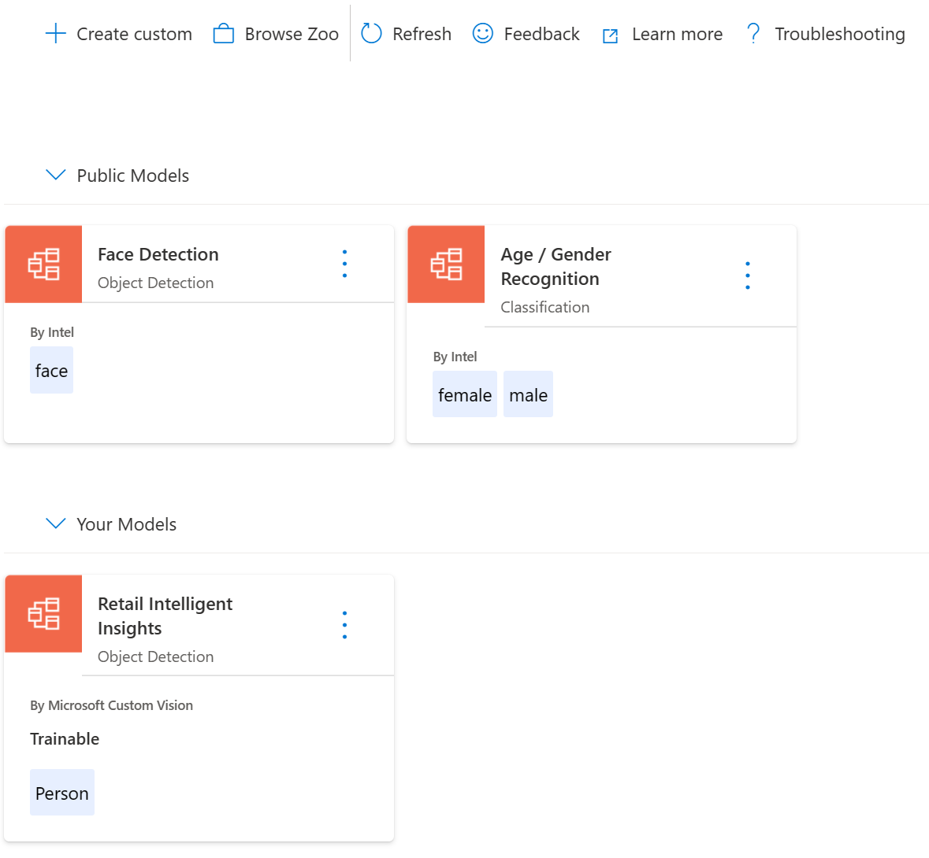
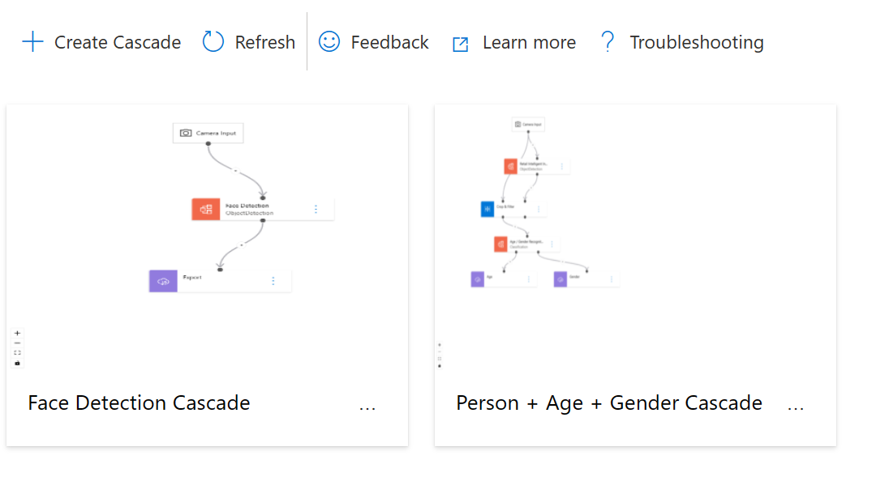
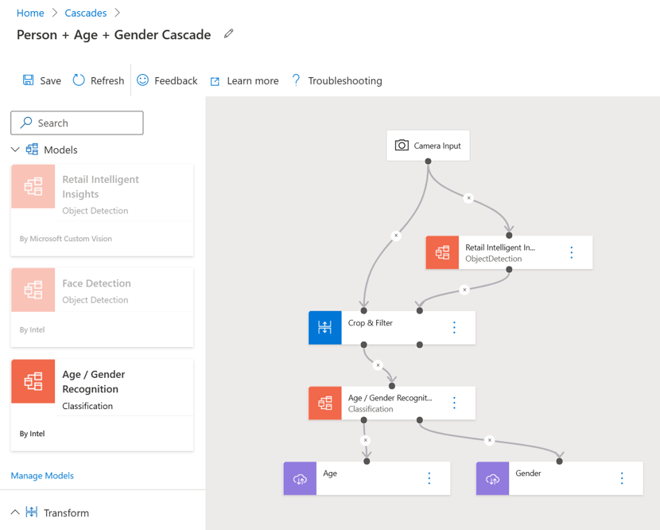
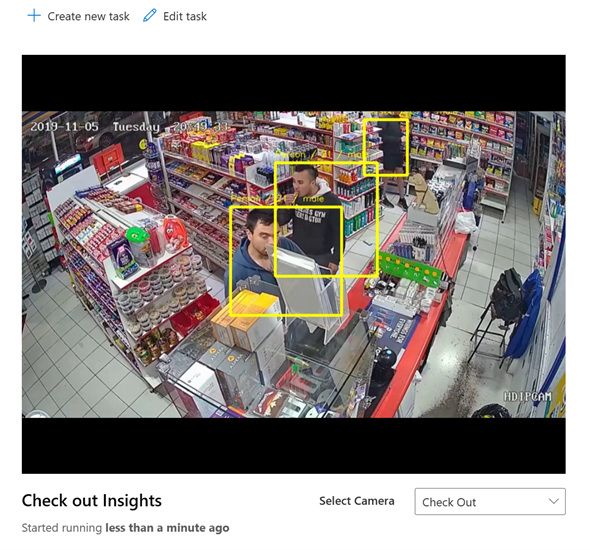

# Concepts
This document discusses basic concepts of VoE.

## Scenario Library

Scenario Library is a collection of pre-built solutions and templates targeted towards specific retain and manufacturing use-cases. These scenarios help you get started with your first VoE deployment in just 2 clicks. Each of the scenarios includes a pre-trained ML model and pre-written business logic code such as object counting that when combined can help with a useful business use case.

Deploying the scenarios will deploy the appropriate configuration as a task on a sample video stream that loops indefinitely to demo the use case. These scenarios indicate the value of using VoE right at the beginning of your journey. One thing to note is that the Pretrained models provided as part of these scenarios are mostly meant for demo purposes. However, once deployed, you can edit the deployment task to run the scenario on your camera streams or possibly change the pre-trained ML model to your own custom model and run the business logic where it fits your use case. For example, if you have a camera stream viewing the entrance of a parking lot and you used VoE to create your ML model (trained using Azure Custom Vision in the cloud) to detect vehicles, you can modify the ‘Counting Objects’ scenario to count vehicles going through the entrance on your camera feed.

## Cameras

Cameras are sensors that connect the physical and digital worlds. In this section of the UI, you will be able to add your RTSP camera streams that you would like to analyze and generate insights from. Each camera in VoE has a location associated with it that helps you better identify them (insights generated from them) at scale. If you don’t have access to an actual live camera stream, you can create a simulated camera stream by adding a camera using a direct link to a video file. VoE will automatically upload and configure the video as a simulated RTSP stream that loops through the video indefinitely. 

## Models

To be able to generate insights and actions from your camera streams, you need to be able to understand objects and concepts present at each frame or across frames of your camera. Machine Learning Models are the building blocks of such understanding in VoE. 

The Model’s section of the UI is your workspace of these building blocks. You can add Models to your workspace by:
- Adding models from our Model Zoo by going to Browse Zoo. These models will be saved as part of Public Models in your workspace. Model Zoo models are pre-trained and HW optimized. These generic yet performant models are ready for use without any need for training.
- Creating Custom Models by clicking on Create Custom. These models will be saved as part of “Your Models” in your workspace. You can capture and tag images from your Camera streams to train and improve your Custom Models in VoE. VoE uses Azure Custom Vision Service to train these models in the cloud. Once the training is complete, an HW accelerated version of the model will be downloaded to the edge device for local use/inferencing.

## Cascades

Cascade is where you will be able to use your Model building blocks to mix and match and build a more advanced and useful AI Skill. 

Cascade enables you to combine Models from your Model’s workspace (Both your Custom and Public Model Zoo Models) in a pipelined fashion using an easy-to-use drag-n-drop tool. As an example, you can see in the picture below that using the drag-n-drop tool, I was able to create an AI Skill that detects people alongside their age and gender on my camera stream by:
1.	Using my custom trained model to detect “Person” in frames coming from my camera
2.	Using Age and Gender Recognition pre-trained Model from the Model Zoo to take the section of the frame that was detected as "Person" and classify and recognize their Gender and Age.

## Deployment

Lastly, Deployment is where you will be able to take your Models or Cascades and apply them on your 1 or many Cameras. During deployment, you can configure whether you would like to receive your inference results and events locally on the edge device and/or send them to Azure IoT Hub in the cloud for further processing/aggregation and/or actions. For example, you can use these intelligent events produced locally on your edge device to start a chain of events on Azure Logic Apps to send an email or Teams message to appropriate people for notification, etc. It is important to note that all of this intelligent processing on your camera stream is happening locally on your edge device without the need for the cloud. It is up to you based on your deployment configuration if you would like to share any events/videos to the cloud if fitting within your use-case.

## Read Next

- [Learn about VoE's architecture and its technical requirements](req_arch.md)