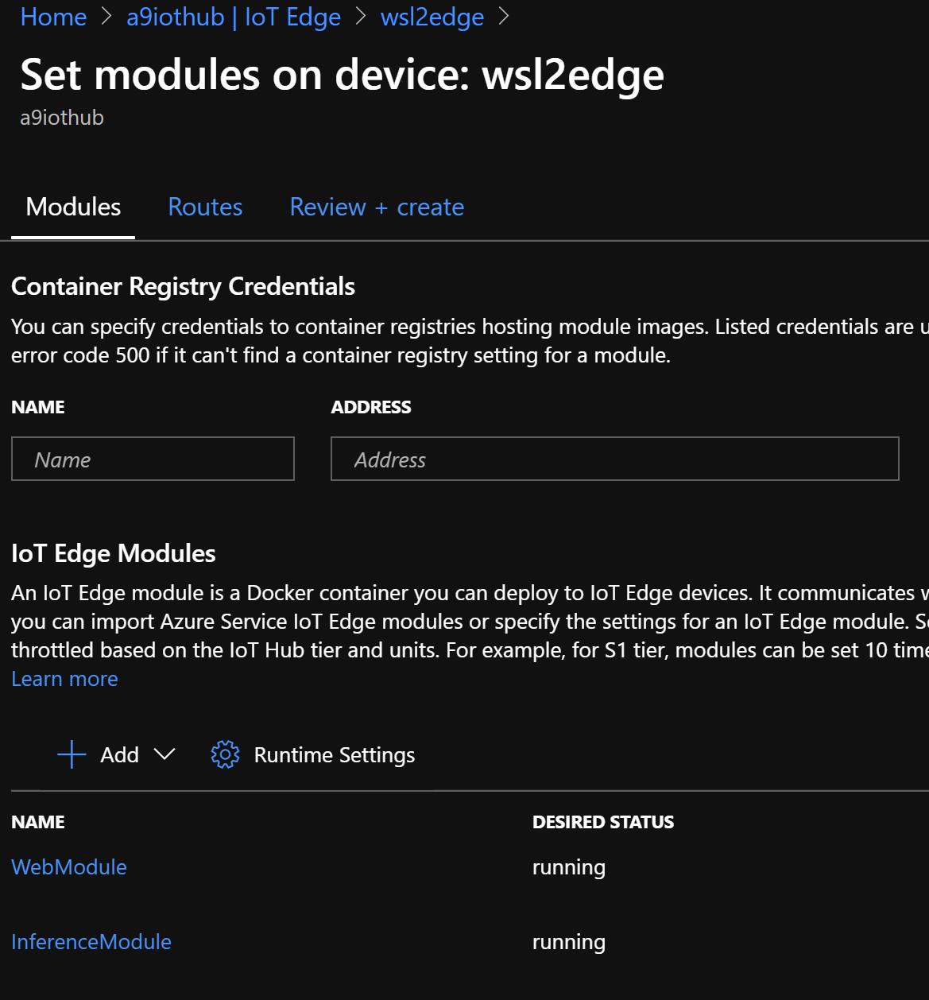
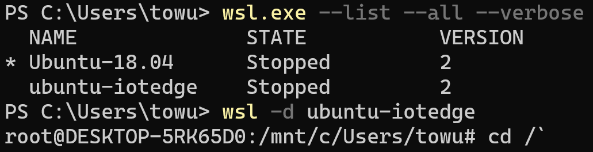
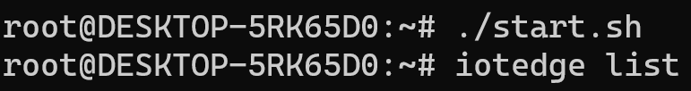
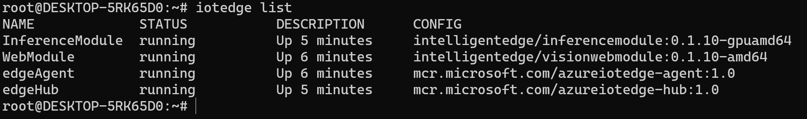
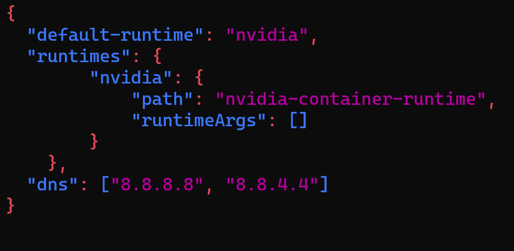
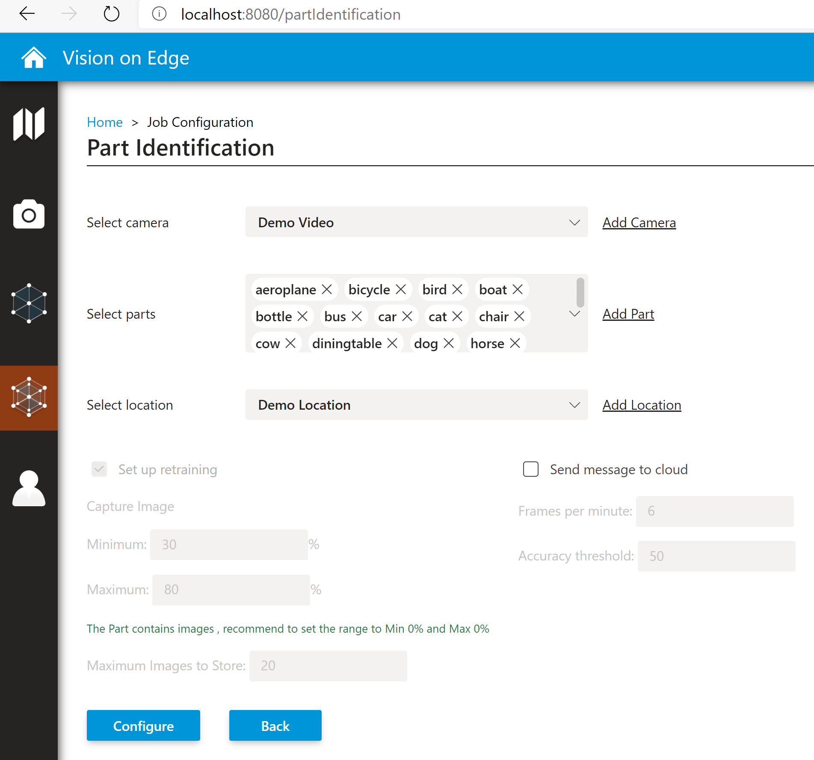
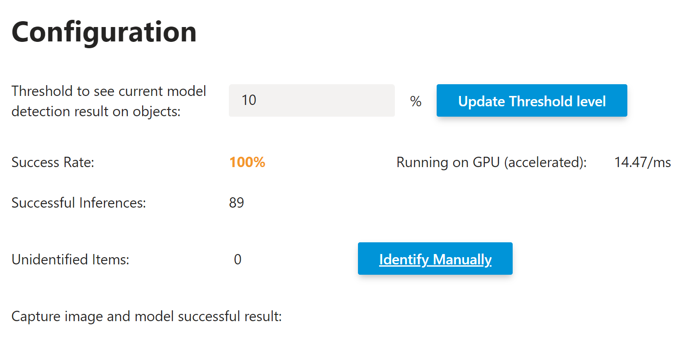
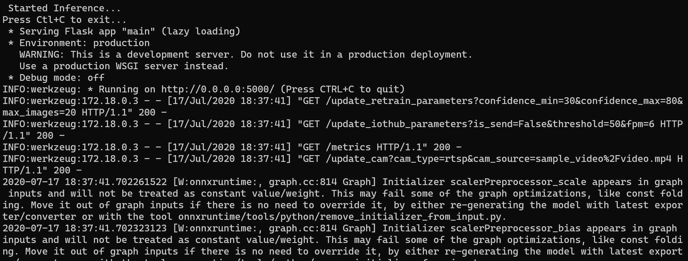

## Running Factory AI on WSL2 with Nvidia GTX
1.  WSL2 Environment Setup :

    A.  Surface Book2 with GTX 1060

    B.  Windows Insider Preview Build 20150 or higher :  [register for
        the Windows Insider
        Program](https://insider.windows.com/getting-started/#register).

    C.  Download Nvidia Driver :
        <https://developer.nvidia.com/45541-gameready-win10-dch-64bit-international>

    D.   [Enable WSL
        2](https://docs.microsoft.com/en-us/windows/wsl/install-win10) and [install
        a glibc-based
        distribution](https://docs.microsoft.com/en-us/windows/wsl/install-win10#install-your-linux-distribution-of-choice) (like
        Ubuntu or Debian). I choose Ubuntu 18.04

    E.  Check this
        [guide](https://docs.nvidia.com/cuda/wsl-user-guide/index.html#setting-containers)
        to install Nvidia container. (Should install this before IoT
        Edge installation) .

2.  Install IoT Edge and Configure your device on IoT Hub by the
    [doc](https://docs.microsoft.com/en-us/azure/iot-edge/how-to-install-iot-edge-linux).

{width="5.170833333333333in"
height="5.5642793088363955in"}

3.  Steps to run AI workload for Web Module & Inference Module --

    A.  Start the previous distro environment

> {width="4.073611111111111in"
> height="1.043170384951881in"}

B.  Clone the
    [start.sh](https://github.com/tommywu052/azure-intelligent-edge-patterns/blob/master/factory-ai-vision/wsl2/start.sh)
    on the root folder.

C.  cd \~ & ./start.sh

> {width="3.20370406824147in"
> height="0.4238954505686789in"}

D.  Check your module status :

> {width="6.0552121609798775in"
> height="0.8981485126859142in"}

E.  nano the /etc/docker/daemon.json as

> {width="3.1890430883639547in"
> height="1.5603510498687665in"}

F.  systemctl restart docker & iotedge restart

```{=html}
<!-- -->
```
4.  Testing Process :

    A.  Check WebModule is running :

> iotedge logs -f WebModule \--tail 500

B.  Go to <http://localhost:8080/> and add a new location.

> {width="5.243124453193351in"
> height="4.901620734908136in"}

C.  Choose "demo Pretrained Detection " and Configure

D.  Check the Right-hand side Configuration about GPU(accelerated) :
    around 10-15 ms , compared with CPU around 300-500 ms.

{width="5.768055555555556in"
height="2.8673611111111112in"}

E.  Verify the logs on inference module : some onnxruntime warning but
    initializer scalepreprocessor scale.

> {width="5.768055555555556in" height="2.19375in"}

F.  Done and Enjoy your WSL2 !

