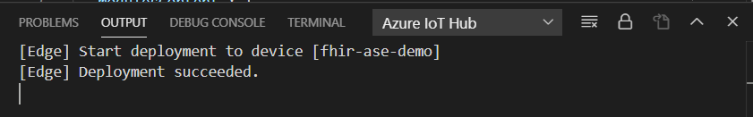

# Running FHIR Server on Azure IoT Edge Runtime

This sample has been created to enable edge-based scenarios for running FHIR Server on Azure IoT Edge appliances. This deployment guide explicity focuses on deploying FHIR Server to the Azure Stack Edge device.

## Supported FHIR Server Features
- Azure Active Directory integration
- Audit logging with Azure Application Insights
- HHTP/HTTPS protocols (you must provide your own certificate)
- SQL Server backend
- Persistent data storage on Azure Stack Edge

## Prerequisistes

### Tools and Devices
- [Azure Stack Edge](https://azure.microsoft.com/en-us/products/azure-stack/edge/)
    - Device must be activated and connected to IoT Hub. See the link [here](https://docs.microsoft.com/en-us/azure/databox-online/azure-stack-edge-deploy-prep) for instructions to order an Azure Stack Edge and configure it.
- [Visual Studio Code](https://code.visualstudio.com/download)
- [Iot Tools Extension for Visual Studio Code](https://marketplace.visualstudio.com/items?itemName=vsciot-vscode.azure-iot-tools)
- Certificate for HTTPS functionality (you can generate a development certificate by following instructions located [here](https://docs.microsoft.com/en-us/aspnet/core/security/docker-https?view=aspnetcore-3.1#running-pre-built-container-images-with-https))

### Authentication

For authentication to be enabled, the following will need to be setup in you Azure environment 

- Review the FHIR [Roles.md](https://github.com/microsoft/fhir-server/blob/master/docs/Roles.md) documentation to configure and associate roles in Azure 
- [Register the Azure Active Directory apps for Azure API for FHIR](https://docs.microsoft.com/en-us/azure/healthcare-apis/fhir-app-registration)
- [Register a confidential client application in Azure Active Directory](https://docs.microsoft.com/en-us/azure/healthcare-apis/register-resource-azure-ad-client-app).  You also have the option to register by [Public](https://docs.microsoft.com/en-us/azure/healthcare-apis/register-public-azure-ad-client-app) or [Service](https://docs.microsoft.com/en-us/azure/healthcare-apis/register-service-azure-ad-client-app) client.
- [Add app roles in your application and receive them in the token](https://docs.microsoft.com/en-us/azure/active-directory/develop/howto-add-app-roles-in-azure-ad-apps)

## Step 1: Define Your Environment

- Fill out the .env.template file and give the filename ".env" in this directory. Be sure to specify the below variables for your environment.

    |Environment Variable|Description|
    |--------------------|-----------|
    |FHIR_VERSION | Version of FHIR Server to Run (ex. R4, R5, STU3)|
    |FHIRServer__Security__Authentication__Audience| Audience from your service princpal registration in Azure Active Directory|
    |FHIRServer__Security__Authentication__Authority| Authority from your client app in Azure Active Directory|
    |SAPASSWORD| Password to use for SQL Server service account
    |ApplicationInsights__InstrumentationKey| Instrumentation key for Azure Application Insights to send audit logs|
    |ASPNETCORE_Kestrel__Certificates__Default__Path| Fully qualified path to your certificate|
    |ASPNETCORE_Kestrel__Certificates__Default__Password| Password required to use your certificate|

- For HTTPS connectivity, you will need to provide a certificate
    - You will need to [add a share](https://docs.microsoft.com/en-us/azure/databox-online/azure-stack-edge-deploy-add-shares) to the following path: `/https`    
        - Note: be sure to configure your share as Edge local share
    - Connect to the share and copy your certificate to the share location

## Step 2: Deploy to Edge Device

After specifying your environment, you will need to deploy to your Azure Stack Edge device. 

1. Open Visual Studio Code

1. Select your IoT Hub in Visual Studio Code
    - Choose your Azure subscription and Iot Hub from the prompts that are displayed
    

1. Right-click on your deployment template

1. Select "Generate IoT Edge Deployment Manifest"
    

1. Navigate to the config folder where the deployment manifest was saved

1. Right-click on your template and select "Create Deployment for Single Device"
    

1. Choose your device from the menu

    

1. Confirm the deployment was successful

    

    > **Note:** It may take some time for the device to report the containers are running as it will need to pull the docker images from the container registry prior to being operational

## Step 3: Test your Deployment

- Follow the guide [here](https://docs.microsoft.com/en-us/azure/healthcare-apis/access-fhir-postman-tutorial) to get a token and test your deployment using Postman
