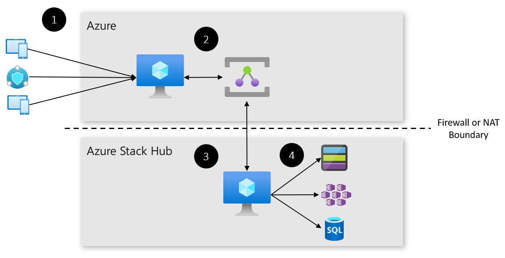

# Deploy a Hybrid Relay Solution
This article describes how to deploy a solution allows connection to resources on an Azure Stack Hub from outside a corporate firewall or NAT solution.

In this article you learn how to:

  - Deploy Cloud Native Application Bundles at the edge. To learn about
    CNAB and Porter, [go here](https://porter.sh/).

  - Deploy an application that spans cloud boundaries.

  - Use Azure Hybrid Relay to route network traffic.



Learn more about this solution
[here](https://docs.microsoft.com/en-us/azure-stack/user/hybrid-solution-retail-footfall-detection?view=azs-1908).

## Prerequisites

Before you begin, make sure you have:

  - An Azure Stack Development Kit or Azure Stack Integrated System.
    
      - You should have a subscription on the Azure Stack with Compute quota.

  - An Azure subscription
    
      - If you don't have an Azure subscription, create a free account
        before you begin.

  - Two service principals
    
      - One configured for Azure, with access to the Azure Subscription.
    
      - One configured for Azure Stack, with access to the Azure Stack
        subscription.
    
      - To learn more about creating service principals, go
        [here](https://docs.microsoft.com/en-us/cli/azure/create-an-azure-service-principal-azure-cli?view=azure-cli-latest#create-a-service-principal).

  - The following development resources:
    
      - Azure CLI 2.0
    
      - Docker CE.
    
      - Porter.
    
      - Visual Studio Code.
    
      - Azure IoT Tools for Visual Studio Code.
    
      - Python extension for Visual Studio Code.
    
      - Python

## Get the Code

1.  Clone or download the code.

> <https://github.com/azure-samples/azure-intelligent-edge-patterns>

## Deploy the Cloud Application

Use the Porter CLI to generate a credential set, then deploy the cloud
application.

1.  Porter will generate a set of credentials that will automate
    deployment of the application. You’ll need:
    
    - Azure Service Principal ID
    - Azure Service Principal Key
    - Azure Service Principal Tenant DNS
    - Azure Subscription ID
    - Azure Stack Service Principal ID
    - Azure Stack Service Principal Key
    - Azure Stack Service Principal Tenant DNS
    - Azure Stack Subscription ID
    - VM Password (must comply with Azure's password requirements.)

2.  Run the credential generation process and follow the prompts.

```
porter creds generate --tag intelligentedge/hybrid-relay-deployment:0.1.0
```
3.  Porter also requires a set of insecure parameters to run. Create a
    text file and enter the following text. Ask your Azure Stack’s
    administrator if you don’t know some of the required values.

> The resource suffix should be a unique string of letters and numbers,
> no longer than 8 characters, to ensure that your deployment’s
> resources have unique names across Azure.

```
azure_stack_tenant_arm="Your Azure Stack Tenant Endpoint"
azure_stack_storage_suffix="Your Azure Stack Storage Suffix"
azure_stack_keyvault_suffix="Your Azure Stack KeyVault Suffix"
resource_suffix="Any unique string here."
azure_location="Any Azure region here."
azure_stack_location="Your Azure Stack’s location identifier here."
```
Save the text file and make a note of its path.

4.  You’re now prepared to deploy the cloud application with Porter. Run
    the deployment command and watch as resources are deployed to Azure
    and Azure Stack.
```
porter install hybrid-relay –tag intelligentedge/hybrid-relay-deployment:0.1.0 –creds hybrid-relay-deployment –param-file "path-to-cloud-parameters-file.txt"
```
5.  Once deployment is complete, make a note of the connection string, and the client and server IP addresses.

# Test Your Solution

On the server, run `server.js` specifying the namespace and path for a previously created 
Azure Relay Hybrid Connection, as well as a SAS rule name and key that grants "Listen" permission 
for that path:

`node server.js myns.servicebus.windows.net mypath listenrule [base64 key]`

On the client, run `connect.js` specifying namespace and path of an Azure Relay Hybrid Connection with
an active listener, along with a SAS rule name and a key that grants "Send" permission:

`node connect.js myns.servicebus.windows.net mypath sendrule [base64 key]`

You will be prompted for username/password, which the server will be verified against users.txt once you
establish a connection, then you are presented with a command shell where you can create and destroy tunnels.

> **Security note:**
> The users.txt file holds username and password for the server in clear text! Mind that this is a 
> code sample showing that you can flow the "Authorization" header end-to-end in addition to the 
> security boundary provided by the Relay. It's not a sample that illustrates management of user 
> secrets. (The base sample uses an unsalted MD5 hash, which is worse as it suggests being a solution)

`> tunnel 3306 8.12.44.238:3306`

This will listen on port 3306 on the client (localhost) and forward connections to remote host 8.12.44.238 via the
WebSocket server. Destination port, if omitted, will default to source port.

There is no need to manage SSL/TLS certificates for this sample, unlike in the base sample. TLS 
is handles by the cloud service for both legs of the network connection.  

> ** Security note:**
> This sample (not Hybrid Connections per-se) permits any authorized client to establish a tunnel 
> to any TCP network destination that the server can connect to. The client program "connect.js"
> will expose a raw TCP connectivity path. Be aware that once you have started the *connect.js* 
> program with a valid send key, have interactively entered a password held in users.txt *and* have explicitly 
> opened the tunnel (three boundaries), there is no further protection mechanism for the destination 
> other than what it itself provided as a native security model. (It shouldn't be necessary to make
> that point, but better be safe)

# Remove Your Solution

If you’d like to remove your solution, run the following commands using
Porter, using the same parameter files that you created for deployment.

```
porter uninstall hybrid-relay –tag intelligentedge/hybrid-relay-deployment:0.1.0 –creds hybrid-relay-deployment –param-file "path-to-cloud-parameters-file.txt"

```

# Next Steps

  - Learn more about Azure Stack and the Intelligent Edge, see [here](https://aka.ms/azurestack)

  - Learn more about hybrid cloud applications, see [Hybrid Cloud
    Solutions.](https://aka.ms/hybridpatterns)

  - Modify the code to this sample on
    [GitHub](https://github.com/Azure-Samples/azure-intelligent-edge-patterns).
