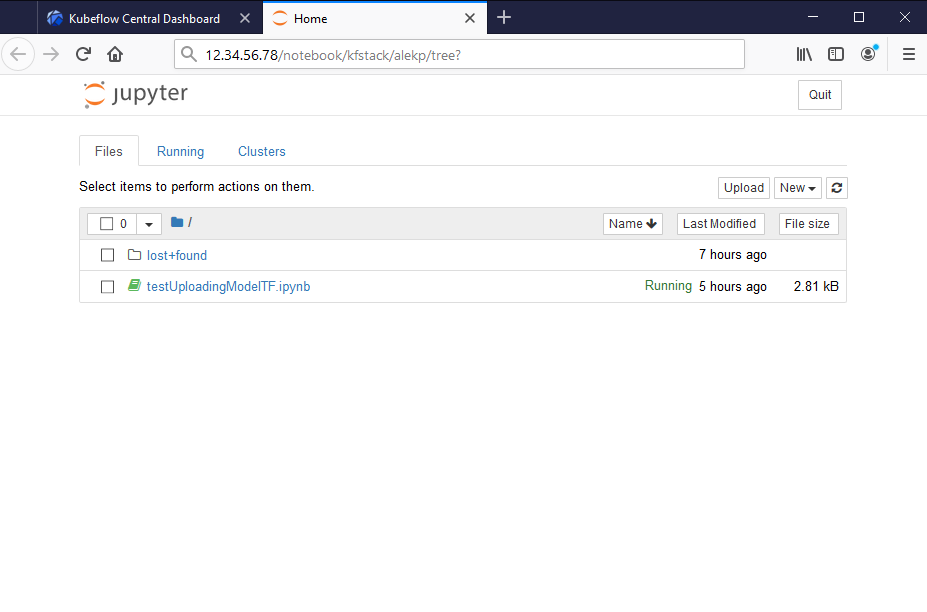

# Kubeflow on Azure Stack

This module demonstrates how to create a Kubeflow cluster on Azure Stack.

Main differences of the detached mode include limitations on:

- Scalability. Can't grow beyond of the hardware on premises.
- Handling of the artifacts(e.g. Docker images).
- How to access software packages(especially third-party).
- How storage is allocated and utilized.

## Prerequieistes

The reader is expected to be familiar with the following:

- [Azure](http://azure.com) CLI, and Microsoft Azure subscription covering AKS.
- [Kubernetes](https://kubernetes.io/)
- [Kubeflow](https://github.com/kubeflow/kubeflow)
- [Jupyter](https://jupyter.org/).
- [Bash in Azure Cloud Shell](https://docs.microsoft.com/en-us/azure/cloud-shell/quickstart)

You need to have an Azure Subscription, or create one. With the subscription you will have the
tenant ID, Service Principal ID and secret.

## Login to the desired cloud

If you do not already have Azure CLI, install it. See [Install Azure CLI with apt](https://docs.microsoft.com/en-us/cli/azure/install-azure-cli-apt?view=azure-cli-latest) if you are using Ubuntu, or similar for other OSes.

    $ curl -sL https://aka.ms/InstallAzureCLIDeb | sudo bash
    ...
    The following NEW packages will be installed:
    azure-cli
    0 upgraded, 1 newly installed, 0 to remove and 34 not upgraded.
    ...

Register with the correct cloud(if you work with multiple):

    $ az cloud register -n DEMOE2 --endpoint-resource-manager "https://management.demoe2.example.com" --suffix-storage-endpoint "portal.demoe2.example.com" --suffix-keyvault-dns ".vault.portal.demoe2.example.com"
    The cloud 'DEMOE2' is registered.

Set it as active:

    $ az cloud set -n DEMOE2

It may be helpful to update it to the desired API version:

    $ az cloud update --profile 2019-03-01-hybrid

Login to the desired cloud:

    $ az login --tenant stackdemo.example.com --service-principal -u 1234567-1234-123-123 -p SUPERSECRET
    [
      {
        "cloudName": "DEMOE2",
        "id": "12345-1234-1234-1234-12344321",
        "isDefault": true,
        "name": "DemoKubeflowSubscription",
        "state": "Enabled",
        "tenantId": "12345-1234-5678-9abcd-0987654321",
        "user": {
          "name": "1234567890-1234-987654321",
          "type": "servicePrincipal"
        }
      }
    ]

## Create Kubeflow Kubernetes cluster

A cluster for Kubeflow will be created using 'aks-endine', although, you could create
a resource group using Portal, or CLI:

    $ az group create --name sandboxRG3kf --location ppe2
    {
        "id": "/subscriptions/123456789-1234-9876-123456789123456/resourceGroups/sandboxRG3kf",
        "location": "demoe2",
        "managedBy": null,
        "name": "sandboxRG3kf",
        "properties": {
            "provisioningState": "Succeeded"
        },
        "tags": null,
        "type": null
    }

If you do not have a suitable key pair already, you can generate one using `ssh-gen`:

    $ ssh-keygen -t rsa -b 4096

Then follow the instructions and use the public key in the "ssh" in .json below. If you have any problems, see [Create SSH Key Pair](https://docs.microsoft.com/en-us/azure/virtual-machines/linux/mac-create-ssh-keys)
or 
[App Identity in Azure Stack Hub](https://docs.microsoft.com/en-us/azure-stack/operator/azure-stack-create-service-principals)

Edit the deployment definition file to adjust for your own configuration and desired scale. Here is kube-rgKF_ppe2.json:

    {
        "apiVersion": "vlabs",
        "location": "",
        "properties": {
            "orchestratorProfile": {
                "orchestratorType": "Kubernetes",
                "orchestratorRelease": "1.15",
                "kubernetesConfig": {
                    "cloudProviderBackoff": true,
                    "cloudProviderBackoffRetries": 1,
                    "cloudProviderBackoffDuration": 30,
                    "cloudProviderRateLimit": true,
                    "cloudProviderRateLimitQPS": 3,
                    "cloudProviderRateLimitBucket": 10,
                    "cloudProviderRateLimitQPSWrite": 3,
                    "cloudProviderRateLimitBucketWrite": 10,
                    "kubernetesImageBase": "mcr.microsoft.com/k8s/azurestack/core/",
                    "useInstanceMetadata": false,
                    "networkPlugin": "kubenet",
                    "kubeletConfig": {
                        "--node-status-update-frequency": "1m"
                    },
                    "controllerManagerConfig": {
                        "--node-monitor-grace-period": "5m",
                        "--pod-eviction-timeout": "5m",
                        "--route-reconciliation-period": "1m"
                    }
                }
            },
            "customCloudProfile": {
                "portalURL": "https://portal.demoe2.example.com",
                "identitySystem": ""
            },
            "featureFlags": {
                "enableTelemetry": true
            },
            "masterProfile": {
                "dnsPrefix": "kube-rgKF",
                "distro": "aks-ubuntu-16.04",
                "count": 1,
                "vmSize": "Standard_D2_v2"
            },
            "agentPoolProfiles": [
                {
                    "name": "linuxpool",
                    "count": 3,
                    "vmSize": "Standard_F16",
                    "distro": "aks-ubuntu-16.04",
                    "availabilityProfile": "AvailabilitySet",
                    "AcceleratedNetworkingEnabled": false
                }
            ],
            "linuxProfile": {
                "adminUsername": "azureuser",
                "ssh": {
                    "publicKeys": [
                        {
                            "keyData": "ssh-rsa SOMESUPERSECRETKEYNOBODYKNOWS"
                        }
                    ]
                }
            },
            "servicePrincipalProfile": {
                "clientId": "",
                "secret": ""
            }
        }
    }

If you do not have `aks-engine` already, install it using (Install the AKS engine on Linux in Azure Stack)[https://docs.microsoft.com/en-us/azure-stack/user/azure-stack-kubernetes-aks-engine-deploy-linux]. For Linux, if you have the connection:

    $ curl -o get-akse.sh https://raw.githubusercontent.com/Azure/aks-engine/master/scripts/get-akse.sh
    $ chmod 700 get-akse.sh
    $ ./get-akse.sh --version v0.43.0

In the completely disconnected environment, you need to acquire the archive via a machine that does have the connection, and uncompress it on the machine where you plan using it:

    $ tar xvzf aks-engine-v0.xx.x-linux-amd64.tar.gz -C /usr/local/bin

Verify `aks-engine` version:

    $ aks-engine version
    Version: v0.43.0
    GitCommit: 8928a4094
    GitTreeState: clean

If Azure Resource Manager endpoint is using a self-signed certificate, you need to explicitly add the root certificate to trusted certificate store of the machine:

    $ sudo cp /var/lib/waagent/Certificates.pem /usr/local/share/ca-certificates/azurestackca.crt 
    $ sudo update-ca-certificates

Run `aks-engine deploy` command:

    $ aks-engine deploy -m kube-rgKF_ppe2.json --auth-method client_secret --auto-suffix \
        --azure-env AzureStackCloud --client-id 123456-1234 --client-secret 123supersecret \
        --force-overwrite --location demoe2 --resource-group kube-rgKF \
        --subscription-id 12345-4321-1234567890 --debug
    INFO[0000] Writing cloud profile to: /tmp/azurestackcloud.json045678
    DEBU[0000] Resolving tenantID for subscriptionID: 12345-4321-1234567890
    DEBU[0000] Already registered for "Microsoft.Compute"
    DEBU[0000] Already registered for "Microsoft.Storage"
    DEBU[0000] Already registered for "Microsoft.Network"
    DEBU[0006] pki: PKI asset creation took 3.586868203s
    DEBU[0006] output: wrote _output/kube-rgKF-5e9a2ec4/apimodel.json
    DEBU[0006] output: wrote _output/kube-rgKF-5e9a2ec4/azuredeploy.json
    DEBU[0006] output: wrote _output/kube-rgKF-5e9a2ec4/azuredeploy.parameters.json
    DEBU[0006] output: wrote _output/kube-rgKF-5e9a2ec4/kubeconfig/kubeconfig.demoe2.json
    DEBU[0006] output: wrote _output/kube-rgKF-5e9a2ec4/ca.key
    DEBU[0006] output: wrote _output/kube-rgKF-5e9a2ec4/ca.crt
    DEBU[0006] output: wrote _output/kube-rgKF-5e9a2ec4/apiserver.key
    DEBU[0006] output: wrote _output/kube-rgKF-5e9a2ec4/apiserver.crt
    DEBU[0006] output: wrote _output/kube-rgKF-5e9a2ec4/client.key
    DEBU[0006] output: wrote _output/kube-rgKF-5e9a2ec4/client.crt
    DEBU[0006] output: wrote _output/kube-rgKF-5e9a2ec4/kubectlClient.key
    DEBU[0006] output: wrote _output/kube-rgKF-5e9a2ec4/kubectlClient.crt
    DEBU[0006] output: wrote _output/kube-rgKF-5e9a2ec4/etcdserver.key
    DEBU[0006] output: wrote _output/kube-rgKF-5e9a2ec4/etcdserver.crt
    DEBU[0006] output: wrote _output/kube-rgKF-5e9a2ec4/etcdclient.key
    DEBU[0006] output: wrote _output/kube-rgKF-5e9a2ec4/etcdclient.crt
    DEBU[0006] output: wrote _output/kube-rgKF-5e9a2ec4/etcdpeer0.key
    DEBU[0006] output: wrote _output/kube-rgKF-5e9a2ec4/etcdpeer0.crt
    INFO[0006] Starting ARM Deployment (kube-rgKF-987654321). This will take some time...
    INFO[0497] Finished ARM Deployment (kube-rgKF-987654321). Succeeded

If you did everything correctly, at this point you could ssh to the master node and check
the cluster. You can find master node's public IP address at the Portal.

    $ ssh -i id_rsa_demokey -l azureuser 12.345.123.45
    Authorized uses only. All activity may be monitored and reported.
    Welcome to Ubuntu 16.04.6 LTS (GNU/Linux 4.15.0-1061-azure x86_64)
    ...

    azureuser@k8s-master-27515788-0:~$ kubectl cluster-info
    Kubernetes master is running at https://kube-rg3-123456.demoe2.cloudapp.example.com
    CoreDNS is running at https://...
    kubernetes-dashboard is running at https://...
    Metrics-server is running at https://...
    To further debug and diagnose cluster problems, use 'kubectl cluster-info dump'.

    azureuser@k8s-master-27515788-0:~$ kubectl get nodes
    NAME                       STATUS   ROLES    AGE   VERSION
    k8s-linuxpool-27515788-0   Ready    agent    22m   v1.15.5
    k8s-linuxpool-27515788-1   Ready    agent    22m   v1.15.5
    k8s-linuxpool-27515788-2   Ready    agent    22m   v1.15.5
    k8s-master-27515788-0      Ready    master   22m   v1.15.5

## Install Kubeflow

The following is done at the master node. Download the `kfctl` from [Kubeflow releases](https://github.com/kubeflow/kfctl/releases) page.

    $ mkdir kubeflow
    $ cd kubeflow/
    $ wget https://github.com/kubeflow/kfctl/releases/download/v1.0.1/kfctl_v1.0.1-0-gf3edb9b_linux.tar.gz
    ...
    ‘kfctl_v1.0.1-0-gf3edb9b_linux.tar.gz’ saved [31630869/31630869]

    $ tar -xvf kfctl_v1.0.1_<platform>.tar.gz

    $ export PATH=$PATH:~/kubeflow/
    $ export KF_NAME=sandboxASkf
    $ export BASE_DIR=/opt/
    $ export KF_DIR=${BASE_DIR}/${KF_NAME}
    $ export CONFIG_URI="https://raw.githubusercontent.com/kubeflow/manifests/v1.0-branch/kfdef/kfctl_k8s_istio.v1.0.1.yaml"
    
Generate and deploy Kubeflow:

    $ sudo mkdir -p ${KF_DIR}
    $ sudo chown azureuser ${KF_DIR}
    $ cd ${KF_DIR}
    $ kfctl apply -V -f ${CONFIG_URI}
    ...
    INFO[0184] Successfully applied application seldon-core-operator  filename="kustomize/kustomize.go:209"
    INFO[0184] Applied the configuration Successfully!       filename="cmd/apply.go:72"

Check the resources deployed correctly in namespace `kubeflow`
  
    $ kubectl get all -n kubeflow

It will show the list of the services and posd for the cluster we just created.

## Using dashboard

To access the dashboard using external connection, replace `"type: NodePort"` with `"type: LoadBalancer"` using the editor:

    $ kubectl edit -n istio-system svc/istio-ingressgateway
    service/istio-ingressgateway edited

Then the EXTERNAL-IP will become available from:

    $ kubectl get -w -n istio-system svc/istio-ingressgateway
    NAME                   TYPE           CLUSTER-IP     EXTERNAL-IP   PORT(S)                          AGE
    istio-ingressgateway   LoadBalancer   10.0.123.210   12.34.56.78   15020:30397/TCP,80:31380/TCP,..  7m27s

Open it in your browser, and make sure your firewall rules allow HTTP port 80.

For more information see [Installing Kubeflow on Azure](- https://www.kubeflow.org/docs/azure/deploy/install-kubeflow/)

## Using Kubeflow

You need to create a namespace to be able to create Jupyter servers. 

Once you create a server, you can connect to it and upload Python files.

## Next Steps

The following resources might help during troubleshooting or modifications:

- https://docs.microsoft.com/en-us/azure/cloud-shell/quickstart
- https://docs.microsoft.com/en-us/azure/aks/gpu-cluster
- https://docs.microsoft.com/en-us/azure-stack/asdk/asdk-install
- https://docs.microsoft.com/en-us/azure-stack/user/azure-stack-kubernetes-aks-engine-deploy-linux
- https://docs.microsoft.com/en-us/azure-stack
- https://docs.microsoft.com/en-us/azure-stack/user/azure-stack-kubernetes-aks-engine-deploy-cluster
