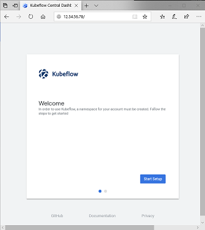
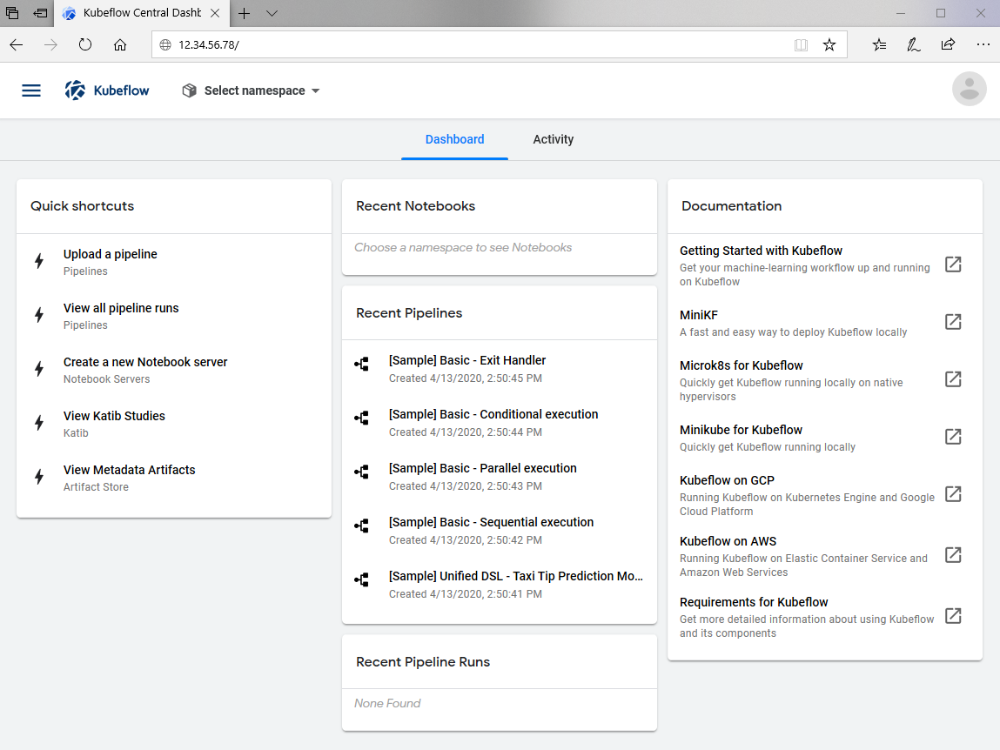
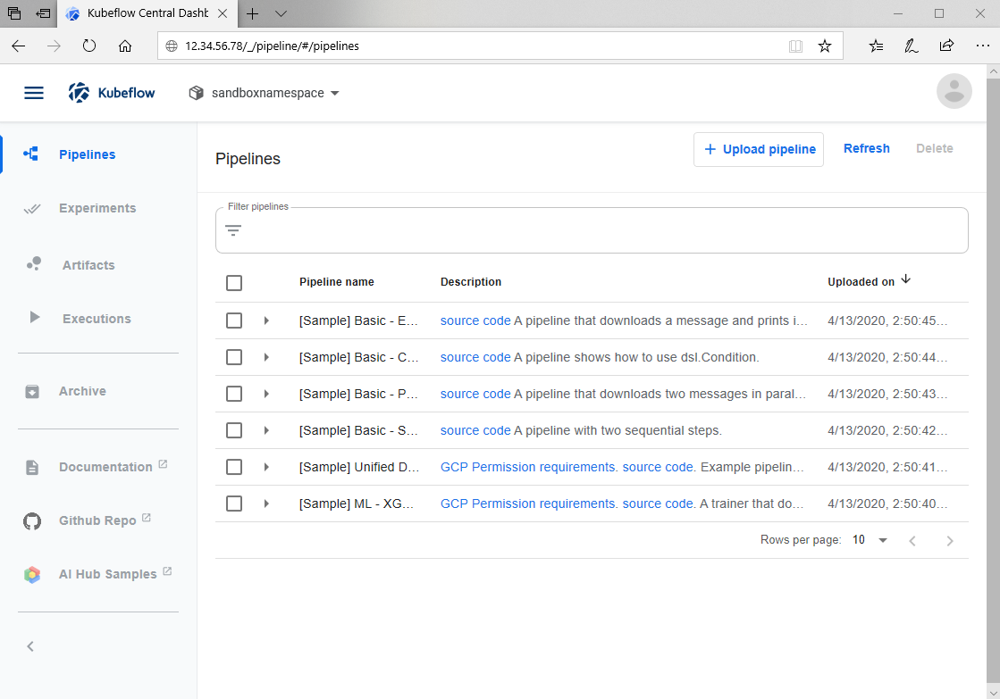

# Kubeflow on Azure

- Docker with GPU
  - local container, building/publishing
  - running GPU-enabled containers on Azure
- Kubernetes cluster on Azure
  - provisioning using Azure CLI
  - running workloads
  - monitoring
- Kubeflow on Azure
  - preparing Kubernetes nodes
  - installing
  - dashboard

## Prerequisites

- [Azure](http://azure.com) CLI, and Microsoft Azure subscription covering AKS.
- git, and [GitHub](http://github.com) account.
- [Docker](http://docker.com), DockerHub account.
- [Jupyter](https://jupyter.org/).
- [Kubeflow](https://github.com/kubeflow/kubeflow)
- [Bash in Azure Cloud Shell](https://docs.microsoft.com/en-us/azure/cloud-shell/quickstart)

## Docker with GPU

A special version is needed for a docker to use GPU hardware. See [nvidia-docker](https://github.com/NVIDIA/nvidia-docker) for more information.

Folder `docker` has a GPU-using Tensorflow example Dockerfile. To test if your VM is can run GPU containers.

Build a simple local image:

    $ cd kubeflow-on-azure/docker
    $ sudo docker build -t mytest:gpu .

To run the image we built: 

    $ sudo nvidia_docker run mytest:gpu

You can also verify the system with `nvidia/cuda` image, running `nvidia-smi`:

    $ sudo docker run --runtime=nvidia --rm nvidia/cuda nvidia-smi
    
    +-----------------------------------------------------------------------------+
    | NVIDIA-SMI 440.33.01    Driver Version: 440.33.01    CUDA Version: 10.2     |
    |-------------------------------+----------------------+----------------------+
    | GPU  Name        Persistence-M| Bus-Id        Disp.A | Volatile Uncorr. ECC |
    | Fan  Temp  Perf  Pwr:Usage/Cap|         Memory-Usage | GPU-Util  Compute M. |
    |===============================+======================+======================|
    |   0  Tesla K80           On   | 0000828D:00:00.0 Off |                  Off |
    | N/A   35C    P8    37W / 149W |      0MiB / 12206MiB |      0%      Default |
    +-------------------------------+----------------------+----------------------+
    +-----------------------------------------------------------------------------+
    | Processes:                                                       GPU Memory |
    |  GPU       PID   Type   Process name                             Usage      |
    |=============================================================================|
    |  No running processes found                                                 |
    +-----------------------------------------------------------------------------+

You can create a virtual machine using [Azure Portal](https://docs.microsoft.com/en-us/azure/virtual-machines/linux/quick-create-portal), and replicate the steps described above if you select the image from N-Series, that provides GPU support.

## Kubernetes cluster on Azure

You can create a new resource group using Azure CLI:

    $ az group create --name sandboxRG --location westus2

This is how you can create a one-node cluster using `aks` command:

    $ az aks create --resouce-group sandboxRG --name sandboxAKS \
      --node-vm-size Standard_NC6 --node-count 1

Now you can run workloads on this cluster. For example, a .yaml from this repository. It refers to the similar image we created earlier,
you can replace `microsoft/samples-tf-mnist-demo:gpu` with your own. the `kubectl` command looks like this:

    $ kubectl apply -f kubeflow-on-azure/kubernetes/sample-tf-mnist.yaml

Now you can see the pods and jobs running. For example:

    $ kubectl get nodes
    NAME                                STATUS   ROLES   AGE   VERSION
    aks-nodepool1-19850186-vmss000000   Ready    agent   29h   v1.15.10
    aks-nodepool1-19850186-vmss000001   Ready    agent   29h   v1.15.10
    aks-nodepool1-19850186-vmss000002   Ready    agent   29h   v1.15.10

    $ $ kubectl get jobs samples-tf-mnist-demo --watch
    NAME                   COMPLETIONS   DURATION   AGE
    samples-tf-mnist-demo  1/1           69s        27h

    $ kubectl get pods --selector app=samples-tf-mnist-demo
    NAME                          READY   STATUS      RESTARTS   AGE
    samples-tf-mnist-demo-7tnz6   0/1     Completed   0          27h

For more details, see [Use GPUs for compute-intensive workloads on Azure Kubernetes Service (AKS)](https://docs.microsoft.com/en-us/azure/aks/gpu-cluster)

## Kubeflow

If you have not done it in the previous step, install `kubectl`, as per [Kubeflow Installation](https://www.kubeflow.org/docs/azure/deploy/install-kubeflow/):

    $ sudo snap install kubectl
    ...
    kubectl 1.18.0 from Canonical✓ installed

If you have not activated your subscription, run `az login`, and follow the authentication instructions:

    $ az login
    To sign in, use a web browser to open the page https://microsoft.com/devicelogin and enter the code FGH7JH8 to authenticate.
    [
      {
        "cloudName": "AzureCloud",
        "id": "678235-6798-567a-8765-985865568765876d",
        "isDefault": true,
        "name": "Azure Stack PM Test and Validation",
        "state": "Enabled",
        "tenantId": "698756985-53784987-a6789-c67896-567876df",
        "user": {
          "name": "yourid@example.com",
          "type": "user"
        }
      }
    ]

Let's create a separate resource group for Kubeflow cluster:

    $ az group create --name sandboxRGkf --location westus2
    {
      "id": "/subscriptions/69876978-56856-23465-2344-ca56784445/resourceGroups/sandboxRGkf",
      "location": "westus2",
      "managedBy": null,
      "name": "sandboxRGkf",
      "properties": {
        "provisioningState": "Succeeded"
      },
      "tags": null,
      "type": "Microsoft.Resources/resourceGroups"
    }

For Kubeflow to work, it needs a specially-defined cluster:

    $ az aks create --resource-group sandboxRGkf --name sandboxAKSkf \
     --node-vm-size Standard_NC6 --node-count 2 --location westus2 --generate-ssh-keys
    {
      "aadProfile": null,
      "addonProfiles": null,
      "agentPoolProfiles": [
        {
          "availabilityZones": null,
          "count": 2,
          "enableAutoScaling": null,
          "enableNodePublicIp": null,
          "maxCount": null,
          "maxPods": 110,
          "minCount": null,
          "name": "nodepool1",
          "nodeTaints": null,
          "orchestratorVersion": "1.15.10",
          "osDiskSizeGb": 100,
          "osType": "Linux",
          "provisioningState": "Succeeded",
          "scaleSetEvictionPolicy": null,
          "scaleSetPriority": null,
          "type": "VirtualMachineScaleSets",
          "vmSize": "Standard_NC6",
          "vnetSubnetId": null
        }
      ],
      "apiServerAccessProfile": null,
      "dnsPrefix": "sandboxAKS-sandboxRGkf-3456d",
      "enablePodSecurityPolicy": null,
      "enableRbac": true,
      "fqdn": "sandboxaks-sandboxrgkf-23546-23452346.hcp.westus2.azmk8s.io",
      "id": "/subscriptions/236423567-2345-5463-2346-5474567/resourcegroups/sandboxRGkf/providers/Microsoft.ContainerService/managedClusters/sandboxAKSkf",
      "identity": null,
      "kubernetesVersion": "1.15.10",
      "linuxProfile": {
        "adminUsername": "azureuser",
        "ssh": {
          "publicKeys": [
            {
                "keyData": "ssh-rsa asdgasfgasghashgasdfasdgasdg
                asdgfasdgasgasfhsdnothingtoseeheredgfhjfghadfgasfgasfgasgasgfagfasgadsgf"
            }
          ]
        }
      },
      "location": "westus2",
      "maxAgentPools": 10,
      "name": "sandboxAKSkf",
      "networkProfile": {
        "dnsServiceIp": "10.0.0.10",
        "dockerBridgeCidr": "172.17.0.1/16",
        "loadBalancerProfile": {
          "effectiveOutboundIps": [
            {
              "id": "/subscriptions/236423567-2345-5463-2346-5474567/resourcegroups/MC_sandboxRGkf_sandboxAKSkf_westus2/providers/Microsoft.Network/publicIPAddresses/f10b3031-6da8-4c15-8a37-4a69861b3ced",
              "resourceGroup": "MC_sandboxRGkf_sandboxAKSkf_westus2"
            }
          ],
          "managedOutboundIps": {
            "count": 1
          },
          "outboundIpPrefixes": null,
          "outboundIps": null
        },
        "loadBalancerSku": "Standard",
        "networkPlugin": "kubenet",
        "networkPolicy": null,
        "outboundType": "loadBalancer",
        "podCidr": "10.244.0.0/16",
        "serviceCidr": "10.0.0.0/16"
      },
      "nodeResourceGroup": "MC_sandboxRGkf_sandboxAKSkf_westus2",
      "privateFqdn": null,
      "provisioningState": "Succeeded",
      "resourceGroup": "sandboxRGkf",
      "servicePrincipalProfile": {
        "clientId": "9e492310-0361-4c76-8c2c-9173923e3e5f",
        "secret": null
      },
      "tags": null,
      "type": "Microsoft.ContainerService/ManagedClusters",
      "windowsProfile": null
    }

You may need to [install the NVidia drivers](https://docs.microsoft.com/en-us/azure/aks/gpu-cluster#install-nvidia-drivers) to use GPUs on your cluster.

To install Kubeflow:

    $ az aks get-credentials --resource-group sandboxRGkf --name sandboxAKSkf
    Merged "sandboxAKSkf" as current context in /home/username/.kube/config

Download the `kfctl` from [Kubeflow releases](https://github.com/kubeflow/kfctl/releases) page.

    $ cd ~/kubeflow
    $ tar -xvf kfctl_v1.0.1_<platform>.tar.gz

    $ export PATH=$PATH:~/kubeflow/
    $ export KF_NAME=sandboxAKSkf
    $ export BASE_DIR=/opt/
    $ export KF_DIR=${BASE_DIR}/${KF_NAME}
    $ export CONFIG_URI="https://raw.githubusercontent.com/kubeflow/manifests/v1.0-branch/kfdef/kfctl_k8s_istio.v1.0.1.yaml"
    
Generate and deploy Kubeflow:

    $ mkdir -p ${KF_DIR}
    $ cd ${KF_DIR}
    $ kfctl apply -V -f ${CONFIG_URI}
    ...
    INFO[0184] Successfully applied application seldon-core-operator  filename="kustomize/kustomize.go:209"
    INFO[0184] Applied the configuration Successfully!       filename="cmd/apply.go:72"

Check the resources deployed correctly in namespace `kubeflow`
  
    $ kubectl get all -n kubeflow

It will show the list of the services and posd for the cluster we just created

## Using dashboard

The default installation does not create an external endpoint but you can use port-forwarding to visit your cluster.

    $ kubectl port-forward svc/istio-ingressgateway -n istio-system 8080:80
    Forwarding from 127.0.0.1:8080 -> 80
    Forwarding from [::1]:8080 -> 80

Now you can access it as `localhost:8080`.

An alternative way is to access the dashboard using external connection, by replacing `type: NodePort` with `type: LoadBalancer` while editing the config via:

    $ kubectl edit -n istio-system svc/istio-ingressgateway

Then the EXTERNAL-IP will become available from:

    $ kubectl get -w -n istio-system svc/istio-ingressgateway

Open it in your browser, and make sure your firewall rules allow HTTP port 80:

For more information see [Installing Kubeflow on Azure](- https://www.kubeflow.org/docs/azure/deploy/install-kubeflow/)

## Using Kubeflow

You can create a namespace, or a default namespace will be generated. This is how the dashboard looks like:

You can explore sample pipelines and create your own:

## Next Steps

The following resources might help during troubleshooting or modifications:

- https://docs.microsoft.com/en-us/azure/cloud-shell/quickstart
- https://docs.microsoft.com/en-us/azure/aks/gpu-cluster
- https://docs.microsoft.com/en-us/azure-stack/asdk/asdk-install
- https://docs.microsoft.com/en-us/azure-stack
- https://www.kubeflow.org/docs/other-guides/kustomize/
