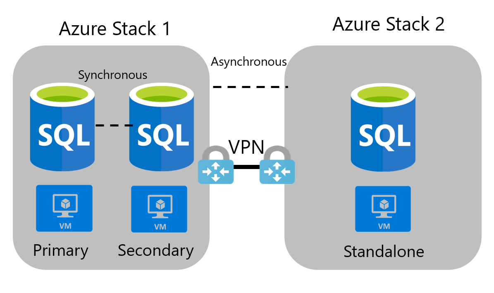
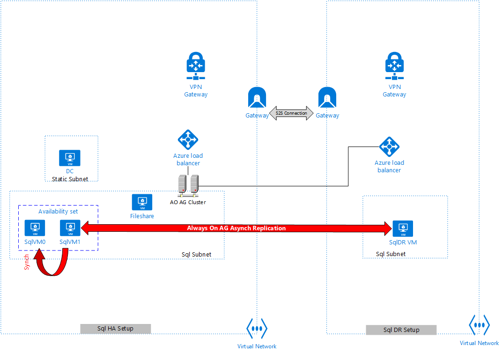

Contents

[1 Overview 1](#overview)

[1.1 Context and Considerations 1](#context-and-considerations)

[2 Prerequisites 2](#Prerequisites)

[3 Before you begin 2](#Before-you-begin)

[4 Reference Architecture 2](#Reference-Architecture)

[4.1 Azure Stack SQL Always-On High Availability Topography 3](#Azure-Stack-SQL-Always-On-High-Availability-Topography)

[4.2 High level deployment architecture 3](#High-level-deployment-architecture)

[4.3 Automation Flow 4](#Automation-Flow)

[5 Azure Stack Resources 5](#Azure-Stack-Resources)

[5.1 Deploying Azure Stack Resources 6](#Deploying-Azure-Stack-Resources)

[5.1.1 Site1-HA 6](#Site1-HA)

[5.1.1 Site2-DR 6](#Site2-DR)

[5.2 Preparing Parameters 7](#Preparing-Parameters)

[5.2.1 Parameters for HA 7](#Parameters-for-HA)

[5.2.2 Parameters for DR 10](#Parameters-for-DR-template1)

[5.3 Deploying Script 11](#Deploying-Script)

[6 Appendix 12](#Appendix)

[6.1 Configuring BGP for Azure Stack Development Kit Only  12](#Configuring-BGP-for-Azure-Stack-Development-Kit-Only)

Overview
========

This reference article details environmental requirements and steps for setting
up Microsoft Sql Server HA-DR (Windows Server 2016) on 2 Azure Stack
environments.

Data replication provides redundancy and increases [data
availability](https://docs.mongodb.com/manual/reference/glossary/#term-high-availability)
for applications dependent on Sql Server.

>   Organizations with a dynamic workload should strive to set up a SQL Server
>   high availability solution, with disaster recovery to prevent downtime and
>   data loss in the case of planned or unplanned server failure.

>   [SQL Server high
>   availability](https://docs.microsoft.com/en-us/sql/sql-server/failover-clusters/high-availability-solutions-sql-server?view=sql-server-2017)
>   will take advantage of replication and failover clustering technologies to
>   make sure there is always a backup of data.

Context and Considerations
--------------------------

There are some distinctions between one-node Azure Stack Development Kit (ASDK),
and multi-node Azure Stack Integrated System (ASIS).

ASDK utilizes a public IP address, while maintaining its own VM with a separate
and defined private network.

Azure Stack Integrated System integrates with your datacenter and has an entire
IP address range to delegate to the system during installation. This requires
some specialized setup and configuration for the Azure stack isolated
environment. Software-defined networking requires only four cables connecting an
Azure Stack machine to the outside network.

>   There are multiple ways to configure high availability SQL Server on Azure
>   Stack. This document will focus on connecting two independent Azure Stacks
>   via a S2S VPN (Site-to-Site Virtual Private Network) connection. This
>   connection allows for traffic to be encrypted and set through a tunnel from
>   one Azure Stack to the other.

Prerequisites
=============

**The below prerequisites are applicable for both Azure Stack environments(HA
Site and DR Site)**

-   Two AzureStack environments.

-   All the linked templates and DSC scripts should be stored in a location
    accessible to the parent template(github by default).

-   On each AzureStack instance, the marketplace should have the required
    edition of Sql Server 2016(on Windows Server 2016).

-   All the SQL VMs should be of the same configuration (recommended) and should
    have same version and edition of SQL server(mandatory for AlwaysOn).

-   For information on how to deploy Azure Stack Development Kit see [Azure
    Stack-SQL-Resource-Provider-Deploy](https://docs.microsoft.com/azure/azure-stack/azure-stack-sql-resource-provider-deploy)

-   Plans, Offers and Quotas Configured.

-   For information on how to configure Quotas, Offers and Plans see
    [Plan-Offer-Quota-Overview](https://docs.microsoft.com/azure/azure-stack/azure-stack-plan-offer-quota-overview)

-   A tenant subscribed to your Azure Stack Offer/Plan.

-   For information on how to Subscribe to an offer see.
    [Subscribe-to-an-Offer](https://docs.microsoft.com/azure/azure-stack/azure-stack-subscribe-plan-provision-vm)

Before you begin
----------------

Verify that you have met the following criteria before beginning your
configuration:

-   Verify that you have an externally facing public IPv4 address for your VPN
    device. This IP address cannot run through network address translation
    (NAT).

-   Ensure all resources are deployed in the same region/location.

For more information about VPN Gateway settings in general, see [About VPN
Gateway
Settings](https://docs.microsoft.com/en-us/azure/vpn-gateway/vpn-gateway-about-vpn-gateway-settings).

**Note: If you are using an ASDK environment please Complete Appendix Section
for configuring BGP**

Reference Architecture
======================

This section details the high reference architecture for SqlServer HADR that can
be used as a guidance to implement the templates.

AlwaysOn Failover Cluster Instances (FCI) and AlwaysOn Availability Groups
provide a comprehensive high availability and disaster recovery solution.

Azure Stack SQL Always-On High Availability Topography
------------------------------------------------------

High level deployment architecture
----------------------------------

As per the above architecture:

-   HA is deployed with 2 Sql Server VM’s on Site1, along with a File Share
    Witness on the same subnet

-   A DC machine is deployed on a different subnet , but same Vnet as the Sql
    VMs

-   DR is deployed as a standalone VM on Site2

-   Both sites are connected via a S2S connections (IPsec)

-   Sql Server secondary instance on the HA site is configured with an
    ‘automatic’ failover and ‘synchronous’ replication.

-   Sql Server secondary instance on the DR site is configured with a ‘manual’
    failover and ‘asynchronous’ replication.

Automation Flow
---------------

-   Sql HA part 1 Deployment on Site1. This includes:

    -   Vnet Gateway , Local Network Gateway, S2S Connection(IPSec)

    -   The AD and File Share are setup

    -   2 Sql Machines deployed, one machine is prepare for always on

    -   Outputs for-

        -   Catering to S2S on DR Site

        -   Configuring DR

-   Sql DR Part1 deployment Components Deployment. This includes:

    -   Virtual networks, subnets and gateway public ip address
    -   Creation of Local gateway and S2S connection on the DR Site

    -   Outputs for-

        -   Catering to S2S on HA Site

        -   Deploying and configuring Sql DR VM

-   Creation of Local gateway and S2S connection on the HA Site, deletion of
    initial local gateway/connection created on the HA Site(this was done to
    ensure the vnetgateway gets a public IP assigned to it)

-   At this point S2S connection is established on both Sites

-   Sq DR VM Deployment (includes domain join

-   HA part2 deployment, this is a DSC that runs on SqlVM1 and includes:

    -   Preparing pre-requisites on SqlVM1 and DR VM for setting up always on

    -   Creation of cluster and addition of all Sql nodes, HA and DR to the
        cluster

    -   Making DNS entry for both load balancers (HA and DR)

    -   Configuring Always on availability group on the Primary Node and adding
        HA VM and DR VM as secondary replicas as

    -   Creating a sample data base and doing a backup from Primary and
        restoring the same in all secondary replicas

    -   Adding dependency on listener for both load balancers (HA and DR) with
        an OR condition

Azure Stack Resources
---------------------

-   **Azure Stack IaaS for Hosting Sql Server on Windows Server 2016.** A
    standard image for Sql Server 2016 Enterprise Edition is used from the
    Marketplace.

-   **Azure Stack Virtual Network.** The Azure Stack Virtual Network, works
    exactly like the [Azure Virtual
    Network](https://docs.microsoft.com/en-us/azure/virtual-network/virtual-networks-overview),
    and enables many types of Azure resources, such as Azure Virtual Machines
    (VM), to securely communicate with each other, the internet, and on-premises
    networks.

    -   **Application Subnet.** Dividing the Azure Virtual Network into two or
        more logical, IP subdivisions via subnets provides a custom private IP
        address space using public and private (RFC addresses. This subnet will
        be where the majority of the resources will be deployed.

    -   **Gateway Subnet.** The gateway subnet is part of the virtual network IP
        address range specified when configuring the virtual network, and
        contains the IP addresses that the [virtual network
        gateway](https://docs.microsoft.com/en-us/azure/vpn-gateway/vpn-gateway-create-site-to-site-rm-powershell)
        resources and services use.

-   **Azure Stack Virtual Network Gateway.** Send network traffic between Azure
    virtual network and an on-premises site by creating a [virtual network
    gateway.](https://docs.microsoft.com/en-us/azure/azure-stack/azure-stack-vpn-gateway-about-vpn-gateways)

-   **Azure Stack Local Network Gateway.** [The local network gateway typically
    refers to the on-premises location. Azure refers to the site name and
    specifies the IP address of the local VPN device to connect
    to.](https://docs.microsoft.com/en-us/azure/azure-stack/azure-stack-network)

**Azure Stack Public IP.** The Azure Stack [Public IP
addresses](https://docs.microsoft.com/en-us/azure/virtual-network/virtual-network-ip-addresses-overview-arm#public-ip-addresses)
work like the Azure Public IP addresses, allowing Internet resources to
communicate inbound to Azure resource, and enable Azure resources to communicate
outbound to Internet and public-facing Azure services with an IP address
assigned to the resource. As note, please work with the Hardware OEM Partners to
make Azure Stack services (such as the portals, Azure Resource Manager, DNS,
etc.) available to external networks.

Deploying Azure Stack Resources
===============================

Site1-HA
--------

The resources deployed on Site1(HA Site) are as follows:

-   1 Virtual network

-   One subnet is used for Sql Server VMs and File Share, another one for
    gateway(gateway subnet). The DC machine sits on a separate subnet, named as
    Static Subnet

-   2 Sql Server IAAS VMs

-   1 File Share VM

-   1 DC machine

-   1 external load balancer, with the DNS entry, configured with the Always on
    availability group listener

-   Network Security Group with valid rules to allow cluster joining of DR VM
    and allowing Sql ports

-   Standard Storage Accounts for OS Disk, Data Disk, and diagnostics

-   Local Network Gateway

-   Virtual Network Gateway

-   Connection – S2S(IPsec)

Site2-DR
--------

The resources deployed on Site2(DR Site) are as follows:

-   1 Virtual network

-   1 subnet for standalone Sql VM, another one for gateway(gateway subnet)

-   1 Sql Server IAAS VM

-   1 external load balancer, with the DNS entry, configured with the Always on
    availability group listener(the load balancer ip on the DR Site gets
    configured as an ‘or’ dependency on the listener along with the load
    balancer ip on the HA Site , please refer
    [here](https://blogs.msdn.microsoft.com/igorpag/2014/12/22/sql-server-2014-high-availability-and-multi-datacenter-disaster-recovery-with-multiple-azure-ilbs/)
    step5.6)

-   Network Security Group with valid rules to allow cluster joining of DR VM
    and allowing Sql ports

-   Standard Storage Accounts for OS Disk, Data Disk, and diagnostics

-   Local Network Gateway

-   Virtual Network Gateway

-   Connection – S2S(IPsec)

Preparing Parameters
--------------------

| **Step** | **Step Details**                                                                                                                                                                            |
|----------|---------------------------------------------------------------------------------------------------------------------------------------------------------------------------------------------|
| 1        | Download the project and save it to your local machine                                                                                                                                      |
| 2        | Navigate to the folder, and open the **azurestackdeploy.paramaters.json** file for HA deployment. It is located in the HA folder.                                                           |
| 3        | Fill in **Parameter** **values for the HA part1 template**, located in the HA folder. The HA Part2 parameters are provided based on the output of HA part1 and DR deployments.              |
| 4        | Fill in **Parameter** **values for the DR1 template only**, located in the DR folder. The DR2 template parameters are overwritten based on the outputs derived from HA and DR1 deployments. |

### Parameters for HA

| **Parameter**                   | **Description**                                                                                                              | **Value**                                                                                                          |
|---------------------------------|------------------------------------------------------------------------------------------------------------------------------|--------------------------------------------------------------------------------------------------------------------|
| \_artifactsLocation             | Artifacts base url where all linked templates and scripts are stored.                                                        | You can use the default value or copy these artefacts to a location accessible to the arm template being deployed. |
| localGatewayName                | Admin account password                                                                                                       | Enter a Value                                                                                                      |
| adminUsername                   | The name of the Administrator of the new VMs and Domain.                                                                     | Enter a Value                                                                                                      |
| adminPassword                   | The password for the Administrator account of all the VMs and Domain                                                         | Enter a Value                                                                                                      |
| adVMSize                        | Size of the AD VM being deployed                                                                                             | Please select from the allowed values                                                                              |
| witnessVMSize                   | Size of the Witness VM being deployed                                                                                        | Please select from the allowed values                                                                              |
| domainName                      | The FQDN of the AD Domain created                                                                                            | Enter a Value                                                                                                      |
| dnsSuffix                       | The DNS Suffix for reverse lookup of public IPAddresses. Must be lowercase.                                                  | Enter a Value                                                                                                      |
| virtualNetworkAddressRange      | The network address space for the virtual network                                                                            | Enter a Value                                                                                                      |
| staticSubnet                    | The address range of the subnet static IPs are allocated from in the new VNET. This subnet is used for the DC machine.       | Enter a Value                                                                                                      |
| sqlSubnet                       | The address range of the SQL subnet created in the new VNET, All Sql VM’s and the File share VM are deployed in this subnet. | Enter a Value                                                                                                      |
| adPDCNICIPAddress               | The IP address of the new AD VM                                                                                              | Enter a Value                                                                                                      |
| deploymentPrefix                | The DNS Prefix for the Public IP Address for the Always On Cluster                                                           | Enter a Value                                                                                                      |
| virtualNetworkName              | The name of the virtual network to be created                                                                                | Enter a Value                                                                                                      |
| sqlServerServiceAccountUserName | The Sql Server service account name                                                                                          | Enter a Value                                                                                                      |
| sqlServerServiceAccountPassword | The SQL Server Service Account password                                                                                      | Enter a Value                                                                                                      |
| sqlAuthUserName                 | The SQL Server Auth Account name for all Sql Server instances on the HA Site/Site1                                           | Enter a Value                                                                                                      |
| sqlAuthPassword                 | The SQL Server Auth Account password                                                                                         | Enter a Value                                                                                                      |
| sqlStorageAccountName           | The name of Sql Server Storage Account                                                                                       | Enter a Value                                                                                                      |
| sqlStorageAccountType           | The type of the Sql Server Storage Account created                                                                           | Select from given set of values, default value is Standard_LRS                                                     |
| sqlServerOffer                  | The SQL Server Version                                                                                                       | Enter a Value                                                                                                      |
| sqlServerSku                    | The SQL Server Edition                                                                                                       | Enter a Value                                                                                                      |
| sqlVMSize                       | The size of the SQL VMs Created                                                                                              | Select from the given set of values                                                                                |
| sqlAOAGName                     | The Sql AlwaysOn Availability Group Name                                                                                     | Enter a Value                                                                                                      |
| sqlAOListenerName               | The Sql AG Listener Name                                                                                                     | default value                                                                                                      |
| sqlAOListenerPort               | The Sql AG Listener port                                                                                                     | Use default value                                                                                                  |
| workloadType                    | The Sql VM work load type                                                                                                    | Select from the given set of values                                                                                |
| vmDiskSize                      | The size of the SQL VM data disks in GB                                                                                      | Select from the given set of values                                                                                |
| numberOfSqlVMDisks              | Number of data disks (subject to VM size limitations)                                                                        | Select from the given set of values                                                                                |
| sampleDatabaseName              | Sample Availability group database name                                                                                      | Enter a value                                                                                                      |
| autoPatchingDay                 | The day of a week for auto patching                                                                                          | Select from the given set of values                                                                                |
| autoPatchingStartHour           | The start hour of a day for auto patching                                                                                    | Select from the given set of values                                                                                |
| gatewayPublicIPName             | Arbitrary name for public IP resource used for the azure stack gateway                                                       | Enter a value                                                                                                      |
| gatewayName                     | Arbitrary name for the new gateway                                                                                           | Enter a value                                                                                                      |
| gatewaySku                      | The Sku of the Gateway.                                                                                                      | Select from the given set of values                                                                                |
| connectionName                  | Arbitrary name for the new connection between Azure Stack HA Site and DR Site                                                | Enter a value                                                                                                      |
| sharedKey                       | Shared key (PSK) for IPSec tunnel. Same value to be used on DR Site                                                          | Enter a value                                                                                                      |
| localGatewayName                | Arbitrary name for the Azure Stack local gateway                                                                             | Enter a Value                                                                                                      |
| localGatewayIpAddress           | CIDR block representing the address space of the DR Sites VPN network's Subnet                                               | Enter a Value                                                                                                      |
| vpnType                         | Type of VPN connection, RouteBased only works for Azure Stack as of now.                                                     | Default Value                                                                                                      |

### Parameters for DR

| **Parameter**          | **Description**                                                                 | **Value**                           |
|------------------------|---------------------------------------------------------------------------------|-------------------------------------|
| vmName                 | Name of the Sql DR VM                                                           | Enter a Value                       |
| adminUsername          | The name of the Administrator of the new VMs and Domain.                        | Enter a Value                       |
| adminPassword          | The password for the Administrator account of all the VMs and Domain            | Enter a Value                       |
| virtualNetworkName     | Arbitrary name for the Azure Stack Virtual Network                              | Enter a Value                       |
| azureVNetAddressPrefix | CIDR block representing the address space of the Azure Stack VNet               | Enter a Value                       |
| subnetName             | Arbitrary name for the Azure Stack Subnet for Sql VM                            | Enter a Value                       |
| subnetPrefix           | CIDR block for Sql VM subnet, susnet of azureVNetAddressPrefix address space    | Enter a Value                       |
| gatewaySubnetPrefix    | CIDR block for gateway subnet, subset of azureVNetAddressPrefix address space   | Enter a Value                       |
| gatewayPublicIPName    | Arbitrary name for public IP resource used for the new azure stack gateway      | Enter a Value                       |
| gatewayName            | Arbitrary name for the new gateway                                              | Enter a Value                       |
| gatewaySku             | The Sku of the Gateway. This must be one of Basic, Standard or HighPerformance. | Select from the given set of values |
| sharedKey              | Shared key (PSK) for IPSec tunnel                                               | Enter a Value                       |
| dnsNameForPublicIP     | Unique DNS Name for the Public IP used to access the Virtual Machine            | Enter a Value                       |
| DNSServerAddress       | Server address spaces for DNS. This is an array                                 | Enter a value                       |
| vpnType                | Type of VPN connection, RouteBased only works for Azure Stack as of now.        | Default value                       |
| sqlStorageAccountName  | The name of Sql Server Storage Account                                          | Enter a Value                       |
| sqlStorageAccountType  | The type of the Sql Server Storage Account created                              | Select from the given set of values |
| sqlVMSize              | The size of the SQL VM Created                                                  | Select from the given set of values |
| vmDiskSize             | The size of the SQL VM data disks in GB.                                        | Select from the given set of values |

Deploying Script
----------------

| **Step** | **Step Details**                                                                                                                                                                                                                                                                                      |
|----------|-------------------------------------------------------------------------------------------------------------------------------------------------------------------------------------------------------------------------------------------------------------------------------------------------------|
| 1        | Open a PowerShell window as Administrator and navigate to the root directory and you will find Deploy-AzureResourceGroup.ps1                                                                                                                                                                          |
| 2        | Please ensure to do an ‘app registration’ for HA in the Azure Tenant that is used to register the Azure Stack, where HA Site will be deployed. This AD app will then be required to be given owner access at the subscription level, in Azure Stack. These inputs are required for the script to run. |
| 3        | Please ensure to do an ‘app registration’ for DR in the Azure Tenant that is used to register the Azure Stack, where DR Site will be deployed. This AD app will then be required to be given owner access at the subscription level, in Azure Stack. These inputs are required for the script to run. |
| 4        | Now run the **Deploy-AzureResourceGroup.ps1** , if will prompt for the following parameters:                                                                                                                                                                                                          |
| 5        | The script switches between HA and DR site, but it does not prompt for credentials again as it uses service principal for the HA and the DR Sites                                                                                                                                                     |

-   AzureStackApplicationId_HA - Azure Stack application ID of HA App for the
    Service Principal

-   AzureStackApplicationSecret_HA - Azure Stack Application Secret of HA for
    the Service Principal

-   AADTenantName_HA – AAD tenant name for the HA Site(used for authentication)

-   AzureStackResourceGroup_HA – Name of the resource group on the HA Site where
    the resources will get deployed(if this resource group does not exist, the
    script will create it)

-   AzureStackArmEndpoint_HA – Endpoint url of the azure stack on HA Site

-   AzureStackSubscriptionId_HA - AzureStack Subscription Id where HA Site
    resources will be created

-   AzureStackApplicationId_DR - Azure Stack application ID of DR App for the
    Service Principal

-   AzureStackApplicationSecret_DR - Azure Stack Application Secret of DR for
    the Service Principal

-   AzureStackResourceGroup_DR - Name of the resource group on the DR Site where
    the resources will get deployed(if this resource group does not exist, the
    script will create it)

-   AzureStackArmEndpoint_DR – Endpoint url of the azure stack on DR Site

-   AADTenantName_DR - AAD tenant name for the DR Site(used for authentication)

-   AzureStackSubscriptionId_DR - AzureStack Subscription Id where DR Site
    resources will be created

Appendix
========

Configuring BGP for Azure Stack Development Kit Only
----------------------------------------------------

| **Step** | **Step Details**                                                                                                                                                                                                                                                                                                                                                                                                                                        |
|----------|---------------------------------------------------------------------------------------------------------------------------------------------------------------------------------------------------------------------------------------------------------------------------------------------------------------------------------------------------------------------------------------------------------------------------------------------------------|
| 1        | Log in to the Azure Stack physical host for your ASDK                                                                                                                                                                                                                                                                                                                                                                                                   |
| 2        | From the Hyper-V Manager Console Click Az**S-BGPNAT01** On the lower window click on Networking tab Take note of the IP address for the NAT Adapter that uses the PublicSwitch                                                                                                                                                                                                                                                                          |
| 3        | Right Click Az**S-BGPNAT01** and click **Connect** button                                                                                                                                                                                                                                                                                                                                                                                               |
| 4        | Sign into VM                                                                                                                                                                                                                                                                                                                                                                                                                                            |
| 5        | Verify that IP’s match by typing ipconfig /all One of your IP addresses should match to the value from the Networking Tab in previous step In my environment it’s **10.16.169.131** but yours will be something different                                                                                                                                                                                                                               |
| 6        | In the command prompt type **Start PowerShell** And press **Enter**                                                                                                                                                                                                                                                                                                                                                                                     |
| 7        | Enter the PowerShell command To designate the external NAT address for the ports that the IKE Authentication tunnel will use.  Remember to change the IP Address to the value seen in **values are taken from Change 10.16.169.131 to your IP Address** Add-NetNatExternalAddress -NatName BGPNAT -IPAddress 10.16.169.131 -PortStart 499 -PortEnd 501 Add-NetNatExternalAddress -NatName BGPNAT -IPAddress 10.16.169.131 -PortStart 1500 -PortEnd 1501 |
| 8        | Enter the PowerShell command Create a static NAT mapping to map the external address to the Gateway Public IP Address. This maps the ISAKMP port 500 for PHASE 1 of the IPSEC tunnel **Change 10.16.169.131 to your IP Address** Add-NetNatStaticMapping -NatName BGPNAT -Protocol UDP -ExternalIPAddress 10.16.169.131 -InternalIPAddress 192.168.102.1 -ExternalPort 500 -InternalPort 5                                                              |
| 9        | Finally, we will need to do NAT traversal which uses port 4500 to successfully establish the complete IPSEC tunnel over NAT devices **Change 10.16.169.131 to your IP Address** Add-NetNatStaticMapping -NatName BGPNAT -Protocol UDP -ExternalIPAddress 10.16.169.131 -InternalIPAddress 192.168.102.1 -ExternalPort 4500 -InternalPort 4500                                                                                                           |
| 10       | If you run a Get-NetNatExternalAddress -Natname BGPNAT You should see similar results Get-NetNatExternalAddress -Natname BGPNAT                                                                                                                                                                                                                                                                                                                         |
