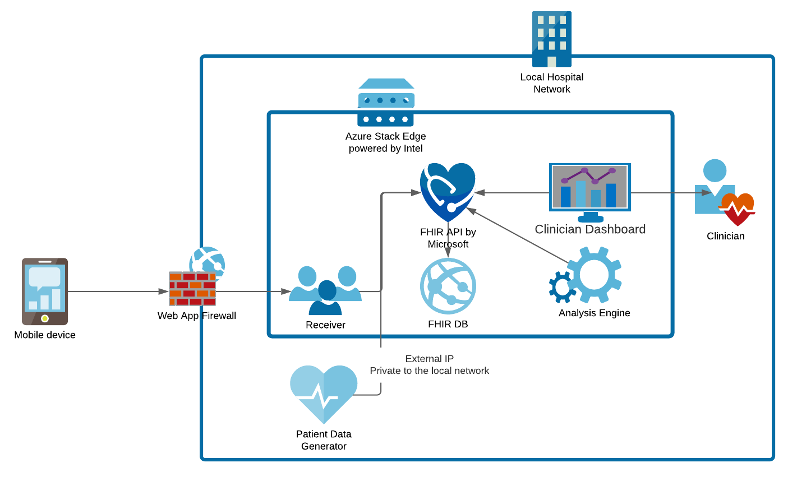

# Direct Connect Scenario 

If you wanted to avoid using cloud services, you could modify this software to use a direct connection. The following diagram illustrates how one might do that. You will need a Web Application Firewall of your choice and an additional software component to receive and convert the data.

The WAF (e.g. an F5 or similar appliance) would provide the necessary authentication, authorization, and other hardening requirements for safely connecting to the internet. 

The receiver would provide the web endpoint to receive the data and, if necessary, convert it to FHIR format. It would then send this data to FHIR for storage. The web endpoint to receive the data would be custom software written in any language you prefer. To convert the data, consider this container published by Microsoft: https://github.com/microsoft/FHIR-Converter 

Once the data is in FHIR, the rest of solution will work as documented. 