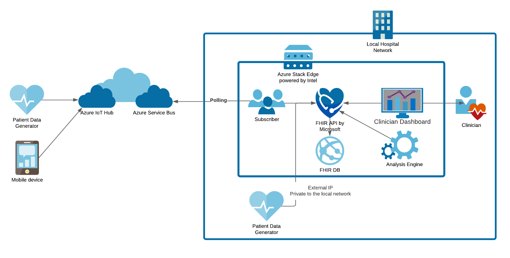
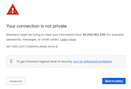

# Patient Data Analysis using Azure Stack Edge

**The Art of the Possible** 

Remote patient monitoring is a telehealth solution that provides early recognition insights regarding a patient’s acute or chronic condition so clinical teams can have the right information, about the right patient, at the right time to drive early interventions to improve clinical outcome. Through the use of Azure Stack Edge powered by Intel this can be done in a secure, scalable, and cost reductive manner.

This proof of concept provides a working example of how to collect, store, and analyze patient data using Azure Stack Edge, powered by Intel. Our patient data generator creates mock patient vitals (heart rate, respiration rate, blood pressure, SpO2, weight) in three different scenarios that the user can choose – improving, worsening, stable. Sending this data, either through IoT Hub on the public cloud (remote patient scenario) or directly to FHIR API (in-clinic scenario), the data is stored in a FHIR server on the Azure Stack Edge. Our analysis engine then analyzes the data for any noteworthy events and writes a flag back to the FHIR server in those cases. All data, including alerts for noteworthy patients, is then viewed in our clinician dashboard where the right information can make it to the right people at the right time.

This is demo code, and not ready for production use. While the scenario of remotely monitoring patients with varying degrees of Congestive Heart Failure (CHF), as well as consideration for typical hospital network architecture were considered; things like security, and HIPPA/PII were not considered for this proof of concept.

Check out [this video](https://myignite.microsoft.com/sessions/7ba986a0-9d05-4d22-abaa-b5f9d1916744) to learn more about the real-world possibilities this solution begins to unlock.

**Unlock the Potential of Edge & AI in Healthcare**

[](https://myignite.microsoft.com/sessions/7ba986a0-9d05-4d22-abaa-b5f9d1916744)


## Prerequisites

The following documentation will show you how to deploy and use the solution on your own Azure Stack Edge.
In order to fully deploy this software you will need several pieces of software, hardware, and cloud services.

### Software Prerequisites

You will need the following software on your machine in order to run and deploy this solution:

#### Windows Users  
_NOTE: For Windows users, it may be necessary to run your shells as an Administrator (right-click the shell you want to open and select `Run as Administrator`) in order for commands to work._  

- [Git Bash/Git for Windows](https://git-scm.com/downloads)
- [Chocolatey](https://chocolatey.org/install)

#### All Users  
- [Node](https://nodejs.org/en/) - Version 12 or higher is recommended.  **Please install the LTS release version and not Current**  
- [kubectl](https://kubernetes.io/docs/tasks/tools/install-kubectl/)
- [helm](https://helm.sh/docs/intro/install/)
- [az](https://docs.microsoft.com/en-us/cli/azure/install-azure-cli)
- [docker](https://docs.docker.com/get-docker/)
- _(Optional)_ [docker-compose](https://docs.docker.com/compose/install/)
  - Included with Docker Desktop for Mac and Windows, but a separate install is required for Linux users
- _(Optional)_ Needed for building react native app
  - [Java JDK](https://www.oracle.com/java/technologies/javase-downloads.html) - JDK SE 8 is recommended
  - [Android Studio](https://developer.android.com/studio) 

### Hardware Prerequisites

You will need the following hardware to deploy the solution:

- [Azure Stack Edge](https://azure.microsoft.com/en-us/products/azure-stack/edge/)

Although you can run this software locally or anywhere else that Docker containers can run, this software was purpose built for the Azure Stack Edge.

### Cloud Services

If you want to utilize this solution with the remote patient cloud connect scenario (recommended), you will need access to the following cloud services.

- [Azure Cloud Services](https://azure.microsoft.com/en-us/services/cloud-services/)
  - [IoT Hub](https://azure.microsoft.com/en-us/services/iot-hub/)
  - [Service Bus](https://azure.microsoft.com/en-us/services/service-bus/)
  - [Azure Container Registry](https://azure.microsoft.com/en-us/services/container-registry/)

## Architecture  

### Remote Patient Cloud Connect Scenario (Recommended)




**Remote Patient Bluetooth Connect app** (running on mobile device) - This is a mobile app for Android that allows patients to connect with the Bluetooth enabled [OMRON Blood Pressure Monitor (model BP7250)](https://omronhealthcare.com/products/5-series-wireless-upper-arm-blood-pressure-monitor-bp7250/) and upload vital readings for processing on an Azure Stack Edge.  
  
**Patient Data Generator** - The Patient Data Generator is a Node command line utility that simulates data coming from remote or in-clinic patient devices. Patient and vital data (also referred to as 'Observations') are generated in the [FHIR format](http://hl7.org/fhir/).  
  
**Azure Cloud Services** - The cloud services used in this solution are Azure IoT Hub to receive data and Azure Service Bus to make the data available to the Azure Stack Edge software. See below for details on a [Direct Connect Scenario](./DirectConnectScenario.md) without public cloud.
  
**Subscriber** - The subscriber is a Node Express application that subscribes to a topic on Azure Service Bus and writes the data to a FHIR server when events are received.  
  
**FHIR API/Server** - [FHIR](https://en.wikipedia.org/wiki/Fast_Healthcare_Interoperability_Resources) servers are key tools for interoperability of health data. [FHIR Server for Azure](https://github.com/microsoft/fhir-server) is a .NET Core implementation of the open source FHIR software and available as a [Docker image](https://hub.docker.com/_/microsoft-healthcareapis-r4-fhir-server). This is the same software that powers [The Azure API for FHIR](https://docs.microsoft.com/en-us/azure/healthcare-apis/fhir/overview) a managed cloud service that you can create, deploy, and begin using quickly.
  
**Analysis Engine** - The patient data analysis component is a Node Express application that handles incoming FHIR-formatted patient vital data and analyzes it for troubling conditions. It produces a simple green/yellow/red analysis against set thresholds as well as producing FHIR flags in cases of extreme weight gain (a key indicator of a critical congestive heart failure patient).
  
**Clinician Dashboard** - The clinician dashboard is a React web application for viewing and organizing patient data stored in an FHIR Server on an Azure Stack Edge. This is the dashboard for clinicians used to see patient data and alerts. It pulls data from the FHIR API.
  
  
### Remote Patient Direct Connect Scenario (Optional)

As an alternate scenario, you might want to avoid cloud and connect a remote patient directly to software running on the Azure Stack Edge. Although this scenario is not implemented in this solution, it is feasible. [Click here for more details.](./DirectConnectScenario.md)


## Get Started

1. [Configure your Azure Stack Edge and Kubernetes Cluster](./AzureStackEdgeInstall.md)
2. [Deploy cloud services in Azure Public](./azure-cloud-services/README.md)
   - If you manually created your Azure Cloud Services, you'll need to follow the setup instructions in the [subscriber readme](./subscriber/README.md) to copy your connection string for the next step. If you used the automated option in the previous step, the values were set for you and you do not need to worry about this. 
3. _(Optional)_ If you would like to build your own Docker images from source, follow the instructions in the page [Build Docker Images from Source](./BuildDockerFromSource.md). If you would like to use the prebuilt images in Docker Hub, skip this step.
4. Deploy Containers with Helm
     ```
    helm dependency update helm

    helm upgrade --install --recreate-pods everything helm --set global.service_bus_connection_string="$connection_string"
    ```
    - If you are using ACR (or another private registry) include this with the Helm command above: `--set global.docker_registry=$docker_registry`  
    - Once the deployment finishes successfully, you will see some helpful notes in your terminal.  
    - To verify all pods are running successfully run: `kubectl get pods`  
    - You can also verify the status in the [k8s dashboard](#how-to-access-your-kubernetes-dashboard)  
    - You can get the IP of your new dashboard by running  
        ```
        kubectl get services dashboard-service --output jsonpath='{.status.loadBalancer.ingress[0].ip}{"\n"}'  
        ```
    - Be sure you are using `http://`. See the [Common Issues](./README.md#common-issues-and-troubleshooting) section if you are having trouble.
5. [Generate some fake patient data](./data-generator/README.md)
6. _(Optional)_ [Connect the blood pressure cuff to the phone app](./bluetooth-mobile-app/README.md)

## Prebuilt Images in Docker Hub

Docker Images have been built and pushed to Docker Hub for your convenience. 

- [Dashboard](https://hub.docker.com/r/intelligentedge/patientmonitoring-dashboard)
- [Analysis](https://hub.docker.com/r/intelligentedge/patientmonitoring-analysis)
- [Subscriber](https://hub.docker.com/r/intelligentedge/patientmonitoring-subscriber)
- [FHIR](https://hub.docker.com/_/microsoft-healthcareapis-r4-fhir-server) (Not part of this project)

## How to Access Your Kubernetes Dashboard

In order to monitor your Kubernetes (k8s) cluster, you will need to configure access via your Azure Stack Edge device's local UI (Azure Stack Edge Dashboard). You can find more detailed documentation here: https://docs.microsoft.com/en-us/azure/databox-online/azure-stack-edge-gpu-monitor-kubernetes-dashboard

- **Potential Issue**: Google Chrome won't let me view my Kubernetes Dashboard!
  - See the [Common Issues](./README.md#common-issues-and-troubleshooting) section.

## Glossary of Terms

- Azure Stack Edge (ASE): Hardware that this software is intended for. [Read more](https://azure.microsoft.com/en-us/products/azure-stack/edge/).
- FHIR: Fast Healthcare Interoperability Resources. [Read more](https://www.hl7.org/fhir/overview.html).
- Observation: This is a FHIR specific term. These are the individual vital readings or data sent to the FHIR server by the data-generator.
- Flag: This is a FHIR specific term.

## Postman Collection

If you would like to access FHIR data or troubleshoot issues with data being generated, you can use [Postman](https://www.postman.com/downloads/) along with the provided [Postman Collection](./AzureStackEdge.postman_collection.json). Simply import the collection following [these steps](https://learning.postman.com/docs/getting-started/importing-and-exporting-data/). Then you will need to update the `fhir-api-url` variable to match your cluster's FHIR IP Address (or `http://localhost:8080` if running locally). You can learn more about editing variables [here](https://learning.postman.com/docs/getting-started/importing-and-exporting-data/).

## Common Issues and Troubleshooting

- `waiting to start: image can't be pulled`
  - This happens when your secret is malformed or named incorrectly.
- Google Chrome won't let me view my Kubernetes Dashboard!

   [](./images/chrome-connection-not-private.png)
   - If you get to a 'Your connection is not private' page that won't let you navigate past it, just type `thisisunsafe` while focused in a Chrome browser window to bypass. (This is known as the [`interstitial bypass keyword`](https://chromium.googlesource.com/chromium/src/+/cb8501aaf28904ff1e39962aaed380a1618a6222%5E%21/) and is a safety feature of Chrome when an [HSTS](https://developer.mozilla.org/en-US/docs/Web/HTTP/Headers/Strict-Transport-Security) violation is detected. It's designed to prevent users from visiting malicious websites. If have concerns about this you should discuss further with your IT department).
- I can't view my dashboard after deployment!
  - Some browsers will try to force `https`, but this app is only configured for `http` on port 80. Be sure that you are only accessing the dashboard with `http://`.
  - Check to make sure the dashboard pod is running. If not, investigate the issue.
  - If your dashboard pod _is_ running but you're not able to access the dashboard, check the logs for that pod. From the k8s dashboard, browse to the pod in question and click the "view logs" button in the top right. More info can be found [here](https://kubernetes.io/docs/tasks/access-application-cluster/web-ui-dashboard/#logs-viewer). You can also view logs [from the command line](https://kubernetes.io/docs/reference/kubectl/cheatsheet/#interacting-with-running-pods).
- My dashboard pod failed to start!
  - If the FHIR server has not started or is unreachable by its internal cluster IP, nginx in the dashboard will fail to start and the pod will restart. Check that the right FHIR url is being passed to the container, and that the endpoint is reachable. You may want to exec into the container to check these issues.

## FAQs

**Q**: How do I want to make changes to the Kubernetes deployments without messing with Helm templates?

**A**: Easy! Just run 

    `helm template helm --dry-run > manifest.json` 
    
  This will generate the k8s manifests that you can edit as you see fit and deploy with `kubctl deploy manifest.json`

