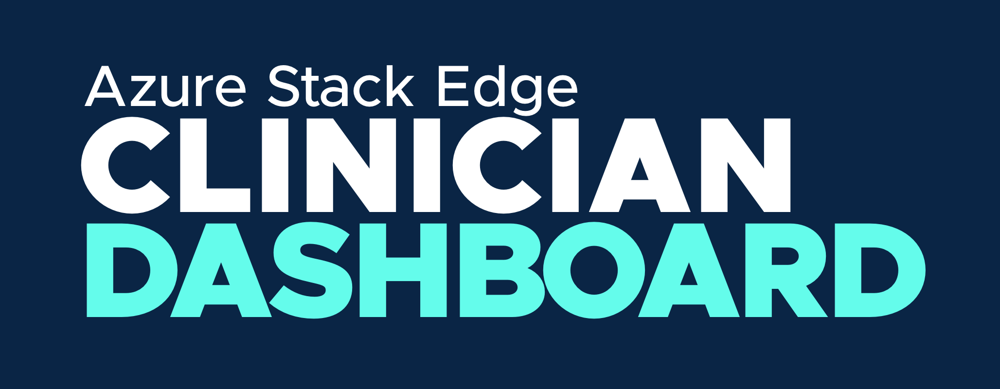

# Clinician Dashboard Web App

A React web application for viewing and organizing patient data stored in an FHIR Server on an Azure Stack Edge.

This is the dashboard for clinicians, used to see patient data and alerts. It pulls data from the FHIR API.

## Deploy via Helm

The **recommended** approach is to deploy all containers at once with the Helm chart in the parent directory (see [README](./../README.md#get-started)).

But, if you want to deploy this single container you can do so by setting the empty values in [`values.helm`](./helm/values.yaml) and then running

_NOTE: This approach will not work if you previously deployed with the parent chart. Running this command creates a new release, but cannot be used to modify an existing release._

```bash
helm upgrade --install dashboard helm
```

# Development

## Prerequisite Software for Development

- [Node](https://nodejs.org/en/download/). _Recommended: 12 or higher_
- [az](https://docs.microsoft.com/en-us/cli/azure/install-azure-cli)
- [kubectl](https://kubernetes.io/docs/tasks/tools/)
- [Docker](https://www.docker.com/products/docker-desktop)

## Build the Docker Image

```
docker build -t dashboard .
```

## Run the Docker Image

```
docker run dashboard \
  --env FHIR_URL=<FHIR URL>
```

`FHIR_URL` here will be an address to your local or development FHIR server.

## Setting up k8s Access

Follow the steps documented in the "Get Started" section of the [README](./../README.md#get-started).

## Generate HELM Templates

Run the following command: `helm template dashboard helm --dry-run`

### How to Get Dashboard URL from Kubernetes

To confirm a successful deployment in Kubernetes, you can access the Clinician Dashboard by looking up the IP address for the running service.

The following command will produce an IP address for you to navigate to in a web browser.

```
kubectl get services dashboard-service --output jsonpath='{.status.loadBalancer.ingress[0].ip}{"\n"}'
```

It will look something like this: `10.255.182.235`. If you are having trouble navigating in a web browser, format the URL like this: `http://10.255.182.235/` (with a prefix of `http://`).
