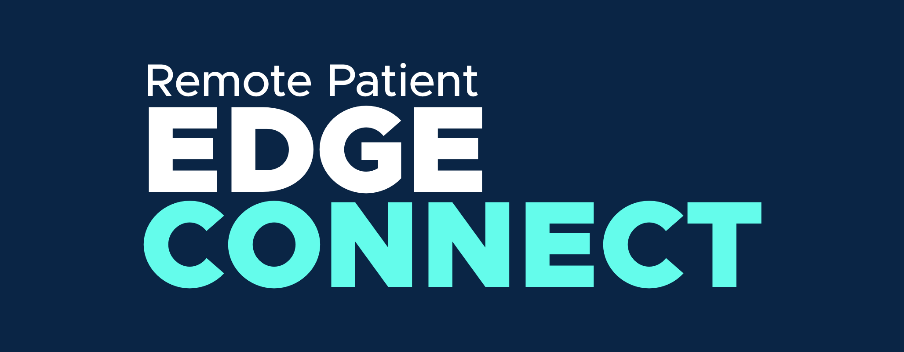

# Remote Patient Edge Connect Bluetooth App

This is a mobile app for Android that allows patients to connect with the Bluetooth enabled OMRON Blood Pressure Monitor (model BP7250) and upload vital readings for processing on an Azure Stack Edge.

## Prerequisite Software Needed

- [Node](https://nodejs.org/en/)
- [Java JDK](https://www.oracle.com/java/technologies/javase-downloads.html) 
  - #TODO: this is the latest version of Java JDK - there are instructions in the Developer Notes that indicate JDK v8 may be less troublesome - this is something to watch out for
  - #TODO note: Even if not developing, the JDK is needed to use the keytool cli tool, - do we instruct the user to use an earlier version of JDK to prevent problems(if they exist) in case they want to start developing?
- adb
   - See instructions for setting up adb on your relevant OS: https://www.xda-developers.com/install-adb-windows-macos-linux/ 

## Prerequisite Hardware Needed

- [OMRON Blood Pressure Monitor (model BP7250)](https://omronhealthcare.com/products/5-series-wireless-upper-arm-blood-pressure-monitor-bp7250/)
   
## Prerequisite Data Before Building an Android .apk File

TODO: add Images/Screenshots of navigation needed to these instructions

The following data is required and will need to be assembled to build an `.apk` file to install on your Android device:

- Patient Id in FHIR Database
- Iot Hub Resource Name
- Device Policy Key
- Device Id

## Patient Id

You will need a patient UUID to associate vital data to.

### Creating a Patient Id

1. In a terminal, navigate to the root directory where the **Data Generator** CLI tool is located. 
2. Generate a simulated patient, to apply your vital readings to, using the following command:

    `npm run addPatients -- -d fhir -n 1`

3. After the command is complete, the console will display a patient UUID that you will need later for the command to build an `.apk` file for installation on your Android device.
   - Example console output:
     ```
     Patient Uuids: 9559fe1a-7194-4dc4-89a4-a88e2f58340e
     ```
NOTE: You will need to login to your Azure account in order to find the following resource information.

## IoT Hub Resource Name

You will need to determine the IoT Hub resource name that you will send data to.

1. Navigate to https://portal.azure.com.
2. In the Search Bar at the top of the page, type `iot hub` to find the IoT Hub resource.
3. Copy the value underneath the `Name` column to your clipboard. This will save it for use in the command to generate a `.apk`.

## Device Policy Key 

You will need a device policy key in order to securely send data to IoT Hub. 

1. Navigate to https://portal.azure.com.
2. In the Search Bar at the top of the page, type `iot hub` to find the IoT Hub resource.
3. Select your IoT Hub resource.
4. In the left side panel, go to `Shared access policies`.
5. Select `device` from the options underneath the **Policy** column.
6. Your policy key will be the **Primary key** listed under Shared access keys.
7. Copy the policy key by clicking on the Copy icon to the right of the field. This will save it for later use in the command to generate a `.apk`.

## Device Id

You will need a device Id in order to save data for a particular device in IoT Hub. 

(TODO: How to create an IoT Hub device- Do these instructions belong here or somewhere else?)

1. Navigate to https://portal.azure.com.
2. In the Search Bar at the top of the page, type `iot hub` to find the IoT Hub resource.
3. Select your IoT Hub resource.
4. In the left side panel select `IoT devices` (You can search for it in the search bar in the panel).
5. Select the Device you created.
6. Copy the Device Id field value to the clipboard using the copy icon on the right. This will save it for later use in the command to generate a `.apk`.


# Building an .apk (Android app) for use on Android Device

## Building a Keystore

In order to build and sign the Android app for release mode, you will need to generate a keystore file that will be stored locally in the `android/app` directory. This is required to run the application on an Android device. 

1. Navigate to the `android/app` directory inside the project folder and open a terminal there. 
   - **Windows Users**: On Windows you can open the folder where you downloaded/cloned the project and right-click inside anywhere to select `Git Bash Here`. Another option is to open Git Bash from the Desktop or search bar and navigate to the project root directory.
2. Run the following command: `keytool -genkey -v -keystore my-app-key.keystore -storetype jks -alias my-app-alias -keyalg RSA -keysize 2048 -validity 10000 -deststoretype pkcs12`.
3. There will be a prompt for a password. Type or paste `protract-assail-WILLIWAW` (configured via `android/gradle.properties`), and then hit Return/Enter.
  - **Windows Users**: You may need to manually type this password if copying and pasting fails.
4. Type or paste the same password again, then hit Return/Enter.
5. _(Optional)_ Enter Name, Organizational Unit, and Organization, or hit Return/Enter to skip.
6. There will be a prompt that reads `Is CN=Unknown, OU=Unknown, O=Unknown, L=Unknown, ST=Unknown, C=Unknown correct?` Type `yes` and then hit Return/Enter.
   - Note: This prompt will display your user-entered inputs if they were entered.
7. Verify that `my-app-key.keystore` is now in the `android/app` directory.

## Creating an APK Build:

**Prerequisite Steps for Windows Users**: 
  ### Set ANDROID_SDK_ROOT path
   - #TODO: This could get complicated, so we should decide on some of these ways to set this in windows - there are alternatives which include editing a file in the project if that's simpler? See https://stackoverflow.com/questions/27620262/sdk-location-not-found-define-location-with-sdk-dir-in-the-local-properties-fil for alternatives to try.  Maybe we could also create separate scripts for win/mac that automate some of this more??
    - #TODO: A similar process may be needed for Mac Users to set their path before the build release command will work.
  1. Open a Git Bash terminal and run the command: `echo 'export ANDROID_SDK_ROOT=$HOME/AppData/Local/Android/Sdk' >> ~/.bashrc`
  1. The Android SDK that came installed with Android Studio should be located at `C:\Users\<yourUser>\AppData\Local\Android\Sdk` (If it is in a different location, replace the path in the export command with the correct location.)
  1. Now run the command: `source ~/.bashrc`

**All Users**:
1. Navigate to the root folder of the mobile-bluetooth-app project. 
2. Run the following script in a terminal using the values you assembled from the `Prerequisite Data Before Building` Section:
  
  - `./build-release-apk.sh <Patient Id> <IoT Hub Name> <Policy Key> <Device Id>`

3. The script will produce an .apk file (`app-release.apk`) on your computer at `<project-root>/android/app/build/outputs/apk/release/app-release.apk`

## Installing the APK on an Android Device

1. Connect the Android device to your computer via USB. Make sure USB Debugging mode is turned on (See instructions under Enable Debugging Over USB here: https://reactnative.dev/docs/running-on-device).
2. After the device is connected to your computer, use the `adb` CLI tool to install the APK to your Android device: 
  1. Make sure you are in the root project folder.
  2. Run `adb install ./android/app/build/outputs/apk/release/app-release.apk`.
3. The app `Edge Connect` will display on your Android device.
  1. Tap on the app icon to start it.

## Taking a Blood Pressure reading with the Omron Series 5 device:

1. Put the arm cuff on your left arm half an inch above your elbow.
1. Rest your arm on a stable surface with the arm cuff level with your heart.
1. Press the `START/STOP` button on your monitor to start recording.
1. If the reading was successful, the results will display on the Omron device screen. The reading is now ready to be synced to the Edge Connect mobile app.
1. Open the Edge Connect app on your Android device and follow the onscreen instructions to sync the reading.

# Developer Notes
## Running a React Native App on an Android Device

### First Time Setup

Official documentation: https://reactnative.dev/docs/environment-setup

It is recommended that you consult the official React-Native documentation for setting up your environment for development, but a summary of the important steps is listed below.

TODO: Notes for using Homebrew on Windows. Maybe this document: (https://docs.brew.sh/Homebrew-on-Linux)

# Windows

1. Install [Chocolatey](https://chocolatey.org/install)
1. If you don't have the Java JDK installed already (run `javac -version` in a terminal to check), install it by running the following command in a CMD Prompt (in the search bar on the bottom left of your Windows Desktop, search for `cmd` and right click to Run as Administrator):
    `choco install -y openjdk8`
1. Install Android Studio if needed: 
  1. Download and run the installer from https://developer.android.com/studio
1. Open Android Studio and select the "SDK Platforms" tab from within the SDK Manager
  1. Check the box next to "Show Package Details" in the bottom right corner. 
  1. Look for and expand the Android 10 (Q) entry, then make sure the following items are checked:
    - Android SDK Platform 29
    - Intel x86 Atom_64 System Image or Google APIs Intel x86 Atom System Image
1. Select the "SDK Tools" tab and check the box next to "Show Package Details". Look for and expand the "Android SDK Build-Tools" entry, then make sure that 29.0.2 is selected.-
1. Click "Apply" to download and install the Android SDK and related build tools.
1. #TODO: may need to set some environment variables, but it is unclear whether setting ANDROID_SDK_ROOT in the above sections already satisfies this requirement.  We'll have to learn what is missing when we get to this point.  We could use the same link that the Mac OS section below points to if needed? 
(https://reactnative.dev/docs/environment-setup)

# Mac OS

In summary, to set things up:
1. `brew install node`
1. `brew install watchman`
1. `brew install --cask adoptopenjdk/openjdk/adoptopenjdk8`
1. Install [Android Studio](https://developer.android.com/studio) with the Android SDK
1. Run Android Studio, open the Configure Menu then SDK Manager. Select Android 10 (Q), click "Show package details" and also select Intel x86 Atom_64 System Image. Click Apply to install them.
1. Configure the ANDROID_HOME environment variable (https://reactnative.dev/docs/environment-setup)

### Running on Device

The gist is below, but full details are here which includes connecting over WiFi: https://reactnative.dev/docs/running-on-device
1. Enable USB Debugging on your device (in your Android settings)
1. Plug your device in via USB. Follow the prompts on screen to allow interaction, and run `adb devices` to see a list of connected devices.
   - You should see something resembling this message if everything was done correctly: 
     ```
     List of devices attached
     96JX21Y9W       device
     ```
1. Run `npm install` in a terminal to install app dependencies.
1. Run `npx react-native run-android` in a terminal to launch the app on your connected device.

### Troubleshooting

- If you get a `No Callback found` error during development, you can safely dismiss it by pressing `Dismiss` at the bottom of the screen. This is a non-critical error that will not impact the functionality of the application.

