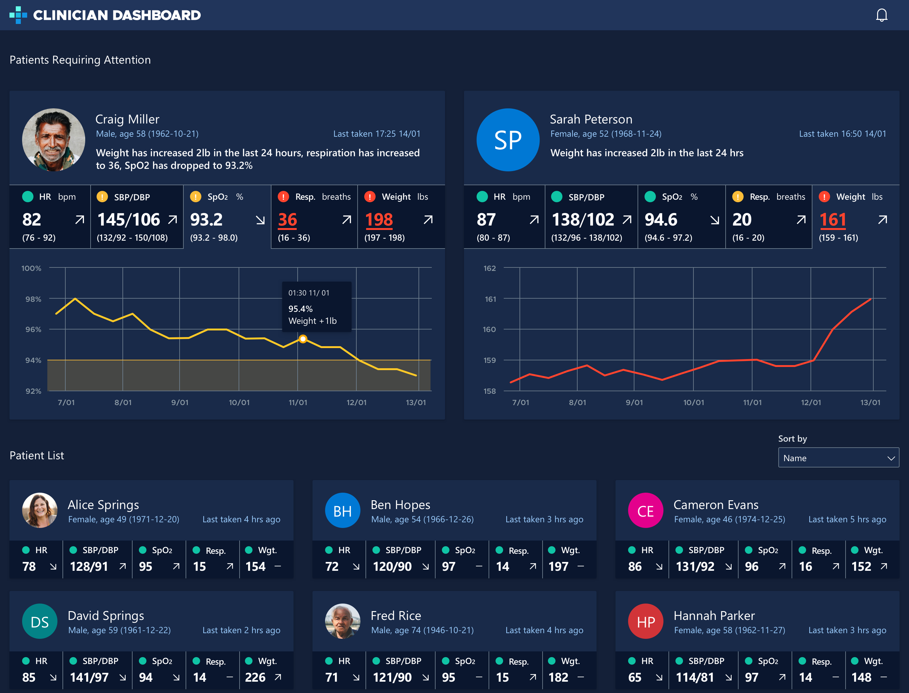

# Clinician Dashboard Web App
A React web application for viewing and organizing patient data stored in an FHIR Server on an Azure Stack Edge.

This is the dashboard for clinicians used to see patient data and alerts. It pulls data from the FHIR API.

# Deploying Container to Azure

## Prerequisite Software Needed for Deployment

- [az](https://docs.microsoft.com/en-us/cli/azure/install-azure-cli)
- [kubectl](https://kubernetes.io/docs/tasks/tools/)
- [Docker](https://www.docker.com/products/docker-desktop)

## Prerequisite Data Needed for Deployment

- ACR name - Name of the container registry in Azure you are deploying to.
- Admin password - (TODO: This looks to come from the `az azr credential` call in Authenticate to ACR section - should confirm).
- Properly configured `kubectl` and `kubeconfig` for your Azure namespace
- FHIR API URL - Documented in `data-generator` repo (TODO: possibly moved up to Root?)

## Authenticate to ACR

_TODO: This should be noted in Root README, initial setup_

_(If you just completed this step you don't need to repeat it)_

```bash
az login
az acr update -n <acrName> --admin-enabled true #this may have been done previously, but does not hurt to do it again
az acr credential show -n <acrName> --query 'passwords[0].value'
docker login -u <acrName> -p <your admin password> <acrName>.azurecr.io
```

## Authenticate Kubernetes on ASE to ACR

_TODO: This should be noted in Root README, initial setup_
_(This step only has to happen once)_

```kubectl create secret docker-registry acr-secret --docker-server=<acrName>.azurecr.io --docker-username=<acrName> --docker-password=<your admin password>```

## Build with Docker

Before deployment to Azure, a Docker image will need to build and then pushed. 

1. Fill in `acrName` and `fhirApiUrl` for the following script:

```bash
TAG=<acrName>.azurecr.io/clinician-dashboard:latest
docker build --build-arg FHIR_URL=<fhirApiUrl> -t $TAG  .
docker push $TAG
```

2. Run to build a Docker image. 
3. Push to your specific Azure container registry.

## Deploy via Helm

To deploy

```helm upgrade --install clinician-dashboard helm --set global.docker_registry=<acrName>```

# Development

## Prerequisite Software for Development

- [Node](https://nodejs.org/en/download/). _Recommended: 12 or higher_
- [az](https://docs.microsoft.com/en-us/cli/azure/install-azure-cli)
- [kubectl](https://kubernetes.io/docs/tasks/tools/)
- [Docker](https://www.docker.com/products/docker-desktop)

## TODO: This might be useful for documentation on kubeconfig

## Setting up k8s Access
1. Install kubectl on your machine: (For instructions for different operating systems, see https://kubernetes.io/docs/tasks/tools/install-kubectl/)
2. Replace `~/.kube/config` file contents (or create `config` file) with the contents of the `wwtintelcluster.txt` file (sent by Neil on 1/11 in the `Sending Data to ASE` thread)
    - **Note**: You may need to create the `~/.kube` directory if it is not created automatically during the install process
3. Run `kubectl` commands against the ASE pods.
4. All commands should be prefixed with `kubectl -n msftintel`. TODO: Create an alias for this (e.g. `alias kdev=kubectl -n msftintel`). 

## Generate HELM Templates
Run the following command: ```helm template clinician-dashboard helm --dry-run```

# TODOs


_**[Remove this section before release]**_

- Address the TODO in the dockerfile. Not sure what thats about. fix and/or remove.
- Many, many warnings about deprecated packages in npm install output. should we fix any of those?
- Templatize FHIR server url in nginx default.conf
  - place template file in /etc/nginx/templates/
  - anything in the config like ${MY_VAR} will be replaced with the value on an env of the same name
  - https://github.com/docker-library/docs/tree/master/nginx#user-content-using-environment-variables-in-nginx-configuration-new-in-119
- This has to be deployed AFTER fhir. If the fhir server is not up nginx will fail with `nginx: [emerg] host not found in upstream "fhir-server-service.msftintel.svc.cluster.local" in /etc/nginx/conf.d/default.conf:15`
- ports are defined twice in values.yaml. this could be dried up.
- remove fhir postman files
- remove ARG from dockerfile. this should be driven by helm. it does not need to build time.
- clean up NOTES.txt
- get IP at runtime so that FHIR_URL is always $MY_IP:8080
  - is there an easy client side node way?
  - if not, could helm set that as a runtime env var?
  - this needs to be the LB _external_ IP
- make things set with --set (like acr_name) required in some way? Like what if that is not set properly. would be nice to err out on install, and not wait until someone looks to see the image failed to pull or something

# Notes on Pipeline 
### TODO: Any references to 'pipeline' will be removed. No CI/CD as part of delivery. Remove any scripts relevant to CI/CD?

