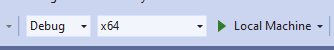
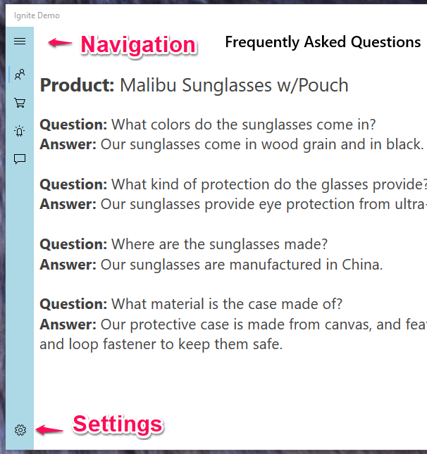
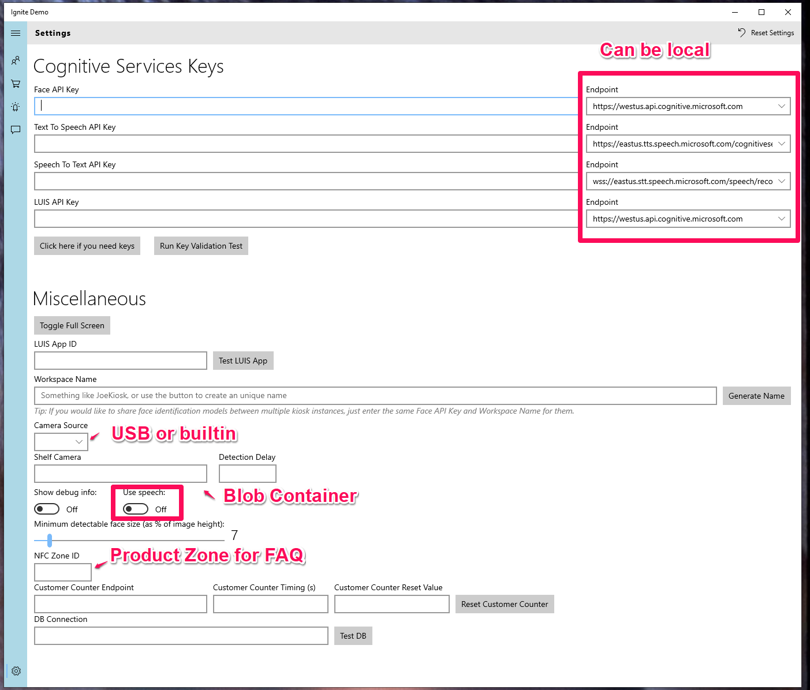

<!-- TOC -->

- [Ignite Demo UX](#ignite-demo-ux)
  - [Prerequisites](#prerequisites)
    - [Optional](#optional)
  - [Building](#building)
  - [Launching](#launching)
    - [Locally](#locally)
    - [On a Tablet](#on-a-tablet)
  - [Configuration](#configuration)
    - [Cognitive Services](#cognitive-services)
    - [LUIS App ID](#luis-app-id)
    - [Shelf Void Detection](#shelf-void-detection)
    - [Toggle Speech](#toggle-speech)
    - [Customer Counter](#customer-counter)
    - [DB Connection](#db-connection)

<!-- /TOC -->
# Ignite Demo UX

The UX runs on Windows 10 release 1903 or higher. It is a UWP application.

## Prerequisites

* Built-in or USB camera
* Windows 10 release 1903
* Visual Studio 2019 Community Edition
* Clone of this repository

### Optional

* NFC-supporting device
* Microphone/speakers

## Building

* Under `IgniteDemoApp\Kiosk`, locate `IgniteDemoApp.sln` and open it in VisualStudio 2019.
* Make sure configuration is set to "Debug" "x64" on the toolbar beneath the Visual Studio main menu:

    
* Build the solution.

Visual Studio may install missing NuGet packages at this point and the solution may not build. If the build fails, clean solution/rebuild solution.

## Launching

### Locally

The app may first be started from Visual Studio by pressing `Ctrl-F5`. This will install and launch the application on the local system. After that it may be launched from the Start menu: click on the Start button and begin typing "Ignite" or locate "Ignite Demo" icon on the start menu.

The application comes up with the "FAQ" page open. Click `Settings` to configure the application. `Navigation` lists the meaning of each icon.

### On a Tablet

* Set your tablet to Developer Mode
* Follow the steps for launching an application in a [remote debugging mode](https://docs.microsoft.com/en-us/visualstudio/debugger/run-windows-store-apps-on-a-remote-machine?view=vs-2019) the first time
* After that, the application will be installed on the tablet and may be launched by tapping its icon

## Configuration

### Cognitive Services

The Endpoints can point to Cognitive Services docker containers deployed on the local Azure Stack Edge. See [IgniteSolution README](../IgniteSolution/README.md).

**NOTE**: Keys are required if addressing cloud endpoints. The keys fields should not be left empty even if addressing local (Azure Stack Edge deployed) endpoints, their values will be ignored.

### LUIS App ID

If using LUIS on ASE, [create a local SMB share](https://docs.microsoft.com/en-us/azure/databox-online/data-box-edge-manage-shares) named `input` on it and [deploy the LUIS application](https://github.com/MicrosoftDocs/azure-docs/blob/master/articles/cognitive-services/LUIS/luis-container-howto.md#export-packaged-app-from-luis) to that share by exporting the application into a `.tar.gz` file.

### Shelf Void Detection

See [Counters and Gap Detection](../IgniteSolution/docs/counters_and_gap_detection.md) for details

* Shelf camera - blob container used to store shelf images
* Detection delay - detection update interval, seconds.

### Toggle Speech

The speech feature is `Off` by default. 

### Customer Counter

See the [Counters and Gap Detection](../IgniteSolution/docs/counters_and_gap_detection.md) document for details. The distributed counter containers are deployed on the ASE, the URL is simply the IP address of the compute endpoint of the ASE on the local network and the port number e.g.: `http://192.168.0.100:5001`

* Customer Counter Timing(s) - seconds delay for counter reporting
* Customer Counter Reset Value - start counting from the given value (when there are already people in the space before the counter is activated)

### DB Connection

Connection string to the Retail Insights database. See [SQL Database Configuration](../sql-backend/README.md) for instructions to configure the SQL DB backend.